# 第一章 容器

## 1. Tutorial

### 1.1 Installation

##### Install Docker

Reference: [setup_docker.sh](https://github.com/davidliyutong/ICE6405P-260-M01/blob/main/scripts/ubuntu/20.04/setup-docker.sh) 

```bash
sudo sh setup_docker.sh
```

Check docker version

```bash
docker --version
```

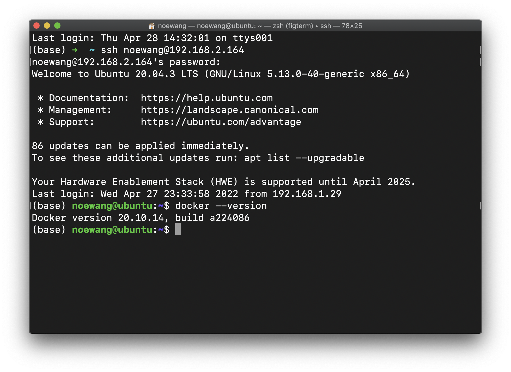

##### Install docker-compose

```bash
sudo apt-get install docker-compose
```

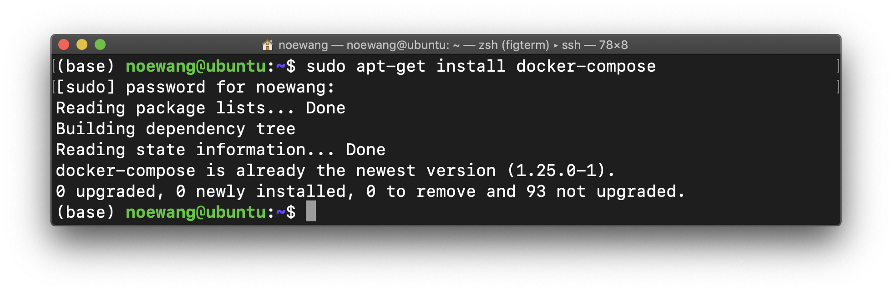

### 1.2 Basics

运行一个docker容器`ubuntu:focal`

```shell
docker run -it -d ubuntu:focal
```

查看容器运行情况

```bash
docker ps -a
```

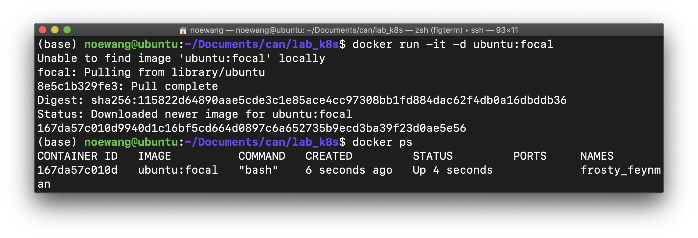

#### 1.2.1 Namespace

##### 简介

Namespace是Linux用来隔离系统资源的方式，它使得PID、IPC、Network等系统资源不再是全局性的，而是属于特定的namespace，其中的进程好像拥有独立的“**全局**”系统资源。每个namespace里面的资源对其他namespace都是彼此透明，互不干扰，改变一个namespace中的系统资源只会影响当前namespace里的进程，对其他namespace中的进程没有影响。

在原先Linux中，许多资源是全局管理的。例如，系统中的所有进程按照惯例是通过PID标识的，这意味着内核必须管理一个全局的PID列表。而且，所有调用者通过uname系统调用返回的系统相关信息（包括系统名称和有关内核的一些信息）都是相同的。用户ID的管理方式类似，即各个用户是通过一个全局唯一的UID号标识。Namespace提供了一种不同的解决方案，前面所述的所有全局资源都通过namespace封装、抽象出来。本质上，namespace建立了系统的不同视图，此前的每一项全局资源都必须包装到namespace数据结构中。Linux系统对简单形式的命名空间的支持已经有很长一段时间了，主要是chroot系统调用。该方法可以**将进程限制到文件系统的某一部分**，因而是一种简单的namespace机制，但真正的命名空间能够控制的功能远远超过文件系统视图。

新的namespace可以用下面3种方法创建：

- 在用`fork`或`clone`系统调用创建新进程时，有特定的选项可以控制是与父进程共享命名空间，还是建立新的命名空间。
- `setns`系统调用让进程加入已经存在的namespace，Docker exec就是采取了该方法。
- `unshare`系统调用让进程离开当前的namespace，加入到新的namespace中。

在进程已经使用上述的3种机制之一从父进程命名空间分离后，从该进程的角度来看，改变全局属性不会传播到父进程命名空间，而父进程的修改也不会传播到子进程。而对于文件系统来说，情况就比较复杂，其中的共享机制非常强大，带来了大量的可能性。

##### 实现

Namespace的实现需要两个部分：每个子系统的namespace结构，将此前所有的“全局”系统包装到namepsace中；将给定进程关联到所属各个namespace的机制。


系统此前的全局属性现在封装到namespace中，每个进程关联到一个选定的namespace。struct nsproxy用于汇集指向特定于namespace的指针：

```c
struct nsproxy {

        atomic_t count; 
        struct uts_namespace *uts_ns; 
        struct ipc_namespace *ipc_ns; 
        struct mnt_namespace *mnt_ns; 
        struct pid_namespace *pid_ns; 
        struct user_namespace *user_ns; 
        struct net *net_ns; 

};
```

##### PID Namespace

当调用`clone`时设定了CLONE_NEWPID，就会创建一个新的PID namespace，`clone`出来的新进程将成为namespace里的第一个进程。一个PID namespace为进程提供了一个独立的PID环境，PID namespace内的PID将从1开始，在namespace内调用`fork`、`vfork`或`clone`都将产生一个在该namespace内独立的PID。新创建的namespace里的第一个进程在该你namespace内的PID将为1，就像一个独立的系统里的init进程一样。该namespace内的其他进程都将以该进程为父进程，当该进程被结束时，该namespace内所有的进程都会被结束。

PID namespace是层次性，新创建的namespace将会是创建该namespace的进程属于的namespace的子namespace。子namespace中的进程对于父namespace是可见的，一个进程将拥有不止一个PID，而是在所在的namespace以及所有直系祖先namespace中都将有一个PID。系统启动时，内核将创建一个默认的PID namespace，该namespace是所有以后创建的namespace的祖先，因此系统所有的进程在该namespace都是可见的。

##### IPC Namespace

当调用`clone`时，设定了CLONE_NEWIPC，就会创建一个新的IPC namespace，clone出来的进程将成为namespace里的第一个进程。一个IPC namespace有一组System V IPC objects标识符构成，这标识符由IPC相关的系统调用创建。在一个IPC namespace里面创建的IPC object对该namespace内的所有进程可见，但是对其他namespace不可见，这样就使得不同namespace之间的进程不能直接通信，就像是在不同的系统里一样。当一个IPC namespace被销毁，该namespace内的所有IPC object会被自动销毁。

PID namespace和IPC namespace可以组合起来一起使用，只需在调用clone时，同时指定CLONE_NEWPID和CLONE_NEWIPC，这样新创建的namespace既是一个独立的PID空间又是一个独立的IPC空间。不同namespace的进程彼此不可见，也不能互相通信，这样就实现了进程间的隔离。

##### Mount Namespace

当调用`clone`时，设定了`CLONE_NEWNS`，就会创建一个新的mount namespace。每个进程都存在于一个mount namespace里面，mount namespace为进程提供了一个文件层次视图。如果不设定这个flag，子进程和父进程将共享一个mount namespace，其后子进程调用mount或umount将会被该namespace内的所有进程看见。如果子进程在一个独立的mount namespace里面，就可以调用mount或umount建立一份新的文件层次视图，mount、unmount只有该namespace可以看见。该flag配合chroot、pivot_root系统调用，可以为进程创建一个独立的目录空间，chroot实现目录独享、mount namespace实现挂载点独享。

##### Network Namespace

当调用`clone`时，设定了`CLONE_NEWNET`，就会创建一个新的Network namespace。一个Network namespace为进程提供了一个完全独立的网络协议栈的视图，包括网络设备接口、IPv4和IPv6协议栈、IP路由表、防火墙规则、sockets等。一个Network namespace提供了一份独立的网络环境，就跟一个独立的系统一样。一个物理设备只能存在于一个Network namespace中，但可以从一个namespace移动另一个namespace中。虚拟网络设备（virtual network device）提供了一种类似管道的抽象，可以在不同的namespace之间建立隧道。利用虚拟化网络设备，可以建立到其他namespace中的物理设备的桥接。当一个Network namespace被销毁时，物理设备会被自动移回初始的Network namespace，即系统最开始的namespace。

##### UTS Namespace

当调用`clone`时，设定了`CLONE_NEWUTS`，就会创建一个新的UTS namespace，即系统内核参数namespace。一个UTS namespace就是一组被uname返回的标识符。新的UTS Namespace中的标识符通过复制调用进程所属的namespace的标识符来初始化。Clone出来的进程可以通过相关系统调用改变这些标识符，比如调用sethostname来改变该namespace的hostname。这一改变对该namespace内的所有进程可见。CLONE_NEWUTS和CLONE_NEWNET一起使用，可以虚拟出一个有独立主机名和网络空间的环境，就跟网络上一台独立的主机一样。

##### 总结

每个Linux中的进程都包含以上多种namespace，可以通过`ls -alt /proc/PID/ns`来查看。以上所有clone flag都可以一起使用，为进程提供了一个独立的运行环境。LXC正是通过clone时设定这些flag，为进程创建一个有独立PID、IPC、mount、Network、UTS空间的容器。一个容器就是一个虚拟的运行环境，但对容器里的进程是透明的，它会以为自己是直接在一个系统上运行的。容器实际上是在创建容器进程时，指定了这个进程所需要启用的一组namespace参数，这样容器进程就只能“看”到当前namespace所限定的资源、文件、设备、状态，或配置。而对于宿主机以及其他不相关的应用，它就完全看不到了。这时，容器进程就会觉得自己是各自PID namespace里的第1号进程，只能看到各自Mount namespace里挂载的目录和文件，只能访问到各自Network namespace里的网络设备，就仿佛运行在一个“容器”里面。

Linux namespaces机制本身就是为了实现“容器虚拟化”开发的，它实际上修改了应用进程看待整个系统资源的“视图”，即它的“视线”被namespace统做了限制，只能看到某些指定的内容。但对于宿主机来说，这些被“隔离”了的进程跟其他进程并没有太大区别。所以namespace提供了一套轻量级、高效率的系统资源隔离方案，远比传统的虚拟化技术开销小。不过它也不是完美的，它为内核的开发带来了更多的复杂性，它在隔离性和容错性上跟传统的虚拟化技术比也还有差距。

##### Namespace Lab

- 查看某个容器的`PID`

```bash
docker inspect --format '{{.State.Pid}}' frosty_feynman
```

> “frosty_feynman” 是docker镜像的名字

- 查看某个`PID`的`namespace`

```bash
sudo ls -alt /proc/17023/ns
```


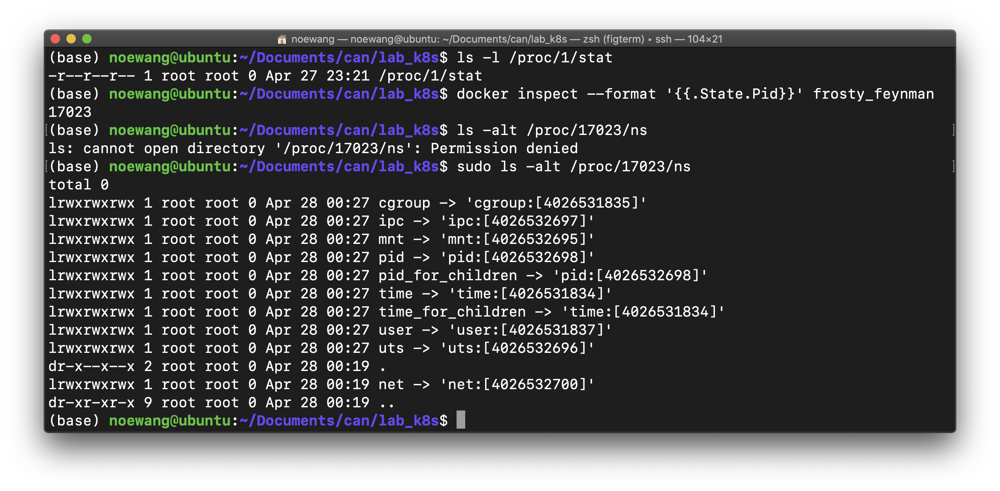

#### 1.2.2 cgroup

cgroup是Linux内核中的一项功能，它可以对进程进行分组，并在分组的基础上对进程组进行资源分配（如 CPU时间、系统内存、网络带宽等）。通过cgroup，系统管理员在分配、排序、拒绝、管理和监控系统资源等方面，可以对硬件资源进行精细化控制。cgroup的目的和namespace不一样，namespace是为了隔离进程之间的资源，而cgroup是为了对一组进程进行统一的资源监控和限制。

cgroup技术就是把系统中所有进程组织成一颗进程树，进程树都包含系统的所有进程，树的每个节点是一个进程组。cgroup中的资源被称为subsystem，进程树可以和一个或者多个subsystem系统资源关联。系统中可以有很多颗进程树，每棵树都和不同的subsystem关联，一个进程可以属于多颗树，即一个进程可以属于多个进程组，只是这些进程组和不同的subsystem关联。进程树的作用是将进程分组，而subsystem的作用是监控、调度或限制每个进程组的资源。目前Linux支持12种subsystem，比如限制CPU的使用时间、内存、统计CPU的使用情况等。也就是Linux里面最多可以建12棵进程树，每棵树关联一个subsystem，当然也可以只建一棵树，然后让这棵树关联所有的subsystem。

在CentOS 7系统中通过将cgroup层级系统与systemd单位树捆绑，可以把资源管理设置从进程级别移至应用程序级别。默认情况下，systemd会自动创建slice、scope和service单位的层级，来为cgroup树提供统一结构。如果我们将系统的资源看成一块馅饼，那么所有资源默认会被划分为 3 个cgroup：System、User和Machine，每一个cgroup都是一个slice，每个slice都可以有自己的子slice。

##### Cgroup lab

- 安装`cgroup-tools`

```bash
sudo apt-get install cgroup-tools
```

- 列出所有cgroup的subsystem

```shell
lssubsys –m
```

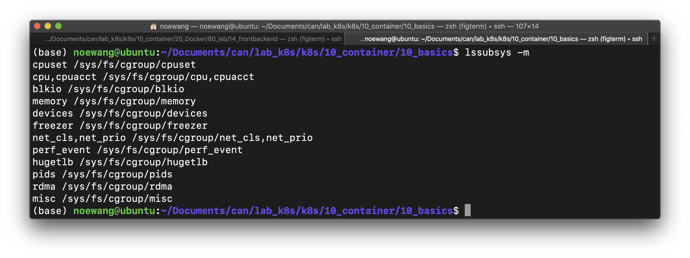

- 查看系统中的cgroup

```shell
ls /sys/fs/cgroup/cpu
```

- 使用cgroup创建新组`test`

```shell
sudo cgcreate -g cpu:test
ls /sys/fs/cgroup/cpu/test
```

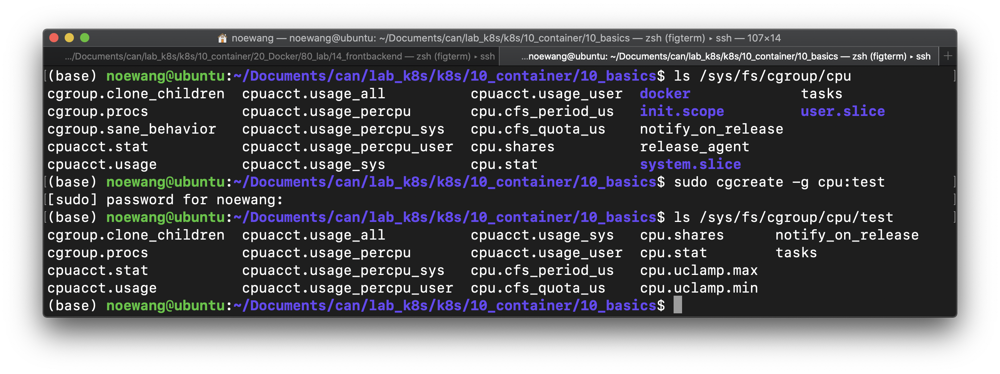

- 创建一个进程，该进程为死循环

```shell
while :; do :; done & echo $! > test.pid && cat test.pid
top -p $(cat test.pid) -n 1
```

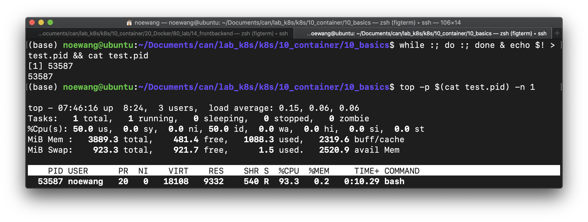

> 使用echo $!可以显示上一条命令的pid，这命令旨在保存上一条命令的PID到`test.pid`中

- 检查cgroup的限制

```shell
cat /sys/fs/cgroup/cpu/test/cpu.cfs_period_us
cat /sys/fs/cgroup/cpu/test/cpu.cfs_quota_us
cat /sys/fs/cgroup/cpu/test/tasks
```

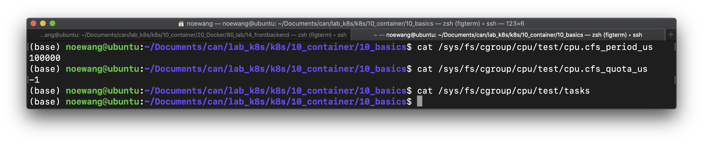

- 限制CPU

```shell
echo 30000 | sudo tee /sys/fs/cgroup/cpu/test/cpu.cfs_quota_us
sudo cgclassify -g cpu:test $(cat test.pid)
```

- 重新查看CPU限制情况和使用情况

```shell
cat /sys/fs/cgroup/cpu/test/cpu.cfs_quota_us
cat /sys/fs/cgroup/cpu/test/tasks
top -p $(cat test.pid) -n 1
```


- 限制磁盘I/O

```shell
sudo -s
dd if=/dev/sda of=/dev/null > dd.log 2>&1 & echo $! > test.pid
iotop
```


> 此时磁盘读写速度是651.22M/s.

- 创建`blkio:test` 组

```shell
mkdir /sys/fs/cgroup/blkio/test
```

- 限制读写速度为`1MiB/s`

```shell
echo '8:0 1048576' | sudo tee /sys/fs/cgroup/blkio/test/blkio.throttle.read_bps_device
```

> 这里`8:0`代表设备编号，可以用`ls -l $DEVICE` 查看
>
> ```shell
> ls -l /dev/sda
> brw-rw---- 1 root disk 8, 0 Apr 27 23:21 /dev/sda
> ```

-  将进程的PID加入cgroup

```shell
echo $(cat test.pid) | sudo tee -a /sys/fs/cgroup/blkio/test/tasks
sudo iotop -aod 0.1
```


> 此时我们看到磁盘读写速度为1Mib/s

- 实验结束，删除cgroup，结束进程

```shell
sudo cgdelete cpu:test
sudo cgdelete blkio:test
kill -9 $(cat test.pid)
```

### 1.3 Image

#### 1.3.1 Manipulation

- `docker image ls`: list all images in the local registry
- `docker image ls -q`: display only image ID
- `docker search ubuntu:xenial`: search all images from the remote registry
- `docker image pull <repository>:<tag>`: download an image from the remote registry to the local registry
- `docker image pull <repository>`: if we don't specify an image tag, Docker uses `latest` as default tag
- `docker image pull -a <repository>`: download all the images of the repo
- `docker image pull gcr.io/nigelpoulton/tu-demo:v2`: download from a third-party registry
- `docker image inspect ubuntu:xenial`: inspect an image
- `docker image rm IMG_ID`: remove a local image
- `docker image rm $(docker image ls -q) -f`: delete all images on the host
- `docker history IMG_ID`: display all the layers of an image

##### Tag

- `docker image tag OLD_REPO:ODL_TAG NEW_REPO:NEW_TAG`: change the tag of an image

##### Create/Commit/Push

- create an account in `hub.docker.com`, my account is **noewangjinyuan**
- `docker container commit -m <comment> -a <author> CT_ID REPO:TAG`: create an image from a running container
- push to a remote registry
- `docker login`: login to `hub.docker.com`
- `docker image push REPO:TAG`: upload to the remote registr

##### Import/Export

- `docker save REPO:TAG > /tmp/registry.tar`: export the registry image
- `docker load < registry.tar`: import the registry image

#### 1.3.2 Lab

- Download `ubuntu:focal` image

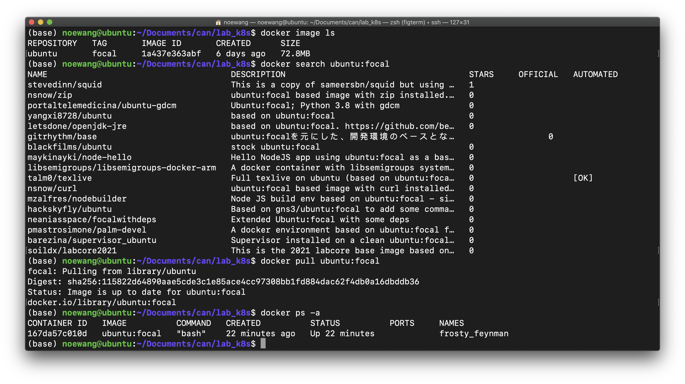

- Create a `ubuntu:focal` image with `ifconfig`

```bash
ping 8.8.8.8 # it doesn't work since it doesn't have the ping tool
apt update
apt install iputils-ping iproute2
ping 8.8.8.8 # it works now!
```


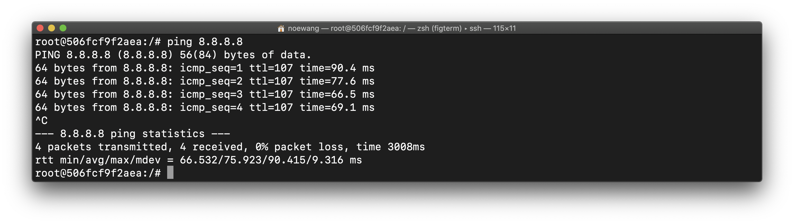

- From another terminal, run

```bash
docker ps
docker ps | grep ubuntu
```

> 寻找并定位容器的container ID

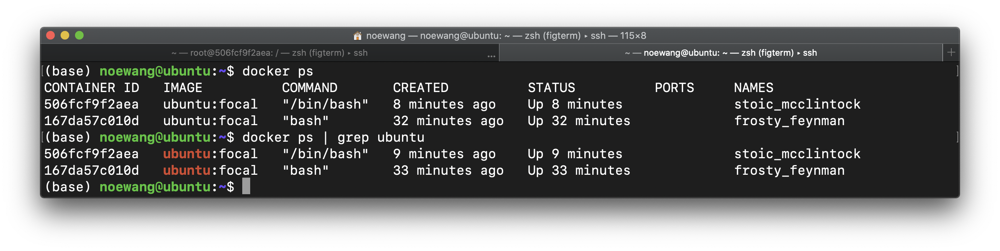

- Push the new image to DockerHub

```bash
docker commit -m "focal with ping" -a "USER_NAME" CT_ID ACCOUNT/focal:net
docker login
docker image push ACCOUNT/focal:net
docker image tag ACCOUNT/focal:net focal:net
```

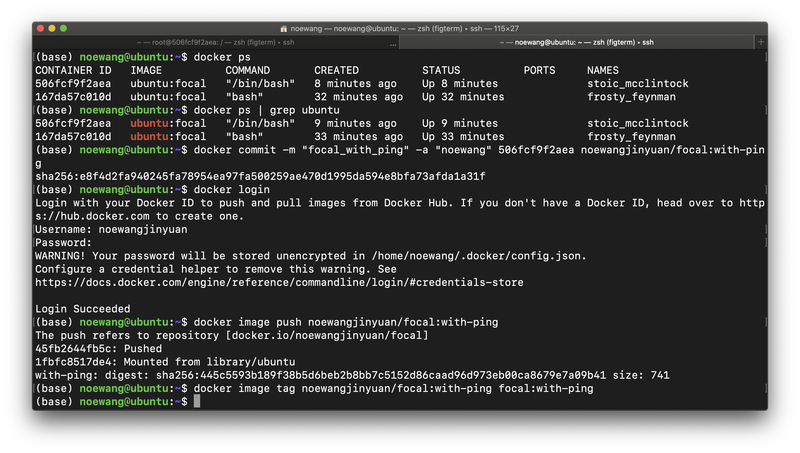

### 1.4. Docker Runtime

#### 1.4.1 Introduction

Docker 创建一个“容器进程”时，会先创建的一个容器初始化进程（dockerinit），而不是应用进程 （ENTRYPOINT + CMD）。dockerinit 会负责完成根目录的准备、挂载设备和目录、配置 hostname 等一系列需要在容器内进行的初始化操作。最后，它通过 execv() 系统调用，让应用进程取代自己，成为容器里的 PID=1 的进程

#### 1.4.2 Manipulation

##### Ps/Inspect

- `docker ps`
- `docker ps -a`: list all the containers included the killed
- `docker inspect`
- `docker inspect --format ‘{{ .State.Pid }}’<container-id>`

##### Run

- `docker run ubuntu:focal /bin/bash`: tell Docker which process to run inside container to replace default CMD, but nothing can be shown in the terminal
- `docker run -it ubuntu:focal`: interactive mode, connect your terminal to the CT's bash shell
- `Ctrl-PQ`: exist and suspend the container
- `docker run --name CT_Name ubuntu:focal`: name of the container
- `docker run -it -d ubuntu:focal`: detached mode (executing as daemon in background)
- `docker run -it --rm ubuntu:focal`: remove after the execution
- `docker run -d -p 80:80 ubuntu:focal`: NAT the port
- `docker run -d -P ubuntu:focal`: NAT port of the container to a random port of the host

##### Attach/Exec

- `docker attach CT_ID`: attach to the container's terminal
- `docker exec`: run a new process inside the container
- `docker exec –it CT_ID /bin/bash`: it attaches a running container with a bash

##### Stop

- `docker start CT_ID`: restart
- `docker stop CT_ID`: stop (send SIGTERM + SIGKILL)
- `docker kill CT_ID`: kill (send SIGKILL)
- `docker rm CT_ID`: remove a stopped container
    - `docker rm -f CT_ID`: force mode, remove a *running* container
    - `docker rm -f $(docker container ps -aq)`: remove all the containers

##### Resource Limitation 

- `docker run -m 200M --memory-swap=300M ubuntu:focal`
- `-m 200M`: memory
- `--memory-swap 300M`: memory+swap
- `docker run -it --vm 1 --vm-bytes 280M ubuntu:focal`
- `--vm 1`: 1 process for the container
- `--vm-bytes 280M`: 280M memory for the process
- `docker run -c 1024 ubuntu:focal`
- `-c 1024`: CPU priority
- `docker run -it --blkio-weight 600 ubuntu:focal`
- `--blkio-weight 600`: disk input/output priority

##### Pause/Unpause

- `docker pause CT_ID`
- `docker unpause CT_ID`

##### Monitor

- `docker ps`
- `docker container top CT_ID`: real-time monitor
- `docker logs CT_ID`: display logs inside a container
- `docker logs -f CT_ID`: continue to display new logs

#### 1.4.3 Lab

##### Basic

```bash
docker run hello-world 
docker ps # we can't see the container `hello-world`
docker ps -a # we can see all the containers including the stopped containers
docker run -it --rm ubuntu:focal /bin/bash
```

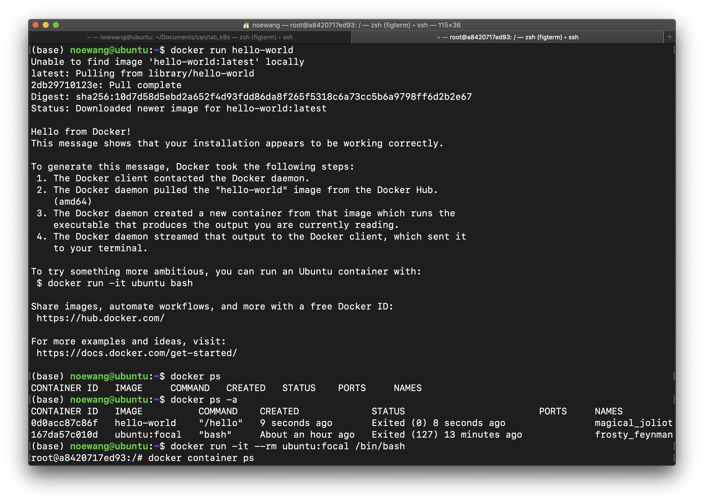

- From another terminal

```shell
docker container ps
```

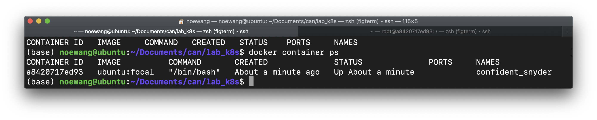

> **Difference**: A docker container is running by the `docker run` command, so we can see a runing docker.

- In the container

```shell
ps aux
exit # Ctrl-PQ
docker ps -a
docker exec -it 167da57c010d /bin/bash
```

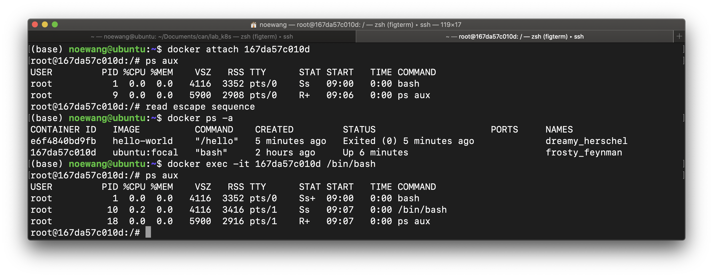

> We can see that `ps aux` has one more `PID`.

##### Run a Web Server

```shell
docker container run -it --rm -p 8888:80 ubuntu:focal
```

- Intall and launch apache2 in the container

```shell
apt update
apt install apache2 vim
vim /var/www/html/index.html # edit the file 
apache2ctl -D FOREGROUND 
```

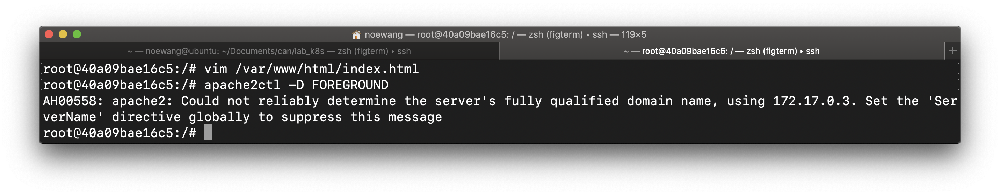

- On the host

```shell
curl localhost:8888 # access the web page
```

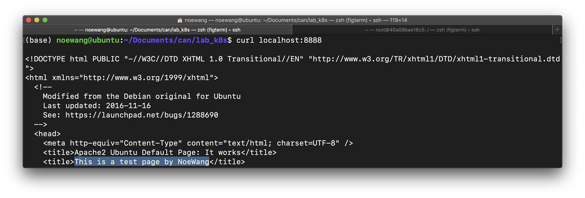

### 1.5. Volume

#### 1.5.1 Introduction

Docker 中的 volume 机制允许你将宿主机上指定的目录或者文件，挂载到容器里面进行读取和修改操作。

##### 搭载流程

- 创建容器进程：
- 创建新的mount namespace：当容器进程被创建后，尽管开启了Mount namespace，但是在它执行chroot（或pivot_root）之前，容器进程一直可以看到宿主机上的整个文件系统。Mount namespace的作用只是隔离挂载点，是容器进程只能能到它自己的挂载点。
- 使用容器镜像在新的mount namespace中设置该容器的rootfs：宿主机上的文件系统也自然包括了容器的镜像，镜像的各个层保存在**/var/lib/docker/aufs/diff**目录下，而它的rootfs会被挂载在**/var/lib/docker/aufs/mnt/**目录中。
- 把Docker volume对应的主机上的目录bind mount到容器到rootfs的某个目录上：
- 如果指定了宿主机的目录，则把指定的宿主机目录（比如/home目录）挂载到容器中指定的目录（比如/test目录）在宿主机对应的rootfs上的目录（即**/var/lib/docker/aufs/mnt/[可读写层 ID]/test**）上。由于执行这个挂载操作时Mount namespace已经开启，所以这个挂载事件只在这个容器里可见，在宿主机上是看不见这个挂载点的，这也就保证了容器的隔离性不会被volume打破。
- 如果未指定目录，则会在宿主机`/var/lib/docker/volumes`下创建一个临时目录用于挂载。
- 调用chroot把rootfs设置为该容器/进程设置新的文件系统根目录：之后该容器只能看见该rootfs之下的目录及文件，从而实现容器在文件系统的隔离。


##### Volume Mount

使用`docker volume ...`创建的volume，指定存放在Docker的工作目录**/var/lib/docker/volumes**下。

如果在创建的容器时不指定volume，则会在该目录下创建一个临时volume。

- 在没有显示声明宿主机目录时，如`$ docker run -v /test ...`，Docker会默认在宿主机上创建一个临时目录/var/lib/docker/volumes/[VOLUME_ID]/_data，然后把它挂载到容器的指定的目录上。

##### Bind Mount

通过Linux的bind mount绑定挂载技术，允许将宿主机上一个目录或者文件而不是整个设备，挂载到容器的一个指定的目录上。这时在该挂载点上进行的任何操作，只是发生在被挂载的目录或者文件上，而原挂载点的内容则会被隐藏起来且不受影响。

- 指定目录：Docker把宿主机指定的目录挂载到容器指定的目录上，如`$ docker run -v /home:/test ...`。

此方法用于将宿主机上的任意目录或文件挂载到容器中与容器共享，但是这类挂载不可以通过`docker volume`管理。

##### tmpfs Mount

第三种是在host的内存中通过tmpfs创建一个volume。因为数据存储在内存中，所以无法做持久化存储，同时也无法通过`docker volume`进行管理，只能作为临时数据的存储。

#### 1.5.2 Manipulation

##### Basics

```
docker volume list # list
docker volume inspect VOL_ID # inspect
docker volume create VOL_ID # create
```

##### Mount Volume

使用`-v` 参数可以挂载volume

```
docker run -d -p 80:80 -v VOL_ID:/usr/local/apache2/htdocs httpd
docker run -d -p 80:80 -v /usr/local/apache2/htdocs httpd # a random volume will be created in `/var/lib/docker/volumes/VOL_ID/_data`
echo "xxx" > /var/lib/docker/volumes/VOL_ID/_data
```

##### Bind Mount

Mount host dir to container volume

```
docker run -it --rm -v VOL_ID:path ubuntu:focal # attach a volume to a container
docker run ... -v $(pwd):path... # sync local dir to the container
docker run ... -v $(pwd):path:rw ... # setup *rw* permission for the volume
docker run ... -v $(pwd):path:ro ... # setup *ro* permission for the volume
```

> 如果要挂载Host路径，则提供的路径必须是绝对路径。
>
> 可以使用`$(pwd)` 获取当前终端路径，例如`$(pwd)/data`与`./data`的作用是一样的

#### 1.5.3 Lab

- Create a volume and mount it on a container

```shell
docker volume create vol1
docker run -it --rm -v vol1:/data ubuntu:focal /bin/bash
```

- In the container

```shell
ls /data # check the path in the container
touch /data/xxx
echo yyy > /data/xxx
```

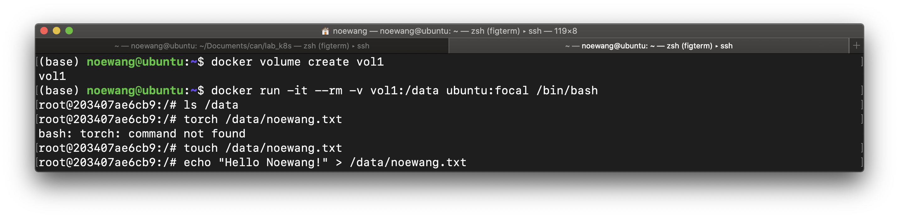

- In another container

```shell
docker run -it --rm -v vol1:/data ubuntu:focal /bin/bash
cat /data/xxx # check the previously created `xxx` file and its content
```

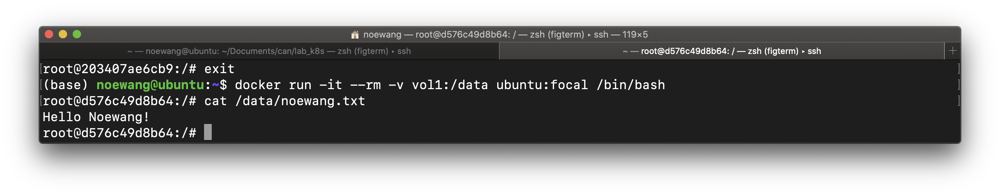

### 1.6. Network

Linux 容器能看见的“网络栈”是被隔离在它自己的 Network Namespace 中的网卡（Network Interface）、回环设备（Loopback Device）、路由表（Routing Table）和 iptables 规则。对于一个进程来说，这些要素实就构成了它发起和响应网络请求的基本环境。

#### 1.6.1 Intra-Host Network

##### None

**none** 网络模式创建 Network namepace，但不配置任何网络功能，容器启动后可以自行为容器配置网络。容器启动时创建 Network Namepace，但不配置任何网络功能，以 --net=none参数启动容器。容器启动后可以为容器配置网络。

```shell
$ docker run --net=none ACCOUNT/focal:net ip addr show

1: lo: <LOOPBACK,UP,LOWER_UP> mtu 65536 qdisc noqueue state UNKNOWN link/loopback 00:00:00:00:00:00 brd 00:00:00:00:00:00
inet 127.0.0.1/8 scope host lo
valid_lft forever preferred_lft forever inet6 ::1/128 scope host
valid_lft forever preferred_lft forever
```

##### Container

如果指定 –net=container，**container**网络模式不创建 Network Namepace，而是加入另一个运行中的容器的 Network namespace。**以 `--net=container:<容器id>` 参数启动容器。**K8s 中 pod 的网络就使用了该模式，pod 中的容器都会加入 pod-init 容器创建的 Network namespace中。

```shell
$ docker run -it -d focal:net bash
a4f59725740788efc9ab3822d77e6d4714447c6854fcd8def30ec5f4415d5278
$ docker run --net=container:a4f597257407 -it -d focal:net bash
112d06adcaa2527d87ce9ed4b51ef1c3317d2ececbf19404d5402e8d710fa823 
$ docker inspect --format '{{.State.Pid}}' 112d06adcaa2
66156
$ docker inspect --format '{{.State.Pid}}' a4f597257407
12630
$ ls -l /proc/66156/ns/net
/proc/66156/ns/net -> net:[4026532355] 
$ ls -l /proc/65571/ns/net 
/proc/65571/ns/net -> net:[4026532355]
```

- `docker run -d -it --name=CT_ID ubuntu:focal`
- `docker run -d -it --network=container:CT_ID ubuntu:focal`: the containers share the same network stack

##### Host

不创建 Network Namepace ，共享主机的Network Namespace，以 `--net=host` 参数启动容器。它会和宿主机上的其他普通进程一样，**直接共享宿主机的网络栈**。但是存在安全问题，容器可以操纵主机的网络配置。

```shell
$ docker run --net=host -it -d focal:net bash
b55213be4c805925ecc4dc1bd7934a01dde6f085313e395777c137b957d91a05
$ docker inspect --format '{{.State.Pid}}' b55213be4c80
22865
$ ls -l /proc/1/ns/net
/proc/1/ns/net -> net:[4026531957]
$ ls -l /proc/22865/ns/net 
/proc/22865/ns/net -> net:[4026531957]
```

- `docker run -it --network=host ubuntu:focal`: container and host share the same network stack
- for the reason of performance
- use the container to config the host network stack

##### Bridge

**bridge**网络模式是 Docker 默认的网络模式，它创建新 Network Namepace 、配置 docker0 Linux bridge、创建 veth pair，并且创建 iptables NAT 规则。同一宿主机上的容器之间通过 docker0 网桥互访，容器访问外网通过 iptable NAT 功能，容器可以通过宿主机端口映射对外暴露服务。


##### Overlay

Docker原生的跨主机通信模型，核心是Linux网桥与vxlan隧道，并且通过KV系统（consul、etcd）同步路由信息。


- `docker network list`: list all the networks
- `docker network inspect NET_ID`: show detailed information
- `docker network create NET_ID`: create
- `docker network create -d DRIVER NET_ID`: specify the network driver to use, by default we use the Bridge
- `docker network rm NET_ID`: remove
- `docker container run --name ct1 -it --rm --net=NET_ID ubuntu:focal`: launch a CT in a network
- `docker network connect NET_ID CT_ID`: connect a CT to a network, one CT can be connected to multiple networks
- `docker network disconnect NET_ID CT_ID`: disconnect

#### 1.6.2 Lab

##### VM-VM Ping

- In the host

```shell
docker network create net1
docker run --name ct1 -it -d --net=net1 focal:with-ping
docker run --name ct2 -it --net=net1 focal:with-ping /bin/bash
```

- In the container `ct2`

```bash
ping ct1
```

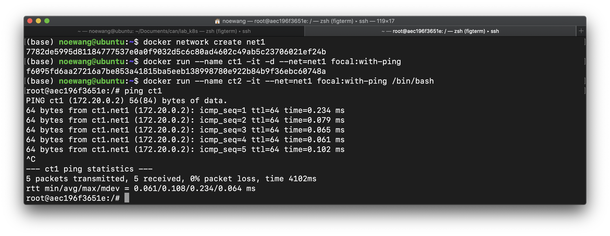

- Remove the containers and network

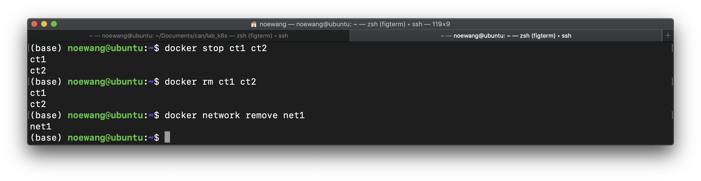

### 1.7 Dockerfile

Dockerfile specifies all the configurations to build an image.

#### 1.7.1 Syntax

- `FROM`: base image，设置基础镜像为 Debian
- `LABEL`: 来给 image 添加 metadata，是 key-value 键值对的形式。
- `LABEL version="1.0"`
- `docker image inspect --format='' myimage`：查看 label
- `ENV`: define environment variables to be used by *RUN*, *ENTRYPOINT*, *CMD*
- `ENV MY_VERSION="1.3"`
- `USER`: execute the commands with which user
- `WORKDIR`: switch path inside the container
- `WORKDIR /path/to/workdir`
- `COPY/ADD`: copy files from the host to the container
- `COPY index.html /var/www/html/index.html`
- `COPY ["index.html", "/var/www/html/index.html"]`
- `ADD`: can unzip tar, zip, taz files，将软件包解压到/xxx/目录下
- `VOLUME`: create default mount points，设置 volume 到目录 /xxx/ 下
- `VOLUME ["/etc/mysql/mysql.conf.d", "/var/lib/mysql", "/var/log/mysql"]`
- `EXPOSE`: export a TCP/UDP port on the container
- -p：发布一个或多个端口
- -P：发布全部端口，并映射到高位端口
- `RUN`: 构建镜像时会执行的命令。effectuate actions as ‘install packages’, 'modify configuration', 'create links and directories', 'create users and groups'.
- `RUN apt-get install -y mypackage=$MY_VERSION`
- `RUN ["/bin/bash", "-c", "echo hello"]`
- `CMD`: 启动容器时会执行的命令。command to be run when launch the container。CMD 与 RUN不同，RUN 是在 build 镜像过程中执行的命令，而 CMD 在 build 时不会执行任何命令，而是在容器启动时（镜像创建的容器）执行。
- if there are multiple CMD, only the last will be run
- `ENTRYPOINT`: docker run 命令的参数会被添加到 ENTRYPOINT 中的所有元素之后，并覆盖 CMD 命令。如果不填 ENTRYPOINT，默认用`/bin/bash -c`代替
- always run even if add another NEW_CMD
- `docker container run NEW_CMD`: NEW_CMD will be added as parameters to ENTRYPOINT, and replace CMD
- `ENTRYPOINT ["top", "-b"]`
- `ONBUILD`：会在镜像中添加一个 trigger，这个 trigger 会在镜像作为 base 时触发。
- STOPSIGNAL：设置 system call signal，发送到容器退出。
- `HEALTHCHECK`：用来告诉Docker怎样测试本容器是否还在工作。
- `SHELL`: use which shell to execute commands.

#### 1.7.2 Lab

##### Build Image

- `docker image build` create a new image using the instructions in the Dockerfile
- `docker image build -t apache2-demo:v1 .`: `-t` stands for tag/name
- `docker image build -t apache2-demo:v1 -f DockerfileXXX .`: `-f` use a Dockerfile with an arbitrary name
- `docker image history apache2-demo`: show image build history

##### Shell Env

```shell
docker build -t img1 -f Dockerfile-env . # create the image
docker run --name ct1 --rm img1 # see the default msg in default file /tmp/xxx.log
docker run --name ct2 --rm -e MSG=111 img1 # see the new msg
```

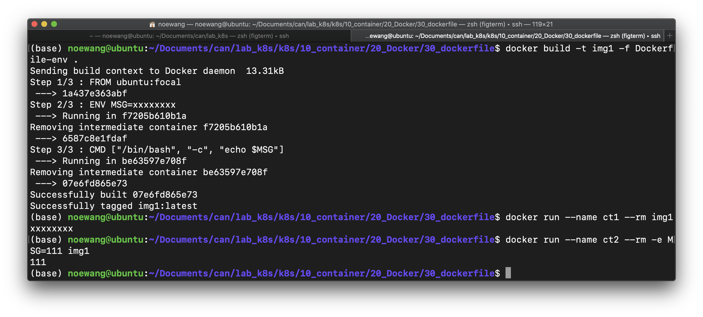

##### Python Argparse Env

```shell
docker build -t img1 -f Dockerfile-env-python . # create the image
docker run --name ct1 --rm img1 # see the default msg
docker run --name ct2 --rm -e MSG1=aaa -e MSG2=bbb img1 # see the new msgs
```

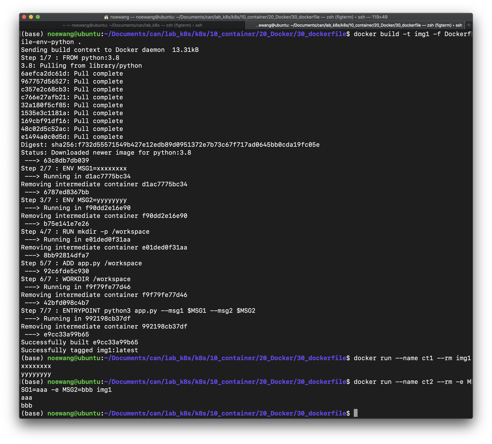

##### Same Image for Different Scripts

```shell
docker build -t img1 -f Dockerfile-env-python2 . # create the image
docker run --name ct2 --rm -v $(pwd):/workspace img1 # launch the default script
docker run --name ct2 --rm -v $(pwd):/workspace -e APP=/workspace/app2.py img1 # launch the new script
```

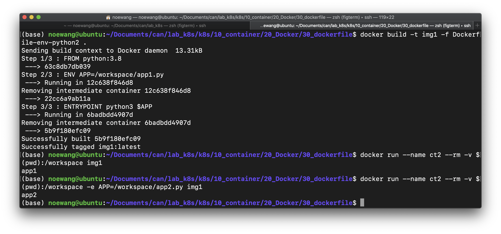

##### Apache2 Web Server

- write a Dockerfile to create an image with packages php, apache (apache2, libapache2-mod-php)
- add a index.php file with: `<?php phpinfo() ?>`

See the [Dockerfile](https://docs.ice6413p.space/10_container/20_Docker/30_dockerfile/Dockerfile) as the answer

```shell
docker image build -t apache2-demo .
docker run -d -p 8885:80 apache2-demo
```

- Visit the webpage from browser

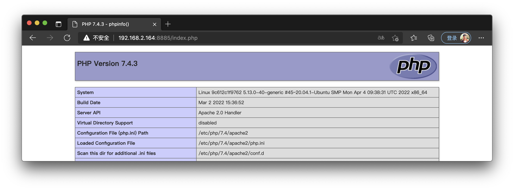

## 2 Labs

### 2.1 WordPress

In order to deploy a *wordpress* application, we should:

- create 1 network
- create 2 volumes
- 1 for mysql
- 1 for wordpress
- launch the *mysql* container
- launch the *wordpress* container

#### Docker Deployment

Network Creation

```shell
docker network create wordpress
docker network list
```

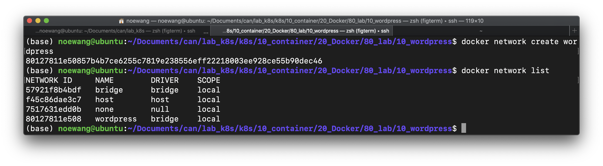

Volume Creation

```shell
docker volume create mysql
docker volume create wordpress
docker volume list
```

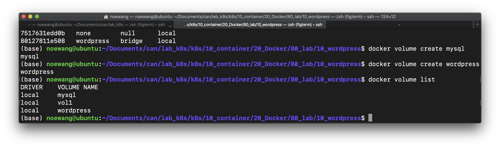

WordPress and MySQL Image Download

```shell
docker image pull wordpress:4.9.6
docker image inspect wordpress:4.9.6
docker image pull mysql:5.7
docker image inspect mysql:5.7
```

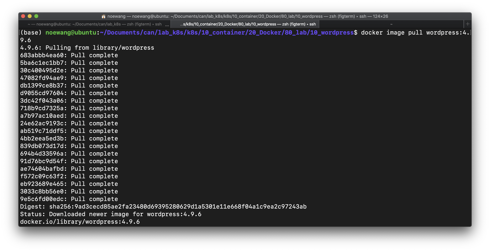


Launch the Container MySQL

```shell
docker run --name wordpressdb -d --rm \
--net wordpress \
-v mysql:/var/lib/mysql \
-e MYSQL_ROOT_PASSWORD=P@ssw0rd \
-e MYSQL_DATABASE=wordpress \
mysql:5.7
```

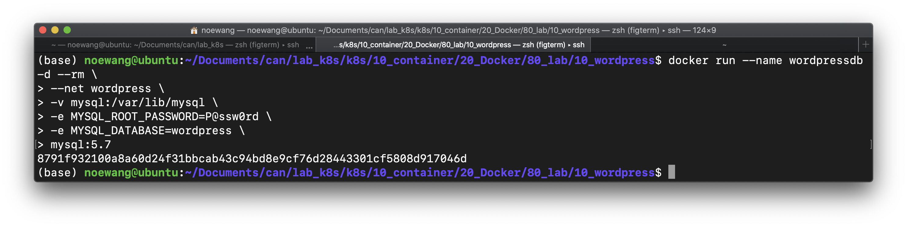

Launch the Container Wordpress

```shell
docker run --name wordpress -d --rm \
--net wordpress -p 8090:80 \
-e WORDPRESS_DB_PASSWORD=P@ssw0rd \
-e WORDPRESS_DB_HOST=wordpressdb \
-v wordpress:/var/www/html \
wordpress:4.9.6
```

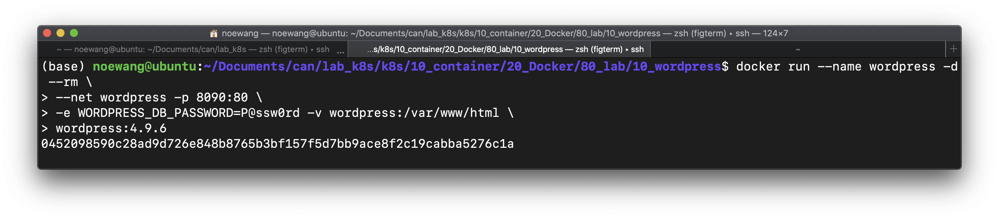

Check

```shell
curl http://localhost:8090 # through a browser
```


### 2.2 Python Web Server

#### 2.2.1 Mysql

```shell
docker network create python-server # create a backend network
docker volume create mysql # create a volume
docker image pull mysql:5.7 
docker container run --name mysql -d --net python-server -v mysql:/var/lib/mysql -e MYSQL_ROOT_PASSWORD=P@ssw0rd  mysql:5.7
```

> MYSQL_IP 需要通过`docker network inspect python-server`获取 若要在宿主机运行`mysql`工具，需要使用`sudo apt-get install mysql-client`安装 `-e MYSQL_ROOT_PASSWORD=P@ssw0rd` 将MySQL的root密码以环境变量的形式穿进了容器。容器初始化的时候会使用该变量初始化root密码

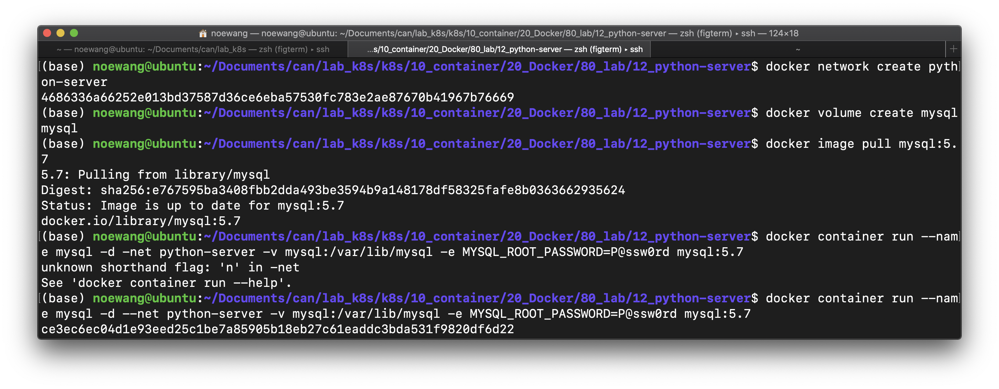

```shell
sudo apt install mysql-client
docker network inspect python-server | grep IPv4
mysql -h 172.23.0.2 -u root -p # test the access to the mysql server
Password: 
```

在mysql中，执行下面两条mysql语句，赋予root@localhost访问权限

```mysql
mysql> GRANT ALL PRIVILEGES ON *.* TO 'root'@'localhost';
mysql> FLUSH PRIVILEGES;
```

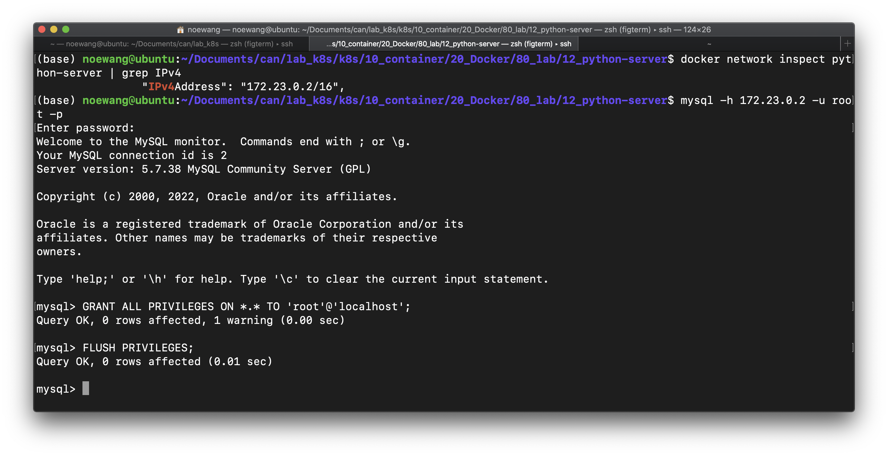

#### 2.2.2 Python server

Build python-server Docker Image

```shell
cd docker
docker build -t python-server:0.1 .
docker image list # check the image
```

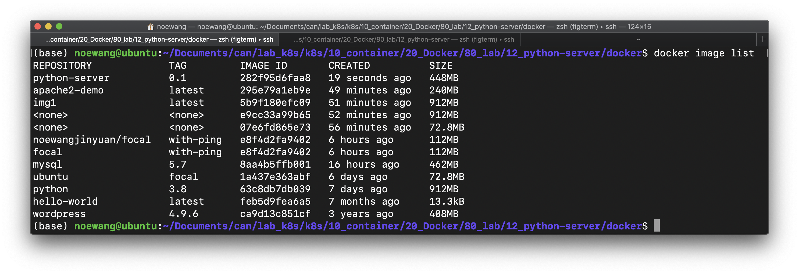

Launch Python Server

```shell
docker container run --name python-server -d --net python-server -p 6666:8888 -e MYSQL_HOST=mysql python-server:0.1
```

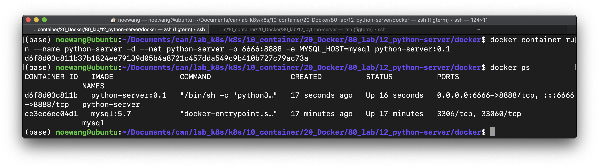

Initialize MySQL DB

```mysql
mysql -h MYSQL_IP -u root -p < db1_tbl1.sql # init the db1 database of mysql
```

check

```shell
curl localhost:6666
```

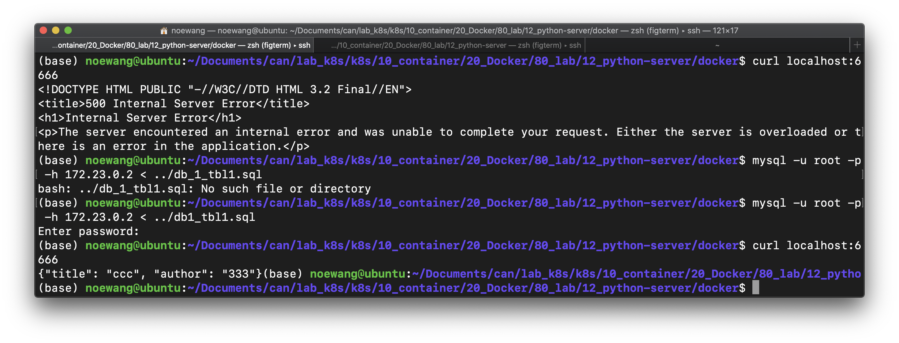

### 2.3 Front/Back end

Build Images

```shell
docker image build -t backend backend
docker image build -t frontend frontend
```

Create Network

```shell
docker network create frontbackend
```

Launch Containers

```shell
docker container run --name backend -d --net=frontbackend backend
docker container run --name frontend -d --net=frontbackend -p 6666:8888 frontend
```

Check

```shell
curl localhost:6666 # type twice
```

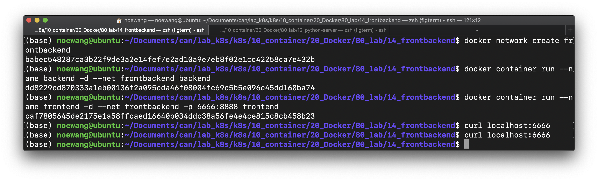

modify the file `backend:/data/input.txt`, check the server again

```shell
curl localhost:6666 #  type twice to see the update
```

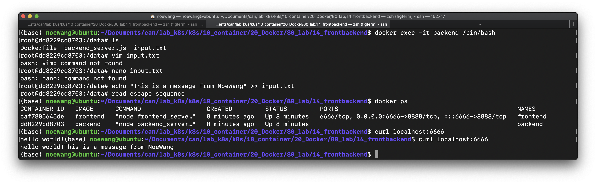

