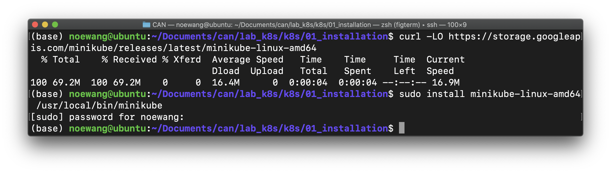
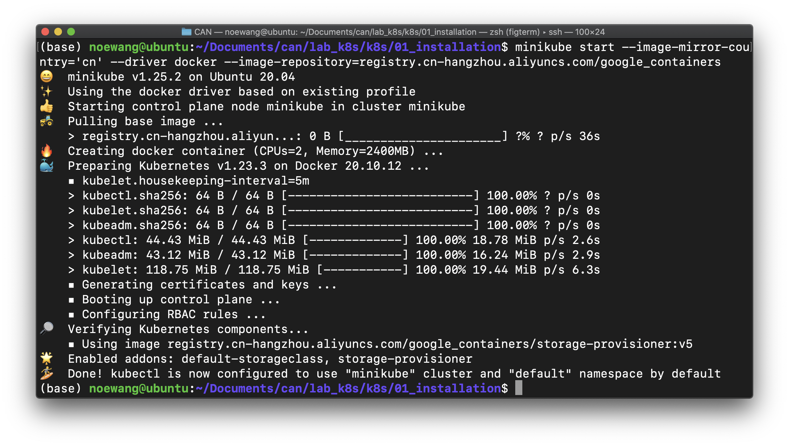

## 1. 单节点K8S集群

在本部分，我们使用Minikube来创建单节点的K8S集群。由于我们将使用多节点K8S集群进行后续实验，本部分我们仅介绍如何安装Minikube。我们在一个Ubuntu 20.04 LTS系统的虚拟机上安装Minikube。

### 1.1 安装本体

#### 二进制安装

```shell
curl -LO https://storage.googleapis.com/minikube/releases/latest/minikube-linux-amd64
sudo install minikube-linux-amd64 /usr/local/bin/minikube
```

> minikubu-linux-amd64 代表该minikube是为amd64平台编译的，只能用于amd64平台 [Minikube start](https://minikube.sigs.k8s.io/docs/start/) 可以获取全平台安装的可执行文件



> 如果要删除安装的Minikube，需要使用`sudo rm /usr/local/bin/minikube`删除可执行文件

#### DPKG 安装

与二进制安装类似

```
curl -LO https://storage.googleapis.com/minikube/releases/latest/minikube_latest_amd64.deb
sudo dpkg -i minikube_latest_amd64.deb
```

> 如果要删除安装的Minikube，需要使用相应的`dpkg`命令卸载

#### 自动补全

如果想为`Minikube`添加终端的自动补全，可以执行如下命令

- `bash`

```shell
echo 'source <(minikube completion bash)' >>~/.bashrc
```

- `zsh`

```shell
echo 'source <(minikube completion zsh)' >>~/.zshrc
```

>  可以通过`echo $SHELL`判断当前的Shell类型。Ubuntu默认使用的是Bash；最近的MacOS默认使用的是Zsh。


### 1.2 Minikube 启动与停止

#### 启动

```shell
minikube start --image-mirror-country='cn' --driver docker --image-repository=registry.cn-hangzhou.aliyuncs.com/google_containers
```

> 由于Google container无法直接访问，可以添加`--image-repository`参数执行镜像

> Minikube 要求硬件必须满足

```shell
- 2 vCPU
- 2.4 GB RAM
```
单核心的VPS，小内存的VPS是无法启动Minikube进行实验的

首次启动集群时，该命令会运行较长时间。这是因为要下载本地不存在的镜像。




#### 停止

停止的命令非常简单

```shell
minikube stop
```
--- 
### 1.3 安装kubectl

Minikube 只负责启动k8s实验集群，还需要安装`kubectl`工具管理，或者使用minikube自带的`kubectl`工具管理。

Minikube 自带的kubectl可以通过如下命令调用：

```
minikube kubectl -- get pod -A
```

该命令等同于

```
kubectl get pod -A
```

> 你可以在终端配置文件中为该命令起一个别名，例如`alias kubectl="minikube kubectl --"`

若要安装kubectl则需要执行下列命令

```shell
curl -LO "https://dl.k8s.io/release/$(curl -L -s https://dl.k8s.io/release/stable.txt)/bin/linux/amd64/kubectl"
sudo install ./kubectl /usr/local/bin/ # Use install command to replace move
```

!!! note 这样安装的是最新的stable release，而`curl -L -s https://dl.k8s.io/release/stable.txt`被用来获取版本号

!!! warning kubectl需要从`dl.k8s.io`下载。该过程可能会遇到连接问题，因此，可以通过任何渠道获取该二进制文件，上传/拷贝到实验环境中进行安装

如果想为`kubectl`添加终端的自动补全，可以执行如下命令

- Bash

```shell
echo 'source <(kubectl completion bash)' >>~/.bashrc
```

- Zsh

```shell
echo 'source <(kubectl completion zsh)' >>~/.zshrc
```

