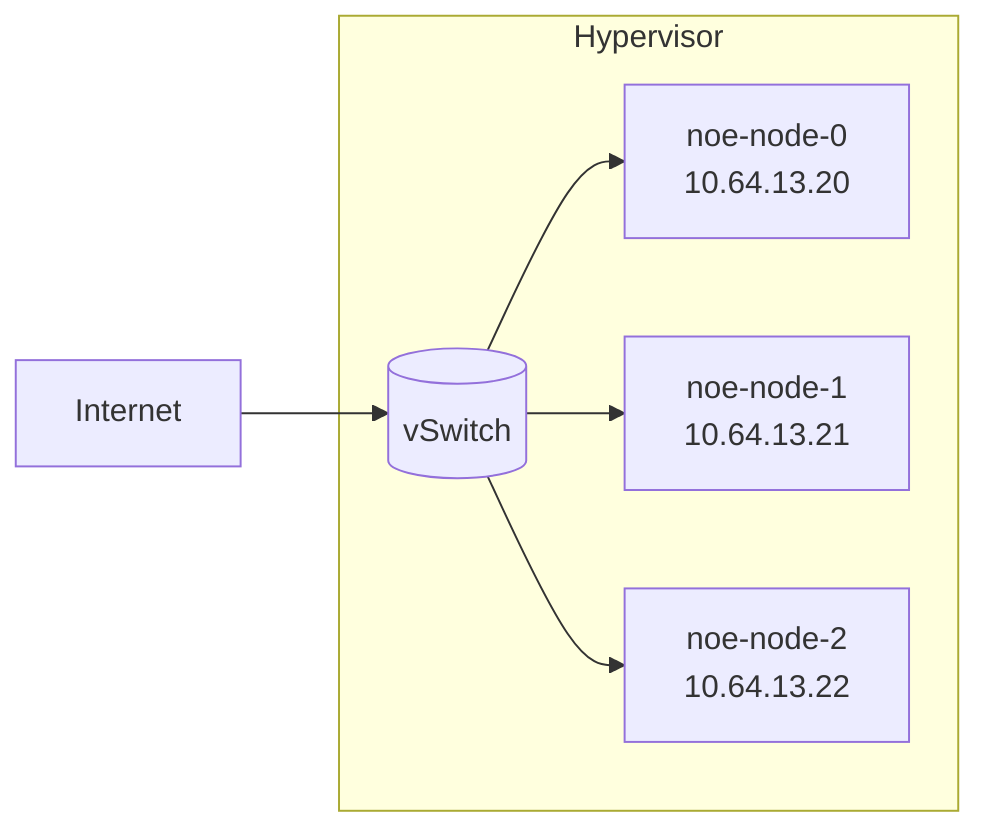

# 第二章 创建高可用的K8S集群


## 1. 单节点K8S集群

在本部分，我们使用Minikube来创建单节点的K8S集群。由于我们将使用多节点K8S集群进行后续实验，本部分我们仅介绍如何安装Minikube。我们在一个Ubuntu 20.04 LTS系统的虚拟机上安装Minikube。

更多细节：[1. Minikube](1_minikube)

## 2. 创建多节点K8S集群

本章节记录了一个有3个节点的K8S集群的配置过程

更多细节：[2. Kubeadm](2_kubeadm)

我们假设有三台互相连接的节点，这些节点在一个交换机域下。



三个节点的主机名、IP地址描述如下
```yaml
nodes:
  - node0:
      hostname: 'noe-node-0'
      address: '10.119.12.1'
  - node1:
      hostname: 'noe-node-1'
      address: '10.119.12.3'
  - node2:
      hostname: 'noe-node-2'
      address: '10.119.12.4'
```

三台节点均为x86虚拟机，安装Ubuntu 20.04.3 LTS操作系统，配置了2核CPU和4GB内存。`noe-node-0`将作为控制平面所在的节点

> - 必须确保`product_uuid`的唯一性，可以用`sudo cat /sys/class/dmi/id/product_uuid`检查
>
> - `hostnamectl` 可以修改主机名

#### 令服务器互相连接

我们编辑节点的`/etc/hosts` 来让它们能够通过主机名互相访问。节点`noe-node-0`上的配置如下：

```
10.64.13.20   noe-node-0  # inner IP
10.64.13.21   noe-node-1  # inner IP
10.64.13.22   noe-node-2  # inner IP
10.64.13.100  storage0    # inner IP
```

