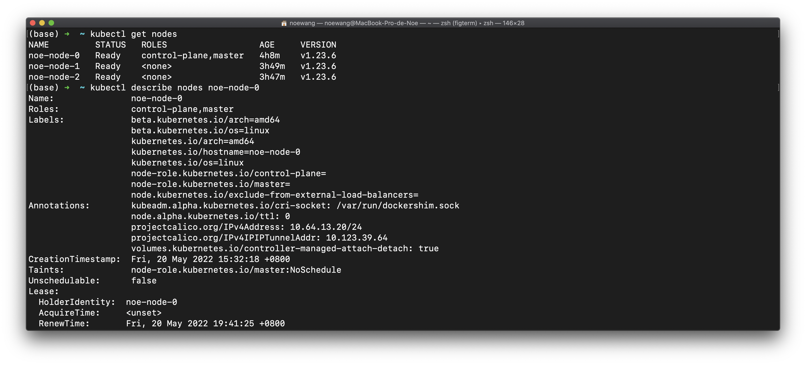
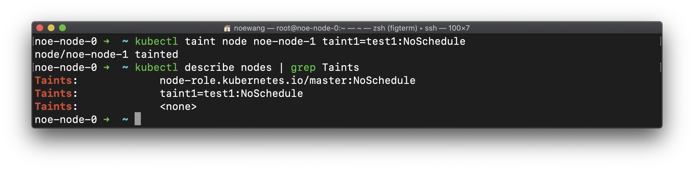
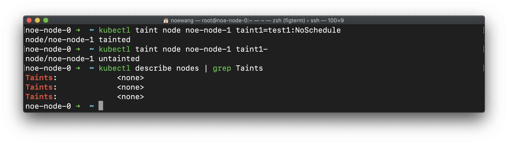
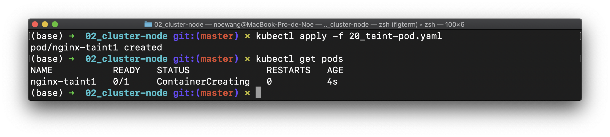
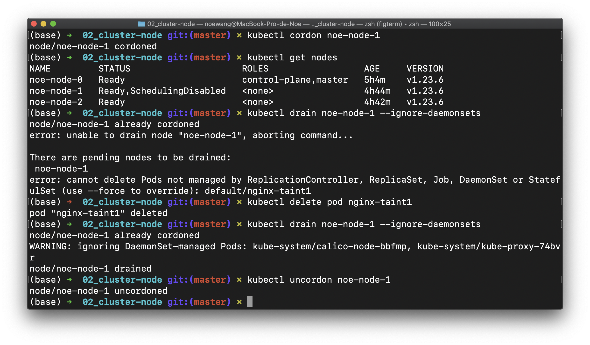

## 2. Cluster & Nodes

### 2.1 Cluster

#### Terminology

- cluster: 1 or 3 master + n nodes
- master: a VM or a physical machine which coordinates the cluster
- node/worker: a VM or a physical machine which serves as a worker that runs applications
- namespace: virtual cluster for resource isolation

#### Port

- pod port
    - containerPort: Docker image/container's exposed port
- service port
    - targetPort: *pod's containerPort*
    - port: service's port, clusterIP's port. If not specified, use the same as targetPort
    - nodePort: node's exposed port for the service


### 2.2 Node

使用`kubectl get`可以查看集群的各类，使用`kubectl describe`可以进一步详查

```shell
kubectl get nodes
kubectl describe nodes NODE_ID
```



Node包括以下信息：

- 地址：hostname、外网地址、内网地址
- Condition：OutOfDisk、Ready、MemoryPressure、DiskPressure
- Capacity：node上可用的资源，包括CPU、内存、Pod总数
- System Info：内核版本、容器引擎版本、OS类型等
- Allocable（可分配资源）：node上可用的资源，包括CPU、内存、Pod总数

> nodes 不属于namespace（可以用`kubectl api-resources --namespaced=false`命令查看不属于namespace管辖的资源

### 2.3 Taint & Toleration

Taint 的语法是

```shell
kubectl taint node [node] key=value[effect]
```

当Node被打上Taint后，因为Pod追求“**完美**”，正常的Pod是不会被调度至有瑕疵的节点。如果Pod比较大度，可以容忍这些Taint，那么是可以调度到这个节点的。这也就是为什么只有key=value的pod才会调度到上面

```yaml title="spec.template.spec"
tolerations:
- key: "key"
  operator: "Equal"
  value: "value"
  effect: "NoSchedule"
```

去除master节点的调度限制可以使用以下命令

```shell
kubectl taint nodes --all node-role.kubernetes.io/master-
```

移除node对应的污点

```shell
kubectl taint node [node] key=value[effect]-
```

##### Lab

给节点node1打上污点，并查看污点

```shell
kubectl taint node noe-node-1 taint1=test1:NoSchedule
kubectl describe nodes | grep Taints
```



删除污点

```shell
kubectl taint node NODE_NAME taint1-
```



我们部署服务

```shell
kubectl apply -f 20_taint-pod.yaml
```

- 下面是`20_taint-pod.yaml`

```yaml
apiVersion: v1
kind: Pod
metadata:
  name: nginx-taint1 # 可以自定义
  labels:
    app: nginx-taint1 # 可以自定义
spec:
  containers:
  - name: nginx-taint1 # 可以自定义
    image: nginx
    resources:
      limits:
        cpu: 30m
        memory: 20Mi
      requests:
        cpu: 20m
        memory: 10Mi
  tolerations: # 自定义调度规则容忍
  - key: taint1 # 容忍taint1:test2的瑕疵
    value: test2
    operator: Equal
    effect: NoSchedule
```

> K8S中CPU使用量的计量周期为100ms，30m即30ms/100ms，也就是30%

> 可以使用下列命令来删除pod
>
> ```shell
> kubectl delete pod POD_NAME
> ```



```shell
kubectl cordon noe-node-1 # 节点进入维护模式
kubectl get nodes # 查看Node
kubectl drain noe-node-1 --ignore-daemonsets # 平滑迁移pod，忽略daemonsets管理的pod
kubectl uncordon noe-node-1 # 取消节点的维护模式
```



> 注意，Drain 节点之前必须把清空节点中的Pod

可以看到，进入维护模式的节点，调度将停止

> `--ignore-daemonsets` 是为了防止和网络有关的Pod被调走

小结一下，节点维护的方法是，先将其置为维护模式停止调度，然后将节点上的Pod迁移到其他节点，随后就可以进行维护了。一旦维护结束，就取消节点的维护模式。

