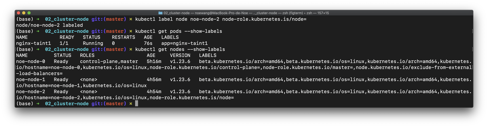
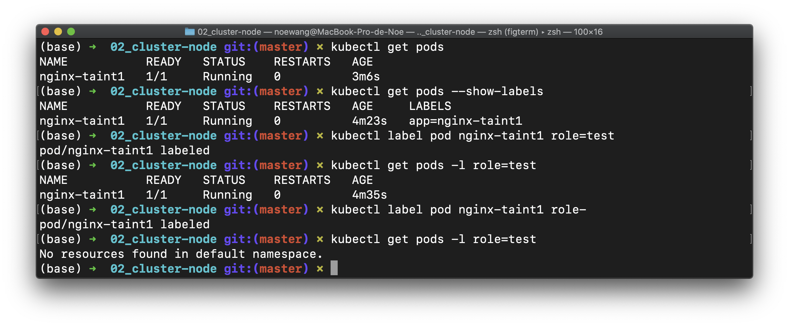

## 3. Label & Annotation

Labels are key-value pairs that are used to group together sets of objects, very often pods.

- show labels：
    - `kubectl get pods --show-labels`
- Add label
    - `kubectl label pod POD_ID app=v1` 给`POD_ID`这个Pod添加`{app: v1}`Label
    - `kubectl label node noe-node-02 node-role.kubernetes.is/node=` (`node-role.kubernetes.is/node`为key)
- select label
    - `kubectl get pods -l run=kubernetes-bootcamp`: select with label `run=kubernetes-bootcamp`
    - `kubectl get services -l run=kubernetes-bootcamp`: select with label `run=kubernetes-bootcamp`

Annotations let you associate arbitrary metadata with k8s objects.

为`get pods`操作增加Label显示

```shell
kubectl get pods --show-labels
```

为`$POD_NAME`的Pod添加`{key: value}`的Label

```shell
kubectl label pod $POD_NAME key=value
```

为`$POD_NAME`的Pod删除名称为`key`的Label

```
kubectl label pod $POD_NAME key-
```

> `kubectl label node $NODE_NAME key=value` 可以对node做类似操作



使用`-l key=value`参数可以在`get pods`的时候过滤pods

```shell
kubectl get pods -l key=value
```

##### Lab

```shell
kubectl get pods --show-labels
kubectl label pod nginx-taint1 role=test
kubectl get pods -l role=test
kubectl label pod nginx-taint1 role-
```


