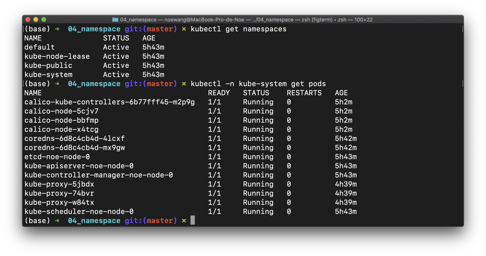
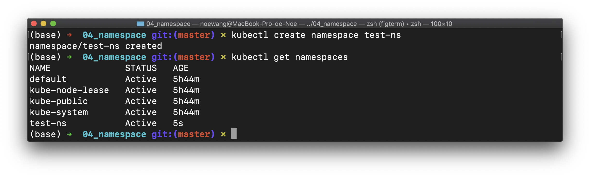
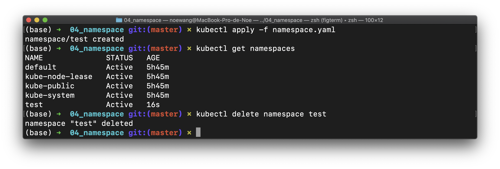
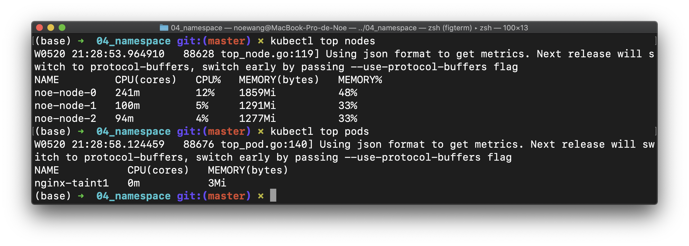

## 4. Namespace & Monitor

Namespace 是一组对资源和对象的抽象集合，可以用来将系统内部的对象划分为不同的组。常见的 pod、deployment、service 等都必须属于某个 namespace，而 node、pv 等资源不属于任何 namespace。

集群自身的核心服务一般运行在 kube-system 这个 namespace 中。刚创建集群时候存在一个 default 默认namespace，默认不需要输入 namespace的 名字。

### 4.1 Namespace

- list
    - `kubectl get namespaces`
- select
    - `kubectl -n kube-system get pods`: execute CMD within 1 namespace
- create
    - `kubectl create namespace test`
    - `kubectl apply -f namespace.yaml` or `kubectl create -f namespace.yaml`
- delete
    - `kubeclt delete namespace test`
    - `kubectl delete -f namespace.yaml`

我们验证namespace操作命令

```shell
kubectl get namespaces
kubectl -n kube-system get pods
```



```shell
kubectl create namespace test-ns
kubectl get namespaces
kubectl delete namespace test-ns
```



也可以用`kubectl apply -f namespace.yaml`应用namespace设置

```yaml title="namespace.yaml"
apiVersion: v1
kind: Namespace
metadata:
    name: test
```

```shell
kubectl apply -f namespace.yaml
kubectl get namespaces
kubectl delete namespace test
```



### 4.2 Monitor

和`top` 命令一样，kubectl可以监控节点的状态

- `kubectl top node`
- `kubectl -n kube-system top pod` 添加`-n`参数可以限定作用域

如果kubeadm部署，则**非常**可能需要手动安装metrics-server

```shell
wget https://github.com/kubernetes-sigs/metrics-server/releases/latest/download/components.yaml
```
由于`k8s.gcr`需要科学上网，我们修改其中的镜像为bitnami/metrics-server，注意tag的不同

```yaml
apiVersion: apps/v1
kind: Deployment
metadata:
spec:
template:
    spec:
    containers:
    - args:
        #image: k8s.gcr.io/metrics-server/metrics-server:v0.6.1
        image: bitnami/metrics-server:0.6.1
```

部署metrics-server

```shell
kubectl apply -f components.yaml
```

监控`kubectl get pods --all-namespaces`，直到`metrics-server-xxxxxxxxx-xxxx`Pod运行成功

> 1. 如果忘记修改镜像来源，第一次创建的Pod永远失败，就使用`kubectl delete deployment metrics-server -n kube-system`删除这次失败的部署，然后修改镜像源重新部署。
>
> 2. 如果遇到metrics-server容器Running而无法Ready，容器日志中出现X509错误，则需要启用serverTLSBootstrap，参考[部署集群](../cluster.md).
>
> 3. 也可以在`template.containers.args`下添加`--kubelet-insecure-tls`参数忽略证书错误




总的来说，metrics-server 的正常运行依赖于：

1. Master节点和Metrics Server Pod能够互相联通（kubeadm默认满足）
2. APIServer 启用聚合支持（kubeadm默认启用）
3. 证书通过CA认证（开启serverTLSBootstrap）


### 4.3 Log

使用`kubectl logs`可以查看某一个resource的log

- `kubectl logs $RESOURCE_ID`: 查看默认命名空间（default）下的`$RESOURCE_ID`的资源的log
- `kubectl -n $NS logs $RESOURCE_ID`: 查看`$NS`命名空间下的`$RESOURCE_ID`的资源的log
- `kubectl get event` 获得K8S事件

> `RESOURCE_ID`需要替换成resource的ID，注意不同namespace下的RESOURCE_ID是不同的 `kubectl get all`可以获取命名空间下所有resource，默认是default命名空间下

查看一个Pod的日志


查看集群发生的事件


