## 5. Pod

### 5.1 Introduction

Pod 是在 K8s 集群中运行部署应用的最小单元，它是可以支持多容器的。Pod 的设计理念是支持多个容器在一个 Pod 中共享网络地址和文件系统，可以通过进程间通信和文件共享这种简单高效的方式组合完成服务。Pod 对多容器的支持是 K8s 最基础的设计理念。比如你运行一个操作系统发行版的软件仓库，一个 Nginx 容器用来发布软件，另一个容器专门用来从源仓库做同步，这两个容器的镜像不太可能是一个团队开发的，但是他们一块儿工作才能提供一个微服务。这种情况下，不同的团队各自开发构建自己的容器镜像，在部署的时候组合成一个微服务对外提供服务。

Pod 是 K8s 集群中所有业务类型的基础，可以看作运行在 K8s 集群中的小机器人，不同类型的业务就需要不同类型的小机器人去执行。目前 K8s 中的业务主要可以分为长期伺服型（long-running）、批处理型（batch）、节点后台支撑型（node-daemon）和有状态应用型（stateful application），分别对应的小机器人控制器为 Deployment、Job、DaemonSet 和 StatefulSet。

#### 5.1.1 initContainer

在Pod中，只有当所有Init Container定义的容器都运行完之后，才会初始化 pod 中的正式containers。Init Container容器会按顺序逐一启动，而直到它们都启动并且退出了，用户容器才会启动。

#### 5.1.2 Static Pod

静态 pod 不经apiserver，都是本地的 pod 通过kubelet直接启动。 Pod only exists on a node, managed by the local kubelet but node k8s master.
It cannot be managed by the API server, so it cannot be managed by ReplicationController, Deployment or DaemonSet.

- launched by the config file */etc/kubelet.d/*
- launched by HTTP


### 5.2 Properities

#### 5.2.1 生命周期

Pod生命周期的变化主要体现在 pod.status.phase 属性：

- Pending：YAML 文件已经提交给 k8s，API 对象已被创建并保存在 Etcd 中，但这个 Pod里有些容器因为某种原因而不能被顺利创建，如：调度不成功。
- Running：Pod 的容器已在某个节点成功创建，并且至少有一个正在运行中。
- Succeeded：Pod 里的所有容器都正常运行完毕，并已经退出了。
- Failed：Pod 里至少有一个容器以不正常的状态（非 0 的返回码）退出。
- Unknown：Pod 的状态不能持续地被 kubelet 汇报给 kube-apiserver，很有可能是主从节点（Master 和 Kubelet）间的通信出现了问题。
- Conditions：对先前状态的细分状态，对造成当前 Status 的具体原因是什么的解释
    - PodScheduled
    - Ready：通过readiness的check
    - Initialized
    - Unschedulable：调度出现了问题

#### 5.2.2 RestartPolicy

- Always：只要退出就重启
- OnFailure：失败退出时重启
- Never：只要退出就再不重启

#### 5.2.3 Resource Restriction

k8s 中资源的设置在 pod 中，由于 Pod 可以由多个 Container 组成，所以 CPU 和内存资源的限额是要配置在每个 Container 的定义上的。这样，Pod 整体的资源配置，就由这些 Container 的配置值累加得到。

- CPU：k8s里为 CPU 设置的单位是“CPU 的个数”，比如500m，指的就是 500 millicpu，也就是 0.5 个 CPU 的意思。这样，这个 Pod 就会被分配到 1 个 CPU 一半的计算能力。
    - cpuset：可以通过设置 cpuset 把容器绑定到某个 CPU 的核上，而不是像 cpushare 那样共享 CPU 的计算能力。这种情况下，由于操作系统在 CPU 之间进行上下文切换的次数大大减少，容器里应用的性能会得到大幅提升。cpuset 方式是生产环境里部署在线应用类型的 Pod 时非常常用的一种方式。设置cpuset只需要将 Pod 的 CPU 资源的 requests 和 limits 设置为同一个相等的整数值即可。
- Memory：内存资源来说，它的单位自然就是 bytes。Kubernetes 支持你使用 Ei、Pi、Ti、Gi、Mi、Ki（或者 E、P、T、G、M、K），其中1Mi=1024*1024；1M=1000*1000。

##### requests vs. limits

- requests：在调度的时候使用的资源值，也就是 kube-scheduler 只会按照 requests 的值进行计算。
- limits：真正设置 Cgroups 限制的值。

k8s认为容器化作业在提交时所设置的资源边界，并不一定是调度系统所必须严格遵守的，因为大多数作业使用到的资源其实远小于它所请求的资源限额。基于这种假设，Borg 在作业被提交后，会主动减小它的资源限额配置，以便容纳更多的作业、提升资源利用率。而当作业资源使用量增加到一定阈值时，Borg 会还原作业原始的资源限额，防止出现异常情况。而 k8s 的 requests+limits 的做法，其实就是上述思路的一个简化版。用户在提交 Pod 时，可以声明一个相对较小的 requests 值供调度器使用，而 k8s 真正设置给容器 Cgroups 的，则是相对较大的 limits 值，所以requests永远小于limits。

#### 5.2.4 Storage

pod-level storage which will be deleted when pod is destroyed.

- emptyDir
- hostPath
- configMap
- secret

> K8S中的volume是跟随Pod的生命周期的

#### 5.2.5 Network

- Pod 内的不同 container 间通过 pause 容器实现网络共享

- hostPort: expose 1 containerPort on the host

    ```yaml
    ports: 
    - containerPort: 8080
      hostPort: 8081
    ```

- hostNetwork: expose all the containerPorts on the host

    ```yaml
    hostNetwork: true
    ```

#### 5.2.6 Health Check

Health Check是K8S集群检查容器健康的一种手段

- livenessProbe：会一直检测，如果失败，pod则会重启失败的容器（restartPolicy=always）。
    - exec:
    - tcpSocket:
    - httpGet:
    - initialDelaySeconds (s):
    - timeoutSeconds (s):
- readinessProbe：优先于liveness，它会一直检测应用是否处于服务正常状态，当应用不健康时，不把 pod 标注为 ready。readinessProbe检查结果的成功与否，决定的这个Pod是不是能被通过Service的方式访问到，而并不影响 Pod 的生命周期。
    - CMD：
    - HTTP：
    - TCP：

### 5.3 CMD

- list pods
    - `kubectl get pods`:
    - `keubctl get pods --show-all`
    - `kubectl get pods --watch`: 实时监控
- describe pods
    - `kubectl describe pods`
    - `kubectl describe pods POD_ID`
- launch a pod
    - `kubectl create -f POD.yml`
    - `kubectl apply -f POD.yml`
- delete pod
    - `kubectl delete pod POD_ID`
    - `kubectl delete -f POD.yml`
- exec
    - `kubectl exec POD_ID -- CMD`: run a cmd in the 1st CT of the pod
    - `kubectl exec POD_ID -- curl localhost:8080`: internal access
    - `kubectl exec POD_ID -c CT_ID -- CMD`: run a cmd in the container CT_ID of the pod

### 5.4 ConfigMap

ConfigMap 是一个 API 对象 ， 让你可以存储其他对象所需要使用的配置。ConfigMap存储key-value pair配置数据，这个数据可以在pods里使用，或者被用来为像controller一样的系统组件存储配置数据。ConfigMap跟secret很类似，但它可以更方便地处理不包含敏感信息的字符串。

- ENV: get 1 value from ConfigMap *Spec/Containers/env*

    ```yaml
    name: APPLOGLEVEL     # environment variable name
    valueFrom: 
      configMapKeyRef: 
        name: cm-appvars
        key: apploglevel
    ```

- ENV: get all values from ConfigMap: *Spec/Containers/env*

    ```yaml
    envFrom: 
      configMapRef: 
        name: cm-appvars
    ```

- volumeMount: *spec/containers/volumeMounts*

    ```yaml
    name: serverxml       # volume name
    mountPath: /configfiles
    
    volumes: 
    - name: severxml
     configMap: 
       name: cm-appconfigfiles
       items: 
       - key: key-severxml
         path: sever.xml
       - key: key-loggingproperties
         path: logging.properties
    ```

### 5.5 Downward API

- ENV: get pod info from field *Spec/Containers/env*

    ```yaml
    name: MY_POD_NAME     # environment variable name
    valueFrom: 
      fieldRef: 
        fieldRef: metadata.name
    ```

    - metadata: fixed info about a pod
        - metadata.name
        - metadata.namespace
    - status: variable info about a pod
        - status.podIP

- ENV: get container info from resourceField *Spec/Containers/env*

    ```yaml
    name: MY_CPU_REQUEST     # environment variable name
    valueFrom: 
      resourceFieldRef: 
        containerName: test-container
        resource: requests.cpu
    ```

    - requests.cpu
    - requests.memory
    - limits.cpu
    - limits.memory

- volume: *volumes*

    ```yaml
    - name: podinfo
      downwardAPI:
        items: 
          - path: "labels" # create a file called "labels"
            fieldRef: 
              fieldPath: metadata.labels      # all the labels of in the metadata
    ```

### 5.6 Lab

本章节主要是完成各种Pod部署并查看不同配置文件的内容对Pod/K8S集群的影响

#### 5.6.1 Pod with 1 Container

##### 10_pod1.yaml

部署提供的`10_pod1.yaml`，该文件描述了一个名为pod1的busybox服务的部署。busybox是一个linux工具集合。它提供了300多个常用的linux命令，并采取复用代码的形式节约了很多空间。容器的入口是运行了`/bin/sh -c echo pod1 is running!`这条语句，因此容器将很快退出。但是由于其`restartPolicy=Always`，容器将反复重启。

- `10_pod1.yaml`

```yaml
apiVersion: v1
kind: Pod
metadata:
  name: pod1
  labels:
    app: pod1
spec:
  restartPolicy: Always
  containers:
  - name: ct-busybox
    image: busybox:latest
    imagePullPolicy: IfNotPresent
    command: ['/bin/sh', '-c', 'echo pod1 is running!']
```

- 运行

```shell
kubectl apply -f 10_pod1.yaml
kubectl logs pod1 # show the echo message
kubectl get pods 
kubectl describe pod pod1 # Back-off restarting failed containe
```

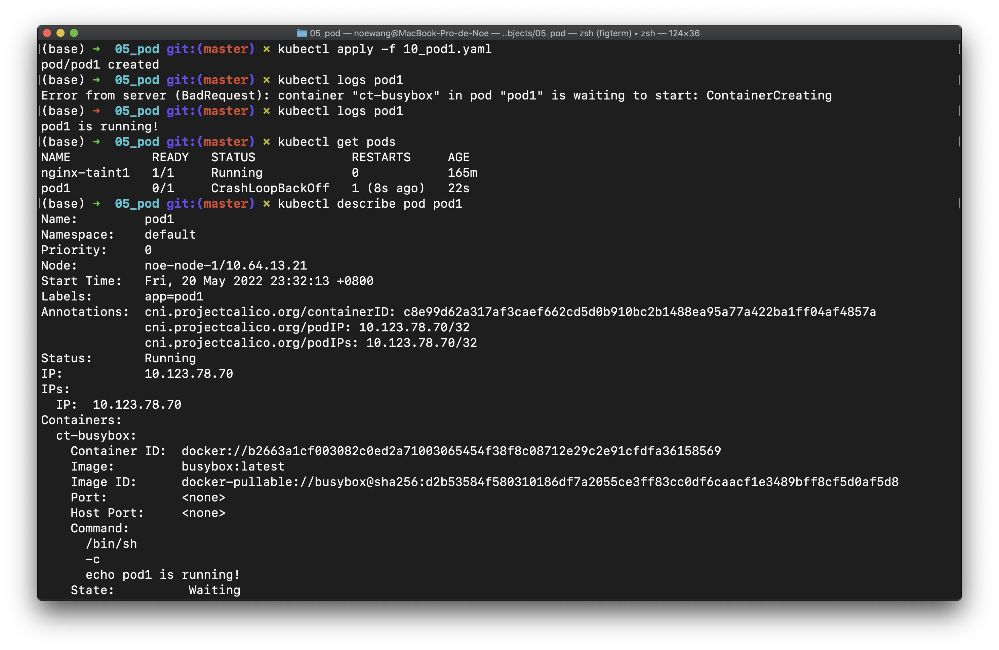

我们观察到，Pod状态会从 Completed 变为 CrashLoopBackOff，原因是 pod 结束后后，因为 RestartPolicy 为 Always，pod重新启动后再次退出，循环往复。


`kubectl delete -f <NAME>.yaml`可以删除由`kubectl apply -f <NAME>.yaml`应用的配置

Pod用完之后要记得删！！！

```shell
kubectl delete -f 10_pod1.yaml
```

##### 11_pod1.yaml

`11_pod1.yaml` 中，`restartPolicy`被设为了OnFailure

```shell
kubectl apply -f 11_pod1.yaml
kubectl logs pod1 # show the echo message
kubectl get pods # 状态会为 Completed
kubectl delete -f 11_pod1.yaml # 记得先截屏，最后再删除pod
```

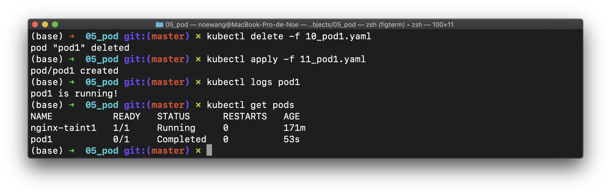

##### 12_pod1.yaml

`12_pod1.yaml` 定义了`command: ['/bin/sh', '-c', 'echo pod1 is running! & sleep 3000']`，即先打印一句"pod1 is running!"，然后休眠3000秒，在此期间，容器将持续运行但不占用CPU

```shell
kubectl apply -f 12_pod1.yaml
kubectl get pods # 状态会为 Running
kubectl exec pod1 -- env # 打印环境变量，这是busybox提供的工具
kubectl exec -it pod1 -- /bin/sh
```

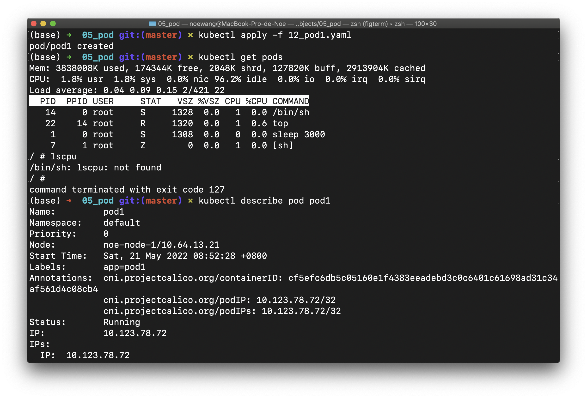

按下`Ctrl-D`退出`/bin/sh`

```shell
kubectl describe pod pod1 # get IP address
[noe-node-0] ping 10.123.78.72 # can ping pod1
```

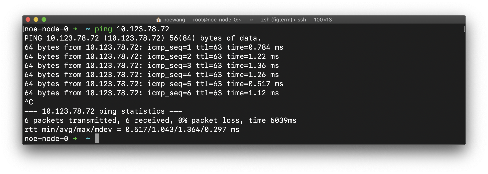

```shell
[noe-node-1] ping 10.123.78.72 # can ping pod1
```


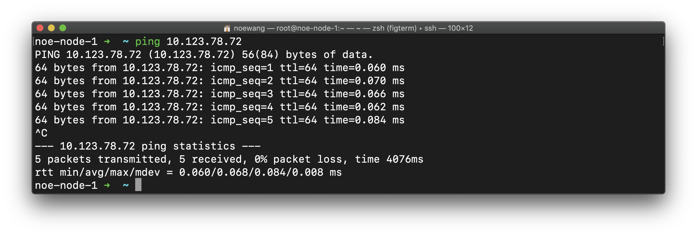

```shell
[noe-node-2] ping 10.123.78.72 # can ping pod1
```

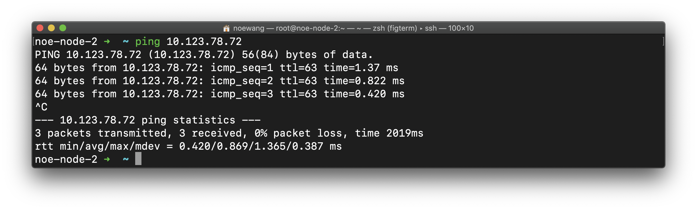

可以看到，由于calico插件的作用，各个node都可以ping通该Pod。其中node1的延迟最小且稳定。


> $POD1_IP 为`kubectl describe pod pod1`得到的Pod IP地址

如果节点没有配置NodePort/LoadBalancer而只有ClusterIP，那么是无法从集群外访问Pod的。这时候就必须登陆到集群才能Ping该Pod

> 由于该Pod执行的命令是`sleep 3000`，无法响应K8S给出的信号从而*优雅地退出*，因此删除容器将会等待较长时间

经过尝试，我们无法通过 `kubectl exec -it pod1 -- /bin/sh`进入pod，通过`kill`或者`kill -9` + `PID`来结束pod里面的进程。


#### 5.6.2 Pod with 2 Containers and shared EmptyDir

##### 13_pod2.yaml

该文件增加了一个nginx服务。两个服务通过`volumeMounts`挂载名称为`name`的数据卷。这个卷是空的

```yaml
apiVersion: v1
kind: Pod
metadata:
  name: pod2
spec:
  volumes:
    - name: data
      emptyDir: {}

  restartPolicy: Never
  containers:
  - name: ct-nginx
    image: nginx:latest
    imagePullPolicy: IfNotPresent
    volumeMounts:
    - name: data
      mountPath: /usr/share/nginx/html

  - name: ct-busybox
    image: busybox:latest
    imagePullPolicy: IfNotPresent
    volumeMounts:
    - name: data
      mountPath: /data
    command: ['/bin/sh', '-c', 'echo Hello from the pod2/ct-busybox > /data/index.html && sleep 3000']
```

在终端运行

```shell
kubectl create -f 13_pod2.yaml
kubectl exec -it pod2 -c ct-nginx -- /bin/bash
[ct-nginx] $ apt update && apt install curl && curl localhost 
# get the hello message
```

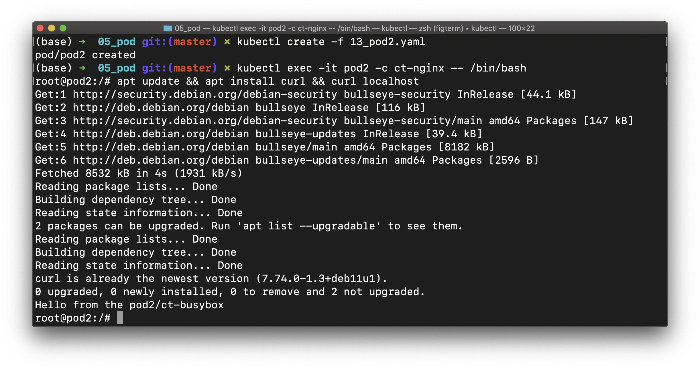

```shell
# Ctrl + D 退出pod2的终端
kubectl get pods -o wide | grep pod2 # get IP address
[noe-node-0] $ curl $POD2_IP # get the hello message
```

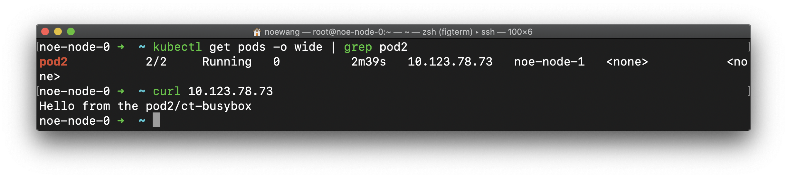

> $POD2_IP 需要修改成Pod的实际IP，上面实验里面是`10.123.78.73`

- `Kubectl create -f` vs. `kubectl apply -f`

`create -f`等价于`apply -f`。`kubectl create`命令可创建新资源。 

因此，如果再次运行该命令，则会抛出错误，因为资源名称在名称空间中应该是唯一的。

`kubectl apply`命令将配置应用于资源。 如果资源不在那里，那么它将被创建。 kubectl apply命令可以第二次运行.

我们接下来将修改网页的内容

```shell
kubectl exec -it pod2 -c ct-busybox -- /bin/sh
[ct-nginx] $ echo "Goodbye from the pod2" > /data/index.html
[noe-node-0] curl $POD2_IP # get the new message
```

网页的内容发生了改变

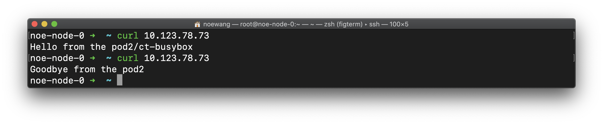

#### 5.6.3 Pod with resource limitation

##### 15_pod3.yaml

```yaml
apiVersion: v1
kind: Pod
metadata:
  name: pod3
spec:
  containers:
    - name: ct-stress
      image: polinux/stress
      imagePullPolicy: IfNotPresent
      resources:
        requests:
          memory: "50Mi" # 要求的内存
        limits:
          memory: "100Mi" # 允许的最大内存
      command: ["stress"]
      args: ["--vm", "1", "--vm-bytes", "250M", "--vm-hang", "1"]
```

`15_pod3.yaml`启动了一个`stress --vm 1 --vm-bytes 250M --vm-hang 1`进程。

`--vm 1`产生一个进程，才进程不断分配和释放内存，内存大小由`--vm-bytes 250M`定为250MB。

`--vm-hang 1`指定每个消耗内存的进程在分配到内存后转入睡眠状态 1秒

这样的命令明显超出了配置文件中的限制，因此会被杀死.

```shell
kubectl apply -f 15_pod3.yaml 
# 这个 pod 状态变为 OOMKilled，因为它是内存不足所以显示容器被杀死
```

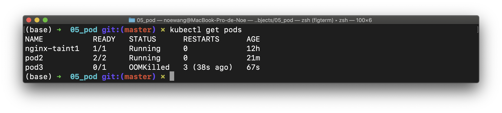

#### 5.6.4 Pod with Liveness Check

这一系列实验测试了K8S提供的容器监控手段。

##### 5.6.4.1 Liveness CMD Check

`20_pod4-liveness-cmd.yaml`定义了`sh -c cat /tmp/healthy`作为监控手段

```yaml
apiVersion: v1
kind: Pod
metadata:
  labels:
    test: liveness
  name: pod4-liveness-cmd
spec:
  containers:
    - name: liveness
      image: busybox:latest
      imagePullPolicy: IfNotPresent
      command: ['sh', '-c', 'touch /tmp/healthy; sleep 20; rm -rf /tmp/healthy; sleep 20']
      livenessProbe:
        exec:
          command: ['sh', '-c', 'cat /tmp/healthy']
        initialDelaySeconds: 5
        periodSeconds: 5

```

在终端运行

```shell
kubectl apply -f 20_pod4-liveness-cmd.yaml
kubectl get pods -w #
```

我们发现 liveness-exec 的 RESTARTS 在 20 秒后由于检测到不健康一直在重启

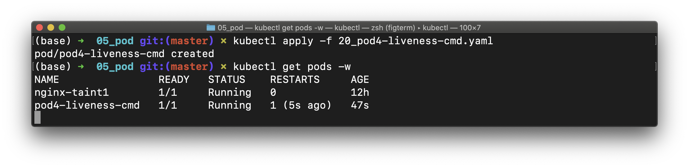

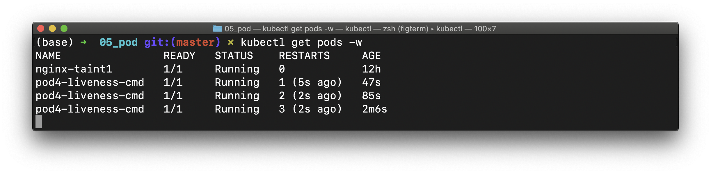

> `kubectl get pods -w` 相当于使用watch命令持续检测，容器的restart策略令其不断重启
>
> `kubectl delete pod pod4-liveness-cmd` 可以删除该Pod

##### 5.6.4.2 Liveness HTTP Check

`21_pod5-liveness-http.yaml`定义了`POD_IP:8080/helthz`作为监控手段，并且规定了`httpHeader`。`initialDelaySeconds： 3`表示第一次查询等待3秒，`periodSeconds: 3`表示每次查询间隔3s

```yaml
apiVersion: v1
kind: Pod
metadata:
  labels:
    test: liveness
  name: pod5-liveness-http
spec:
  containers:
    - name: liveness
      image: registry.hub.docker.com/davidliyutong/liveness:latest # 此处已修改镜像源
      imagePullPolicy: IfNotPresent
      command: '/server'
      livenessProbe:
        httpGet:
          path: /healthz
          port: 8080
          httpHeaders:
            - name: X-Custom-Header
              value: Awesome
        initialDelaySeconds: 3
        periodSeconds: 3

```

`k8s.gcr.io/liveness` 镜像会使 /healthz 服务时好时坏。配置文件中的`k8s.gcr.io/liveness`镜像国内几乎无法下载，可以更改为`registry.hub.docker.com/davidliyutong/liveness`

```shell
kubectl apply -f 21_pod5-liveness-http.yaml
kubectl get pods -w
[noe-node-0] $ curl $POD_IP:8080/healthz
```

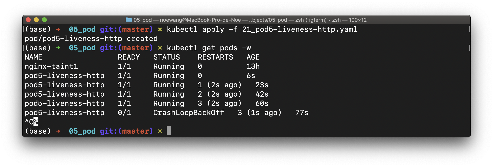

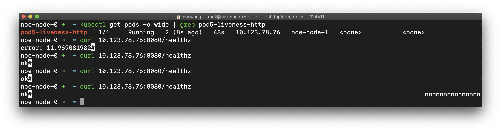

> - $POD_IP 要修改为可访问的IP
> - `initialDelaySeconds` 要合理设置
> - metrics-server 就采取了这种方法通告自己存活

##### 5.6.4.3 Liveness TCP Check

TCP 存活检查的实现，和HTTP检查大同小异

```shell
kubectl apply -f 22_pod6-liveness-tcp.yaml
kubectl get pods
```

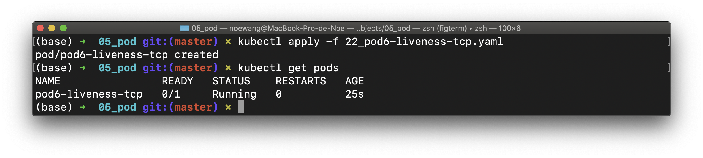

#### 5.6.5 Pod with NodeSelector

`30_pod7-nodeSelector.yaml`中定义的Pod没什么特别的，只是多了`nodeSelector.disktype: ssd`这一键值对。因此K8S在调度过程中就会寻找包含`{disktype: ssd}`这一标签的节点

```yaml
apiVersion: v1
kind: Pod
metadata:
  name: pod7-node-selector
  labels:
    env: test
spec:
  containers:
    - name: nginx
      image: nginx
      imagePullPolicy: IfNotPresent
  nodeSelector:
    disktype: ssd # 新增
```

终端运行

```shell
kubectl label nodes noe-node-2 disktype=ssd
kubectl get nodes noe-node-2 --show-labels
kubectl apply -f 30_pod7-nodeSelector.yaml
kubectl get pod -o wide
```

> - `noe-node-2` 是节点的名称
> - 可以用`kubectl label nodes node1 disktype-`清除标签
> - 可以用`kubectl label nodes node1 disktype=hdd --overwrite`覆盖标签
> - 如果没有节点有该标签，调度将会失败。Pod将会一直处于Pending的状态

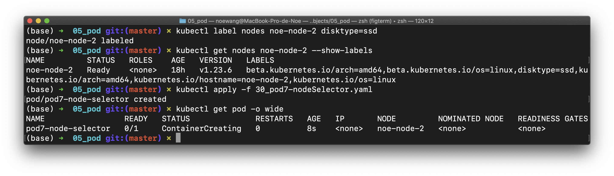

我们做个小实验，现在我们将`noe-node-2`的标签改成`disktype=hdd`，所以当前没有节点满足`disktype=ssd`标签，如下图所示，该Pod一直处于Pending状态

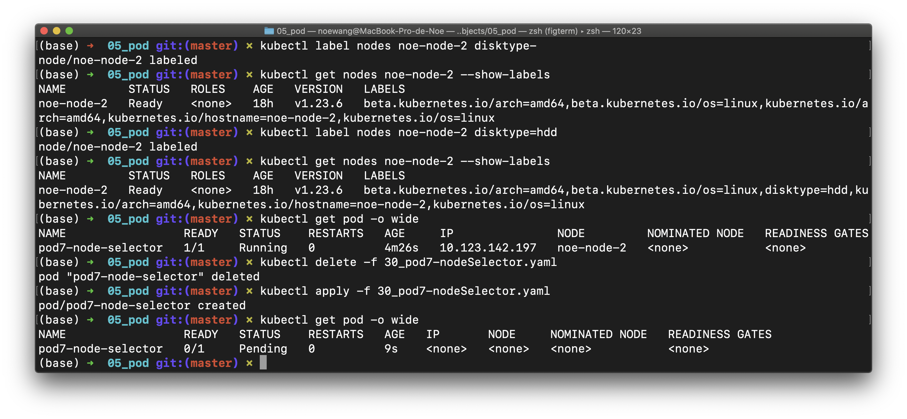

#### 5.6.6 InitContainer

`initContainers` 可以启动一个容器在主容器前做初始化工作。该容器执行完工作后将会退出，而且不会触发K8S的容器失败重启机制

##### 40_pod8-initcontainer.yaml

```yaml
apiVersion: v1
kind: Pod
metadata:
  name: pod8-initcontainer
  labels:
    app: myapp
spec:
  volumes:
    - name: storage
      emptyDir: {}
  containers:
    - name: myapp-containers
      image: radial/busyboxplus
      imagePullPolicy: IfNotPresent
      volumeMounts:
        - name: storage
          mountPath: /storage
      command: ['sh', '-c', 'if [ -f /storage/testfile ] ; then touch /storage/testfile && sleep 3600 ; fi']
  initContainers:
    - name: init-containers
      image: radial/busyboxplus
      imagePullPolicy: IfNotPresent
      volumeMounts:
        - name: storage
          mountPath: /storage
      command: ['sh', '-c', 'touch /storage/testfile && sleep 10']

```

终端运行

```shell
kubectl apply -f 40_pod8-initcontainer.yaml 
# the init CT creates the file 'testfile'
kubectl exec pod8-initcontainer -- ls /storage/ 
# the testfile exists
```

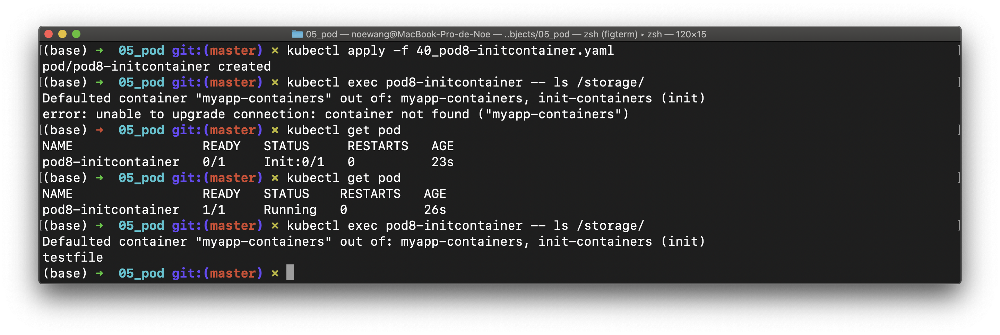

> 不要太急，要等pod进行完init才可以ls

#### 5.6.7 Static Pod

##### 42_pod9-static.yaml

kubelet会自动启动`/etc/kubernetes/manifests/`下配置文件定义的 static pod

```shell
[noe-node-0] $ mv 42_pod9-static.yaml /etc/kubernetes/manifests/ 
kubectl get pod
kubectl delete pod pod9-static-noe-node-0
kubectl get pod # 看到有删除该 pod，但是不会生效
```

如下图所示，能能看到该pod已被删除，但是get pod依然存在，并且可以running

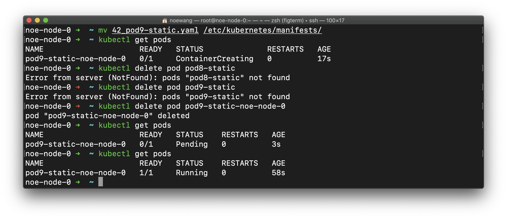

设置stait pod的重点是将pod配置文件存放在控制平面节点的`/etc/kubernetes/manifests/`目录下。如果是远程访问节点，就需要将该文件通过scp等工具拷贝到相应目录：

```shell
scp 42_pod9-static.yaml root@noe-node-0:/etc/kubernetes/manifests/
```

> 切不可删除`/etc/kubernetes/manifests/`目录来取消`42_pod9-static.yaml`配置文件的加载。这是因为该目录下还有很多其他关键的staitc pod，但是可以删除这个文件：
>
> ```shell
> rm /etc/kubernetes/manifests/42_pod9-static.yaml 
> ```
