## 7. Service

### 7.1 Introduction

Service 的主要作用是作为 Pod 的代理入口，从而代替Pod对外暴露一个固定的网络地址。 K8s 之所以需要 Service，一方面是因为 Pod 的 IP 不是固定的，另一方面则是因为一组 Pod 实例之间总会有负载均衡的需求。

Service 是应用服务的抽象，通过 labels 为应用提供负载均衡和服务发现。被 Service 的 selector 选中的 Pod，就称为 Service 的 Endpoints，由 kube-proxy 负责将服务 IP 负载均衡到这些 endpoints 上，可以使用 kubectl get ep 命令看到它们。只有处于 Running 状态，且 readinessProbe 检查通过的 Pod，才会出现在 Service 的 Endpoints 列表里。并且，当某一个 Pod 出现问题时，k8s 会自动把它从 Service 里摘除掉。每个 Service 都会自动分配一个 cluster IP（仅在集群内部可访问的虚拟地址）和 DNS 名，其他容器可以通过该地址或 DNS 来访问服务，而不需要了解后端容器的运行。

#### 7.1.1 IP & Port

- IP
    - podIP: each pod's IP
    - clusterIP: each service's IP (on the clusterIP mode)
    - nodeIP: hosting server IP
- Port
    - containerPort: container's exposed port
    - targetPort: 容器/Pod用到的端口，`<pod-ip>:targetPort`
    - port: Service用到的端口，`<cluster-ip>:port`
    - nodePort: node用到的端口，`<node-ip>:nodePort`

#### 7.1.2 实现原理

Service 是由 kube-proxy 组件，加上 iptables 来共同实现的。

[](https://github.com/rebirthmonkey/k8s/blob/master/20_objects/15_service/figures/image-20211203081416541.png)


kube-proxy 就可以通过 Service 的 Informer 感知到这样一个 Service 对象的添加。而作为对这个事件的响应，它就会在宿主机上创建这样一条 iptables 规则

```shell
-A KUBE-SERVICES -d 10.0.1.175/32 -p tcp -m comment --comment "default/hostnames: cluster IP" -m tcp --dport 80 -j KUBE-SVC-NWV5X2332I4OT4T3
```

这条 iptables 规则的含义是：凡是目的地址是 10.0.1.175（Service的VIP）、目的端口是 80 的 IP 包，都应该跳转到另外一条名叫 KUBE-SVC-NWV5X2332I4OT4T3的 iptables 链进行处理。

```shell
-A KUBE-SVC-NWV5X2332I4OT4T3 -m comment --comment "default/hostnames:" -m statistic --mode random --probability 0.33332999982 -j KUBE-SEP-WNBA2IHDGP2BOBGZ
-A KUBE-SVC-NWV5X2332I4OT4T3 -m comment --comment "default/hostnames:" -m statistic --mode random --probability 0.50000000000 -j KUBE-SEP-X3P2623AGDH6CDF3
-A KUBE-SVC-NWV5X2332I4OT4T3 -m comment --comment "default/hostnames:" -j KUBE-SEP-57KPRZ3JQVENLNBR
```

KUBE-SVC-NWV5X2332I4OT4T3 规则是3条规则的集合，这三条链指向的最终目的地，其实就是这个 Service 代理的三个 Pod。所以这一组规则，就是 Service 实现负载均衡的位置。

```shell
-A KUBE-SEP-57KPRZ3JQVENLNBR -s 10.244.3.6/32 -m comment --comment "default/hostnames:" -j MARK --set-xmark 0x00004000/0x00004000
-A KUBE-SEP-57KPRZ3JQVENLNBR -p tcp -m comment --comment "default/hostnames:" -m tcp -j DNAT --to-destination 10.244.3.6:9376

-A KUBE-SEP-WNBA2IHDGP2BOBGZ -s 10.244.1.7/32 -m comment --comment "default/hostnames:" -j MARK --set-xmark 0x00004000/0x00004000
-A KUBE-SEP-WNBA2IHDGP2BOBGZ -p tcp -m comment --comment "default/hostnames:" -m tcp -j DNAT --to-destination 10.244.1.7:9376

-A KUBE-SEP-X3P2623AGDH6CDF3 -s 10.244.2.3/32 -m comment --comment "default/hostnames:" -j MARK --set-xmark 0x00004000/0x00004000
-A KUBE-SEP-X3P2623AGDH6CDF3 -p tcp -m comment --comment "default/hostnames:" -m tcp -j DNAT --to-destination 10.244.2.3:9376
```

这三条链，其实是三条 DNAT 规则。而 DNAT 规则的作用，就是在 PREROUTING 检查点之前，也就是在路由之前，将流入 IP 包的目的地址和端口，改成–to-destination 所指定的新的目的地址和端口。可以看到，这个目的地址和端口，正是被代理 Pod 的 IP 地址和端口。这样，访问 Service VIP 的 IP 包经过上述 iptables 处理之后，就已经变成了访问具体某一个后端 Pod 的 IP 包了。这些 Endpoints 对应的 iptables 规则，正是 kube-proxy 通过监听 Pod 的变化事件，在宿主机上生成并维护的。

但 Service 的访问在 k8s 集群之外是无效的。所谓 Service 的访问入口，其实就是每台宿主机上由 kube-proxy 生成的 iptables 规则，以及 kube-dns 生成的 DNS 记录。而一旦离开了这个集群，这些信息对用户来说，也就自然没有作用了。

#### 7.1.3 IPVS

IPVS 模式的工作原理，其实跟 iptables 模式类似。当我们创建了前面的 Service 之后，kube-proxy 首先会在宿主机上创建一个虚拟网卡（叫作：kube-ipvs0），并为它分配 Service VIP 作为 IP 地址。而接下来，kube-proxy 就会通过 Linux 的 IPVS 模块，为Pod的3个 IP 地址设置三个 IPVS 虚拟主机，并设置这三个虚拟主机之间使用轮询模式 (rr) 来作为负载均衡策略。

一个集群是否ipvs，取决于它的配置方式。

### 7.2 类型

K8S集群Service类型有多种

- ClusterIP 分配一个集群内IP（默认）
- NodePort 绑定到一个Node的IP
- ExternalName 使用外部DNS
- LoadBalancer 使用外部负载均衡

#### 7.2.1 ClusterIP

K8S在这种服务下为Pod产生一个内部的一个虚拟 IP，是默认的服务方式。Only for the k8s cluster access。

#### 7.2.2 NodePort

NodePort为服务供集群外部调用。其将 Service 承载在 Node 的静态端口上，端口号和 Service 一一对应，那么集群外的用户就可以通过 `NodeIP:Port` 的方式调用到 Service（前提是该IP可以从公网访问）

如果你不显式地声明 nodePort 字段，ks8 就会为你分配随机的可用端口来设置代理。这个端口的范围默认是 30000-32767

对于 NodePort，kube-proxy 要做的就是在每台宿主机上生成这样一条 iptables 规则：

```shell
-A KUBE-POSTROUTING -m comment --comment "kubernetes service traffic requiring SNAT" -m mark --mark 0x4000/0x4000 -j MASQUERADE
```

#### 7.2.3 ExternalName

ExternalName Service 是一种特殊类型的 Service，主要用于访问位于集群外部的服务（例如跨Namespace的Pod间使用name互相访问）。 它的作用是返回集群外服务的域名/主机名。它没有 Selector，也没有定义任何Port 或是 Endpoints。

#### 7.2.4 LoadBalancer

在NodePort基础上，控制Cloud Provider创建LB来向节点引流

### 7.3 其他

除了上述几种类型，实践中还有一下几种操作方式

#### 7.3.1 externalIP

给Service直接分配公有IP。需要和外部路由配合确保确保访问这个IP的数据包能够从集群外路由到集群内的某个节点上。之后就是进入节点哪通讯的范畴了。

根据 Service 的规定，`externalIPs` 可以同任意的 ServiceType 来一起指定

#### 7.3.2 Headless Service

有时不需要或不想要负载均衡，以及单独的 Service IP。 遇到这种情况，可以通过指定 Cluster IP（spec.clusterIP）的值为 "None" 来创建 Headless Service。客户端通过查询集群的DNS（默认是10.96.0.10）确定Pod的IP，而不分配服务IP。

### 7.4 CMD

- list service

    - `kubectl get services`: list services
    - `kubectl get services SVC_ID`: list a service

- describe services

    - `kubectl describe services`
    - `kubectl describe services SVC_ID`: describe a service

- create a service

    - ```
        kubectl expose deployment DEP_ID --type NodePort --port 8080
        ```

        : expose a deployment

        - `curl NODE_IP:NODE_PORT`: test

    - `kubectl apply -f svc1.yaml`: create a service from a YAML file

- delete a service

    - `kubectl delete service SVC_ID`
    - `kubectl delete service -l name=label`: delete a service by label

- list endpoints

    - `kubectl get endpoints`
    - `kubectl get endpoints SVR_ID`


### 7.5 Lab

本实验的工作目录是：`15_service/`

#### 7.5.1 NodePort

##### 10_service1-nodePort.yaml

一些解读：

```yaml
apiVersion: v1
kind: Service
metadata:
  name: service1-node-port
spec:
  selector:
    app: nginx # 选择了上文定义的带有app=nginx标签的Pod
  type: NodePort # 指定Type
  ports:
  - protocol: TCP # 转发TCP端口
    targetPort: 80 # Pod内的80
    port: 8888 # Node 的 8888
    nodePort: 30888 # 集群的出口的30888
```

> 为什么需要selector：因为service可以和pod分开配置。当分开配置的时候，就非常有必要指定service作用的Pod了。而这是通过selector完成的。

```shell
kubectl apply -f 10_service1-nodePort.yaml
kubectl get svc -o wide  # get the random node_port
curl 10.119.12.1:30888 # it works, even with Docker-for-Desktop
```

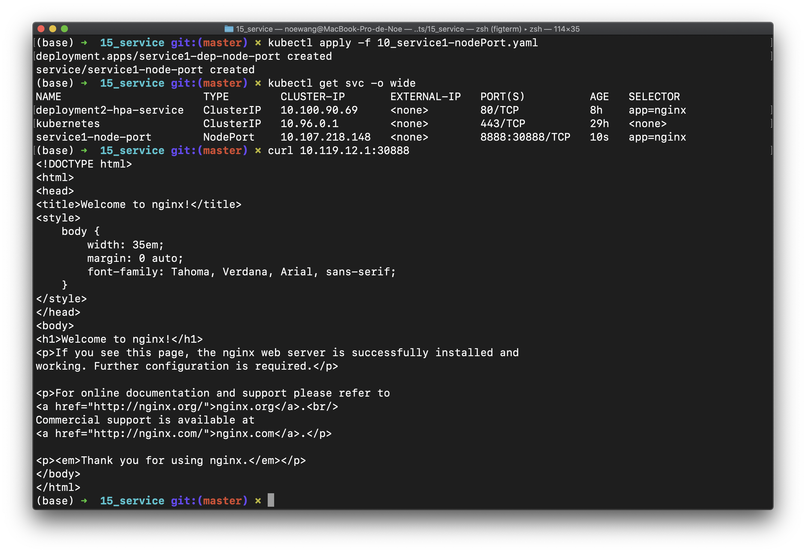

#### 7.5.2 ClusterIP

##### 15_service2-clusterIP.yaml

```yaml
...
apiVersion: v1
kind: Service
metadata:
  name: service2-cluster-ip
spec:
  selector:
    app: nginx
  type: ClusterIP
  ports:
  - protocol: TCP
    targetPort: 80
    port: 8889
```

该配置文件没有在集群IP上创建端口

```shell
kubectl apply -f 15_service2-clusterIP.yaml
kubectl get svc -o wide # get the clusterIP and port of the service
kubectl get pods -o wide
```

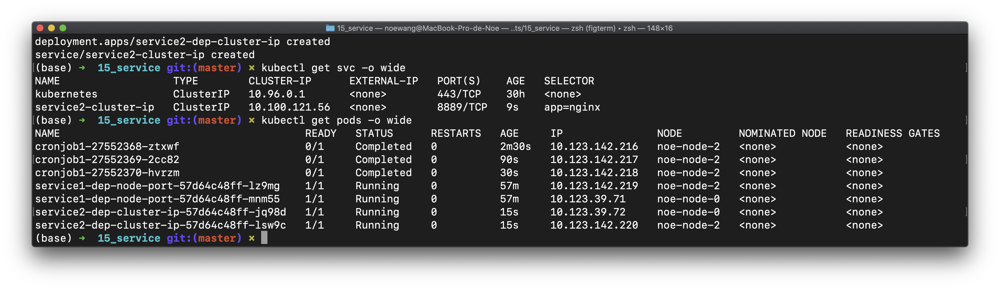

可以看到该服务被分配了`10.100.121.56`的ServiceIP，并且被调度到了node2上。使用curl/ping测试可以发现

```shell
curl 10.119.12.1:80  # 从集群外是无法访问的  
curl 10.119.12.3:80
curl 10.119.12.4:80
[noe-node-0] $ curl 10.100.121.56:8889 # clusterIP:clusterPort  
[noe-node-0] $ curl 10.123.39.72:80 # podIP:podPort
[noe-node-0] $ ping podIP
[noe-node-0] $ ping clusterIP
```

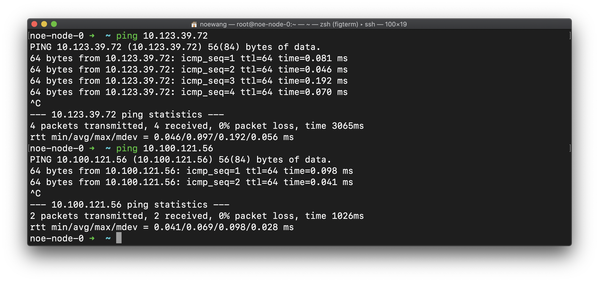

- 该服务的ClusterIP/ServiceIP只能在集群内部访问
- ClusterIP不同于NodeIP，并没有绑定到Node上，不能通过node的主机名访问
- 可以ping通ClusterIP（一般是不行的）
- 存在名为kubernetes的service，提供了`10.96.0.1`集群的DNS

**总结一下**

1. Cluster IP只能和K8S SVC这个对象绑定组成一个具体的通信接口。单独的Cluster IP不具备通信的基础，并且他们属于Kubernetes集群这样一个封闭的空间。
2. 只有使用了IPVS的K8S集群的ClusterIP才能被ping通。如果K8S使用的是iptables，Cluster IP无法被ping，他没有一个“实体网络对象”来响应。但是如果K8S使用了IPVS，则该IP可以被ping，因为IPVS创建了一个虚拟的网卡。
3. 通过Cluster IP，不同SVC下的Pod节点在K8S集群间可以相互访问。

#### 7.5.3 Expose CMD

```shell
kubectl apply -f 20_service3-pod-cmd.yaml
kubectl expose pod pod-service3 --type=NodePort --target-port=80 --port=8888 
```

> `kubectl expose`手动暴露了一个已经部署的Pod，类型是NodePort

我们试图用curl访问该服务，但是失败了

```shell
curl 10.119.12.1:8888 # 10.119.12.1 是noe-node-0的IP
```

这是因为我们没有在expose命令中指定`--node-port`，因此K8S在node上随机选择了端口。我们使用`kubectl get svc -o wide` 查看详情


可以看到该服务`pod-service3`被转发到了`noe-node-2`的`31636`端口。测试之

```shell
kubectl get pods -o wide
curl 10.119.12.4:31636
```

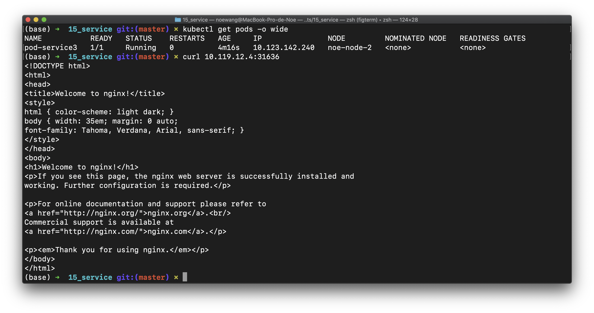

我们也可以在集群上的节点，通过serviceIP/clusterIP:clusterPort来访问该服务

```shell
[noe-node-0] $ curl 10.110.206.217:8888 # 8888 is clusterPort
```

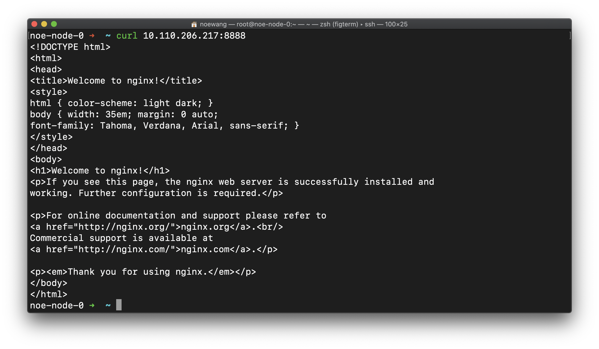

通过命令行指定--nodePort是很麻烦的，需要用到`--overrides`参数

```shell
kubectl expose pod pod-service3 --type=NodePort --target-port=80 --port=8888 \
--overrides '{ "apiVersion": "v1","spec":{"ports": [{"port":8888,"protocol":"TCP","targetPort":80,"nodePort":38888}]}}'
```

#### 7.5.4 Health Check

如果没有 health check，有些服务会报错

```shell
kubectl apply -f 30_service4-health-check.yaml
kubectl expose deployment service4-dep-health-check
kubectl get svc
[noe-node-0] $ curl 10.97.197.237:8080 # doesn't work with Docker-for-Desktop
kubectl get pods
```

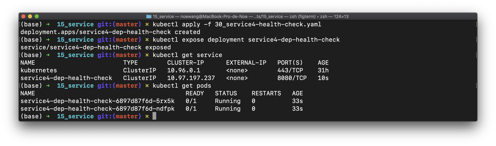

> `10.97.197.237` 为clusterIP，端口为`8080`

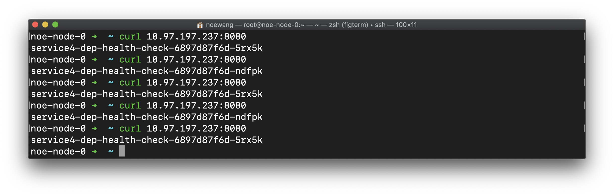

#### 7.5.5 External Service

Endpoint 可以将Service和一个集群外的服务链接。

##### 40_service5-endpoints.yaml

```yaml
kind: Service
apiVersion: v1
metadata:
  name: service5-endpoints
spec:
  ports:
  - protocol: TCP
    targetPort: 30888
    port: 80
```

> 我们没有指定该Service的type，因此创建的是ClusterIP服务
>
> 我们没有指定该Service的`selector`，因此该Service只能指向外部服务

##### 41_endpoints.yaml

```yaml
apiVersion: v1
kind: Endpoints
metadata:
  name: service5-endpoints  # should be the same as the service name
subsets:
  - addresses:
    - ip: 10.64.13.20 # noe-node-0的IP
    ports:
    - port: 8000
```

官方文档的说法是，Endpoint在一下几种情况下发挥作用：

1. 希望在生产环境中使用外部的数据库集群，但测试环境使用自己的数据库。
2. 希望服务指向另一个 名字空间（Namespace） 中或其它集群中的服务。
3. 你正在将工作负载迁移到 Kubernetes。 在评估该方法时，你仅在 Kubernetes 中运行一部分后端。

为了达到这几个目的，我们可以：

1. 创建一个**抽象的**Service，约定该Service提供服务的IP和端口（clusterIP:clusterPort），供前端访问。
2. 创建一个`Endpoint`，将这个Service转发到其他应用上去。通过修改Endpoint，我们可以更换这个被转发的应用。只需要修改Endpoint就可以从测试阶段转移到生产阶段，而无需修改Service。

自然的，Endpoint需要和Service建立联系。因此他们的metadata.name必须一致。我们可以发现，Endpoint处理的是服务的抽象和接口

> Endpoint 中的name要和Service中的一样

由于我们是多节点的K8S集群，因此需要修改`41_endpoints.yaml`中的地址（一个有着多节点集群的本地回环地址是不明确的），填写一个确定的服务的IP地址。这个IP地址可以是一个ClusterIP服务的地址，也可以是一个NodePort服务的地址，甚至是集群外的地址。这里我们选择在noe-node-0（IP:10.64.13.10)）上启动一个python web server

```shell
kubectl apply -f 40_service5-endpoints.yaml
kubectl apply -f 41_endpoints.yaml
kubectl get endpoints # list
kubectl describe endpoints service5-endpoints # ep use the same name as svc
```

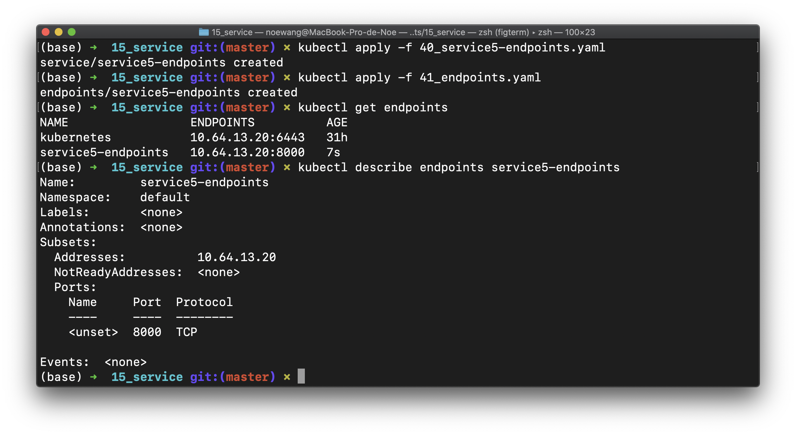

我们可以查看服务情况

```shell
$ kubectl get svc
NAME                 TYPE        CLUSTER-IP   EXTERNAL-IP   PORT(S)   AGE
kubernetes           ClusterIP   10.96.0.1    <none>        443/TCP   31h
service5-endpoints   ClusterIP   10.97.99.9   <none>        80/TCP    113s
```

service5-endpoints的ClusterIP为`10.97.99.9`，登陆集群的节点，然后测试该服务

```shell
[noe-node-0] $ python3 -m http.server 8000 # 在terminal 1 上建立8000端口的服务
[noe-node-0] $ curl 10.97.99.9:80 # 在terminal 2
```

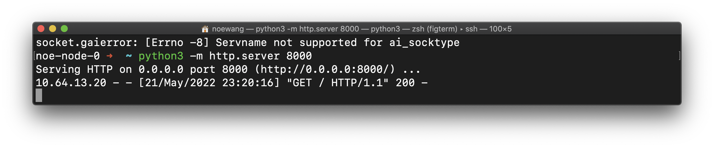

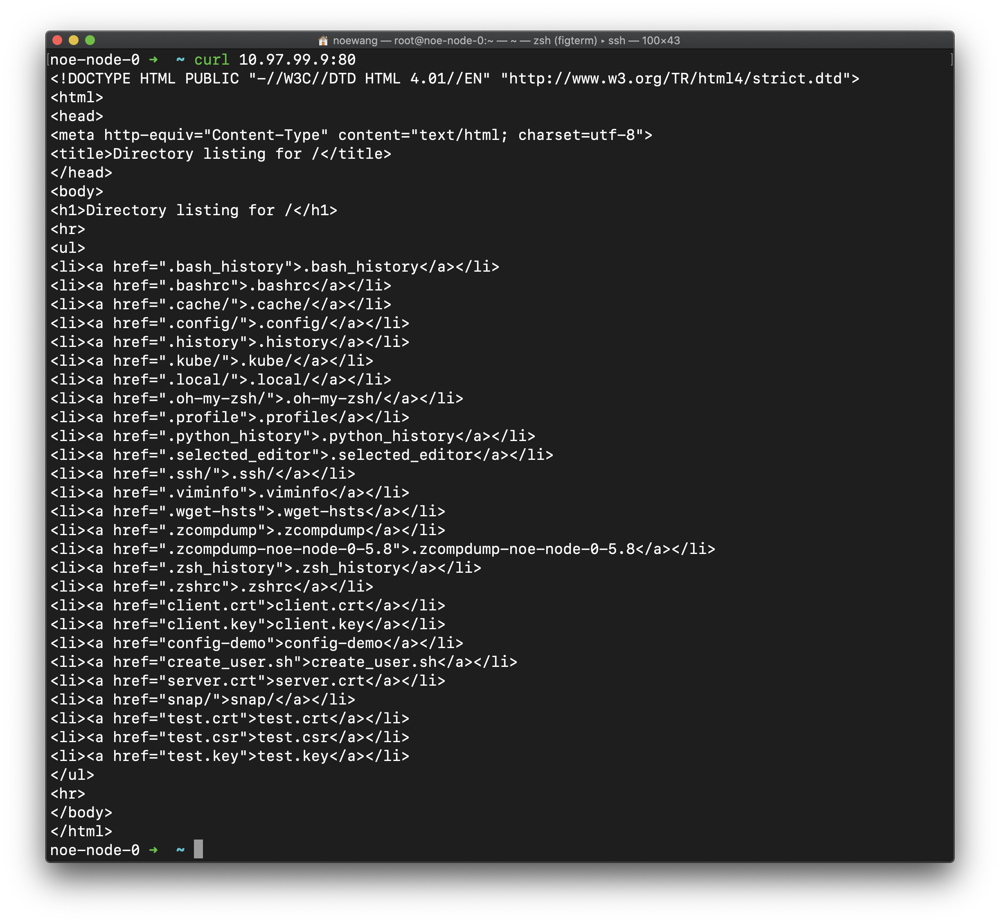

可以看到，我们为运行在`10.64.13.20:8000`上的python web server创建了`10.97.99.9:80`接口。在工程实践时，我们可以很快的设定一个Service的接口，然后分发给前端团队，他们可以在此基础上开发前端应用。

- kubernets的DNS服务就是以这种形式存在的
- 如果需要跟踪多个IP：

```yaml
 - addresses:
     - ip: <IP>
     - ip: <IP>
     - ip: <IP>
```


#### 7.5.6 Headless Service

有时不需要或不想要负载均衡，以及单独的 Service IP。 遇到这种情况，可以通过指定 Cluster IP（spec.clusterIP）的值为 "None" 来创建 Headless Service。客户端通过查询集群的DNS（默认是10.96.0.10）确定Pod的IP，而不分配服务IP。

> 这种Service依赖Label Selector来选择容器

##### 50_svc-headless.yaml

观察配置文件。该文件定义了一个service，它将选择拥有`k8s-app=headless-nginx`的Pod。它还定义了一个Deployment，该Deployment将产生一个拥有两个副本的Nginx服务

```yaml
apiVersion: v1
kind: Service
metadata:
  name: svc-headless
spec:
  selector: # 匹配 spec.template.metadata
    k8s-app: headless-nginx 
  ports:
  - port: 80 # 代理端口
  clusterIP: None # 不分配clusterIP

---

apiVersion: apps/v1
kind: Deployment
metadata:
  name: svc-headless
spec:
  replicas: 2 # 两个副本
  selector:
    matchLabels: # 匹配 spec.template.metadata
      k8s-app: headless-nginx
  template:
    metadata:
      labels:
        k8s-app: headless-nginx # 匹配 spec.selector.matchLabels
    spec:
      containers: # 启动了一个ngixn容器
      - name: nginx
        image: nginx
        imagePullPolicy: IfNotPresent
        ports: 
        - containerPort: 80
        resources:
          limits:
            memory: "200Mi"
            cpu: "500m"
```

应用该配置文件。我们可以看到，K8S为该Service创建了两个Endpoint，分别指向两个副本

```shell
kubectl create -f 50_svc-headless.yaml
kubectl describe svc svc-headless
```

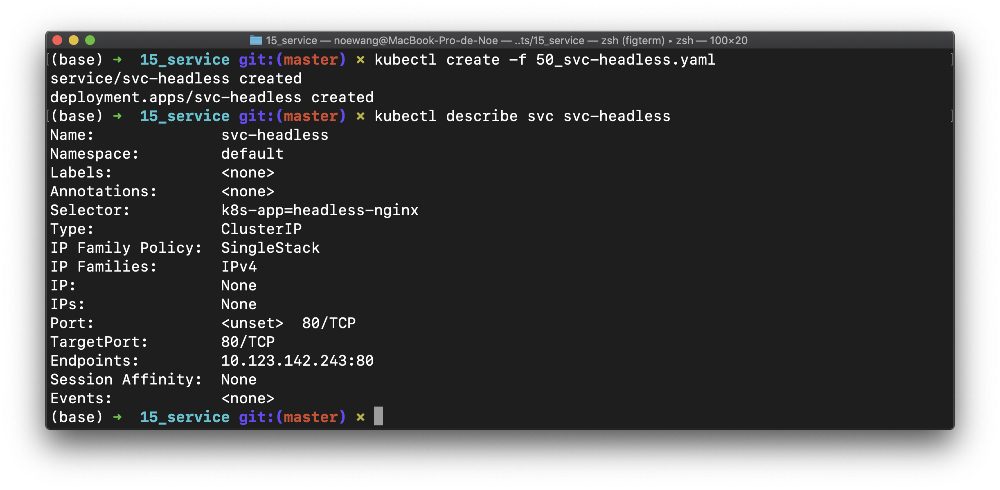

该Service将在K8S集群的DNS中产生一条新的解析`svc-headless.default.svc.cluster.local`。我们可以用nslookup工具查询该名称在K8S的DNS服务器（10.96.0.10）的解析结果

```shell
[noe-node-0] $ nslookup svc-headless.default.svc.cluster.local 10.96.0.10
```

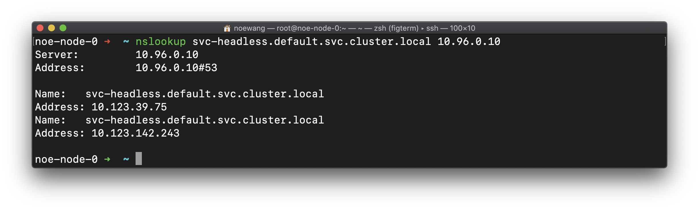

可以看到DNS服务返回了两个IP地址
