## 8. Storage

一些名词的解释

- PersistentVolume（PV）: 持久卷
- PersistentVolumeClaim（PVC）: 持久化卷声明

### 8.1 etcd-based Storage

主要有两种基于ETCD的存储

1. ConfigMap，保存配置文件等非敏感信息
2. Secret，保存敏感信息

#### 8.1.1 ConfigMap

> ConfigMap is an API object used to store non-confidential data in key-value pairs

ConfigMap 是一个持久化的KV数据库，用来保存**非敏感信息**。Pod可以讲ConfigMap用于环境变量、命令行参数，也可以当作卷中的一个配置文件

创建ConfigMap的初中时讲配置数据和程序代码分开存放

> ConfigMap保存的数据量不能超过1MiB

有两种使用ConfigMap的方法

- 变量 (key-value): 如果挂载ConfigMap，则卷中会多出以key为名称的文件，内容是value
- 文件: ConfigMap显示成一个完整的文件

> ConfigMap 常用`cm`代替

##### 8.1.1.1 从yaml创建ConfigMap

首先是对`10_cm1-pod-env.yaml`的一些解读

```yaml
apiVersion: v1
kind: ConfigMap
metadata:
name: cm1 # 名称，独一无二的
data:
special.how: very
special.type: charm

---

apiVersion: v1
kind: Pod
metadata:
name: cm1-pod-env
spec:
restartPolicy: Never
containers:
    - name: ct-debian
    image: debian:latest
    command: [ "/bin/sh", "-c", "env && sleep 3000" ] # 模拟一个持续运行的服务
    env: # 设定容器的环境变量
        - name: SPECIAL_LEVEL_KEY # 环境变量的名称
        valueFrom: # 值的来源
            configMapKeyRef:
            name: cm1 # 和ConfigMap的名字一样
            key: special.how # ConfigMap对应的键值
        - name: SPECIAL_TYPE_KEY
        valueFrom:
            configMapKeyRef:
            name: cm1
            key: special.type
```

```shell
kubectl apply -f 10_cm1-pod-env.yaml 
kubectl exec cm1-pod-env -- env # display the env variables
kubectl delete -f 10_cm1-pod-env.yaml # 删除部署的Pod和ConfigMap
```

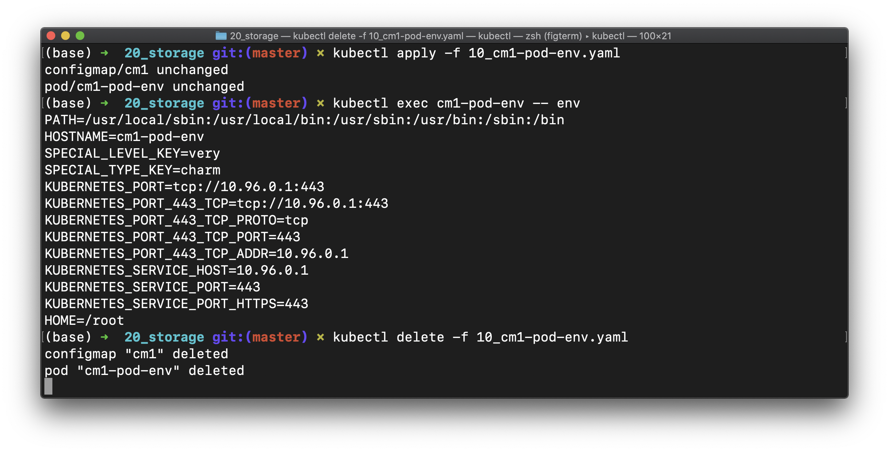

##### 8.1.1.2 从一个主机目录创建ConfigMap

从一个主机目录创建ConfigMap。`./configs`中的内容如下：

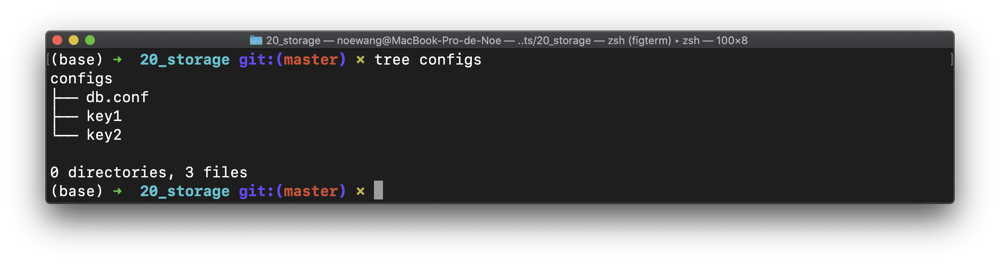

创建命令如下，其中`cm2`为ConfigMap的识别名称

```shell
kubectl create configmap cm2 --from-file=./configs
```

从该目录创建ConfigMap后，使用`kubectl describe cm cm2`可以得到ConfigMap的值

```shell
kubectl describe cm cm2
kubectl delete configmap cm2 # 记得删除
```

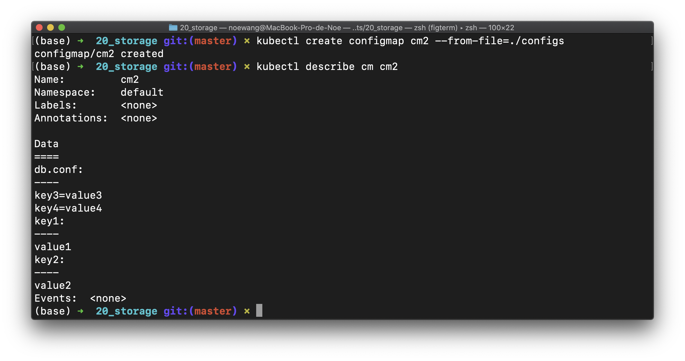

##### 8.1.1.3 从文件创建ConfigMap

```shell
kubectl create configmap cm3 --from-file=./configs/db.conf
kubectl describe cm cm3
kubectl delete configmap cm3
```

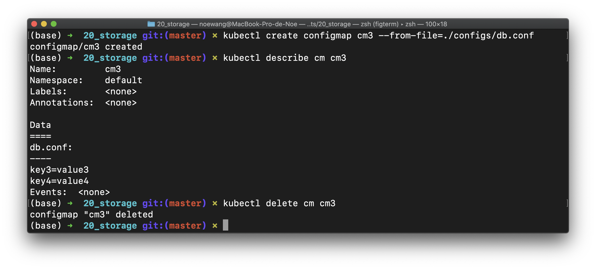

##### 8.1.1.4 从一个键值对创建ConfigMap

```shell
kubectl create configmap cm4 --from-literal=key5=value5 
kubectl describe cm cm4
kubectl delelte cm cm4
```

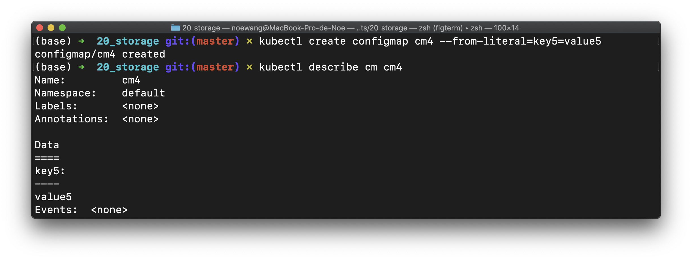

##### 8.1.1.5 可以将ConfigMap的键值对映射成环境变量

对`12_cm1-pod2-env.yaml`的注解如下

```yaml
apiVersion: v1
kind: Pod
metadata:
name: cm1-pod2-env
spec:
restartPolicy: Never
containers:
    - name: ct-busybox # 容器名称
    image: radial/busyboxplus:latest
    imagePullPolicy: IfNotPresent
    command: ["/bin/sh", "-c", "env && sleep 1000000"] 
    # 调用容器内的env命令输出环境变量，保存到输出
    envFrom: # 环境变量的来源
        - configMapRef: # 引用一个ConfigMap
            name: cm1 # ConfigMap的名称
```

```shell
kubectl apply -f 10_cm1-pod-env.yaml 
kubectl apply -f 12_cm1-pod2-env.yaml
kubectl logs cm1-pod2-env # 查看容器的输出
kubectl delete -f 12_cm1-pod2-env.yaml
```

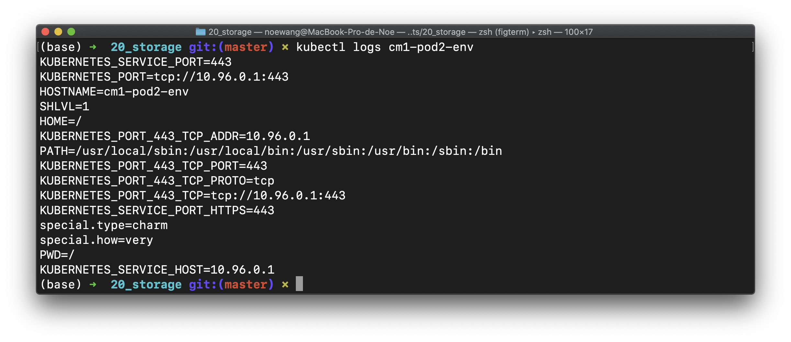

>  可以看到很多`KUBERNETES`开头的环境变量，这些变量可以让容器知道自己运行在K8S集群中，并且访问集群服务

##### 8.1.1.6 将ConfigMap等内容以环境变量的形式传递

可以选择传递哪些值、以怎样的名称传递。

```yaml
apiVersion: v1
kind: Pod
metadata:
name: cm1-pod3-env
spec:
restartPolicy: Never
containers:
    - name: ct-busybox
    image: radial/busyboxplus:latest
    imagePullPolicy: IfNotPresent
    command: ["/bin/sh", "-c", "env && sleep 3000"]
    env:
        - name: SPECIAL_LEVEL_KEY # 环境变量名
        valueFrom:
            configMapKeyRef:
            name: cm1
            key: special.how
        - name: SPECIAL_TYPE_KEY
        valueFrom:
            configMapKeyRef:
            name: cm1
            key: special.type
```

>  和`10_cm1-pod-env.yaml`中的配置大同小异，但是引用了先前创建的ConfigMap，而非同一个YAML配置文件中的ConfigMap

```shell
kubectl create -f 14_cm1-pod3-env.yaml
kubectl logs cm1-pod3-env
kubectl delete -f 14_cm1-pod3-env.yaml
```

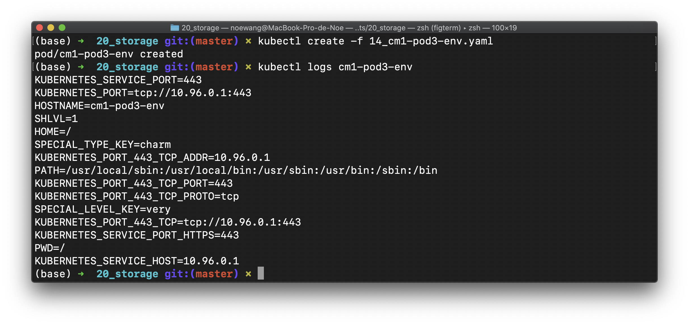

##### 8.1.1.7 将ConfigMap的内容以文件的形式传递

 key-->文件名，value-->文件的内容

```yaml
apiVersion: v1
kind: Pod
metadata:
name: cm1-pod4-vol
spec:
volumes:
    - name: config-vol # 新建卷的名字
    configMap: # 卷的内容由ConfigMap决定
        name: cm1 # 内容来自cm1

restartPolicy: Never
containers:
    - name: ct-busybox
    image: radial/busyboxplus:latest
    imagePullPolicy: IfNotPresent
    command: ["/bin/sh", "-c", "sleep 3000"]
    volumeMounts: # 创建了一个卷的挂载点
    - name: config-vol # 挂载的卷名称，和volume.name一致
        mountPath: /etc/config # 容器内的路径
```

终端运行

```shell
kubectl create -f 16_cm1-pod4-vol.yaml
kubectl exec cm1-pod4-vol -- ls /etc/config
```

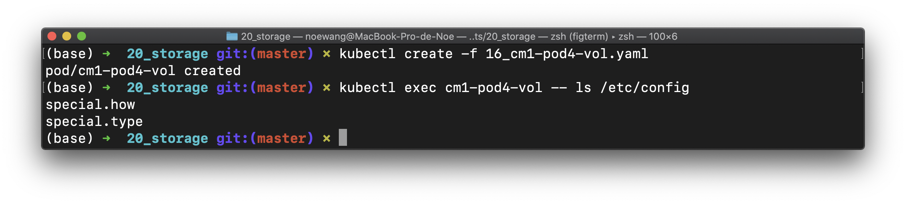

```shell
kubectl describe pods cm1-pod4-vol
kubectl delete -f 16_cm1-pod4-vol.yaml
```

可以看到该Pod包含一个Volume

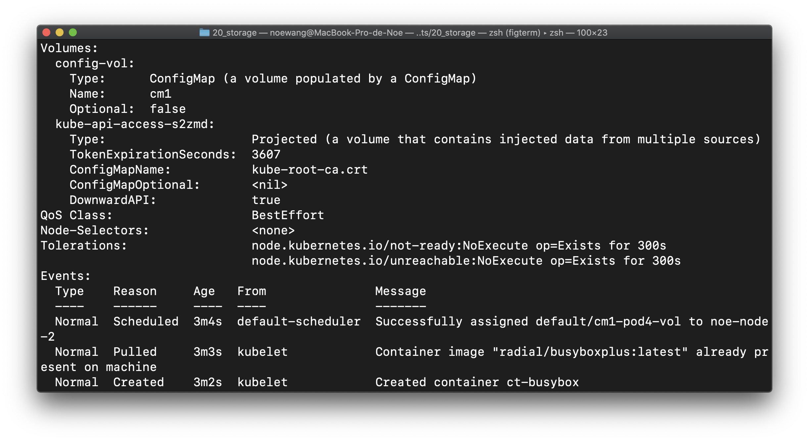

#### 8.1.2 Secret

Secret 是用来保存和传递密码、密钥、认证凭证这些敏感信息的对象。使用 Secret 的好处是可以避免把敏感信息明文写在配置文件（常常是用版本控制软件管理的，且其访问的权限设定的较为宽泛）里。而在配置文件中通过 Secret 对象引用这些敏感信息。kubeadm默认生成的admin.conf中，证书数据就是被base64编码过的。

这种方式的好处包括：

1. 意图明确
2. 避免重复
3. 减少机密信息暴露机会

创建 Secret 时，K8S会用 base64 编码之后以与 ConfigMap 相同的方式存到 etcd Secret mount 到一个 Pod 时会先解密再挂载。

> Q: 为什么不写在配置文件里？
>
> A: 对于很多项目、配置文件，将Secret记录在配置文件中不是一个好想法

Base64 编码/解码可以使用Linux自带的`base64`工具

```shell
echo -n 'admin' | base64 # --> YWRtaW4=
echo 'YWRtaW4=' | base64 --decode # --> admin
```

这种编码只是起到一个混淆的作用，并没有真正的**加密**

v1.13后，K8S引入了加密的Secrets

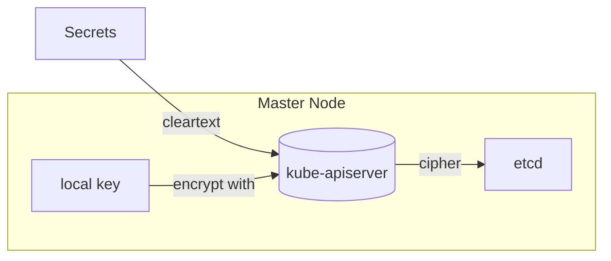

可以看到，加密是在Master节点上进行的。由此可见，此架构仅解决了etcd数据泄露风险。但攻破Master节点后，可以在本地拿到key，仍然意味着可以接管整个集群的数据。

#### Lab

对几个配置文件的注解如下

##### 20_secret1.yaml

```yaml
apiVersion: v1
kind: Secret
metadata:
  name: secret1
type: "kubernetes.io/rbd" # Generic type
data:
  key: QVFBOWF3dFg1UjlPRkJBQWhrbzZPNGxJRGVTTndLeFo4dUNkUHc9PQ==
```

> 该文件是为了挂载Ceph RBD创建的，储存的是Ceph的Secret。详见[Ceph Storage Class](https://kubernetes.io/zh/docs/concepts/storage/storage-classes/)

##### 22_secret2-pod-env.yaml

```yaml
apiVersion: v1
kind: Secret
metadata:
name: secret2
type: Opaque # 默认类型
data:
username: YWRtaW4= # Base64 编码后的值（原始值是admin）
password: MWYyZDFlMmU2N2Rm # Base64 编码后的值（原始值是1f2d1e2e67df）

---
apiVersion: v1
kind: Pod
metadata:
name: secret2-pod-env
spec:
containers:
  - name: ct-busybox
  image: radial/busyboxplus
  imagePullPolicy: IfNotPresent
  command: [ "/bin/sh", "-c", "env && sleep 1000000"]
  env:
    - name: SECRET_USERNAME # 环境变量名称
    valueFrom:
      secretKeyRef: # 引用了Secret
      name: secret2 # 需要指定Secret的名称，和secret.name相同
      key: username # 需要指定secret存储中的一个key
    - name: SECRET_PASSWORD
    valueFrom:
      secretKeyRef:
      name: secret2
      key: password
```

##### 24_secret3-pod-volume.yaml

```yaml
apiVersion: v1
kind: Pod
metadata:
name: secret3-pod-volume
spec:
  containers:
    - name: ct-busybox
    image: radial/busyboxplus
    imagePullPolicy: IfNotPresent
    command: ["/bin/sh", "-c", "ls /xxx && sleep 1000000"]
    volumeMounts: # 挂载secret2-vol 卷，见下方定义
      - name: secret2-vol
      mountPath: "/xxx"
      readOnly: true
  volumes: # 创建secret2-vol卷
    - name: secret2-vol
    secret:
      secretName: secret2
```

我们可以看到，**Secret可以作为环境变量，也可以作为Pod的Volume传入Pod**

```shell
kubectl apply -f 20_secret1.yaml
kubectl get secret
kubectl apply -f 22_secret2-pod-env.yaml
kubectl logs secret2-pod-env # username, password decoded already
kubectl apply -f 24_secret3-pod-volume.yaml
kubectl exec secret3-pod-volume -- cat /xxx/username
```

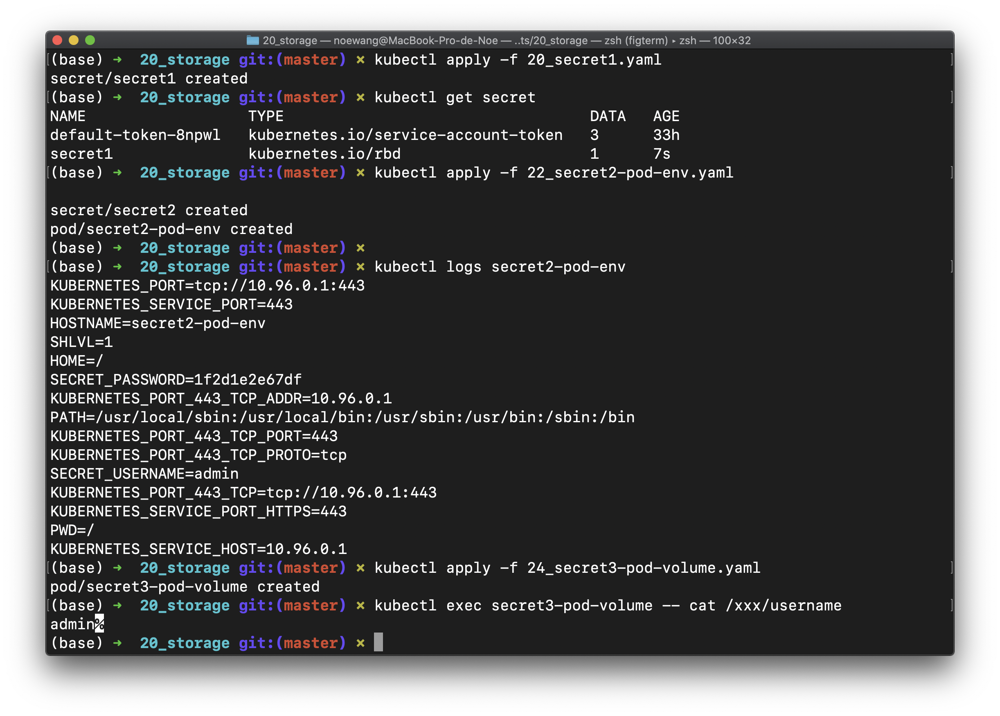

### 8.2 Volume-based

PV 和 PVC 使得 K8s 集群具备了存储的逻辑抽象能力，使得在配置 Pod 的逻辑里可以忽略对实际后台存储技术的配置，而把这项配置的工作交给 PV 的配置者，即集群的管理者。存储的 PV 和 PVC 的这种关系，跟计算的 Node 和 Pod 的关系是非常类似的：PV 和 Node 是资源的提供者，根据集群的基础设施变化而变化，由 K8s 集群管理员配置；而 PVC 和 Pod 是资源的使用者，根据业务服务的需求变化而变化，由 K8s 集群的使用者即服务的管理员来配置。

#### 8.2.1 Pod Volume

必须在定义Pod的时候同时定义Pod Volume，其与Pod同生共死，因此生命周期是Pod中所有对象中最长的。

> Pod Volume会在Pod结束后销毁，正如Docker容器的Volume那样。

##### 8.2.1.1 EmptyDir

创建一个空的目录作为卷，配置文件创建了一个emptyDir卷，挂载到了容器内

```shell
kubectl apply -f 30_vol1-pod-emptydir.yaml
kubectl exec vol1-pod-emptydir -- ls /data
```

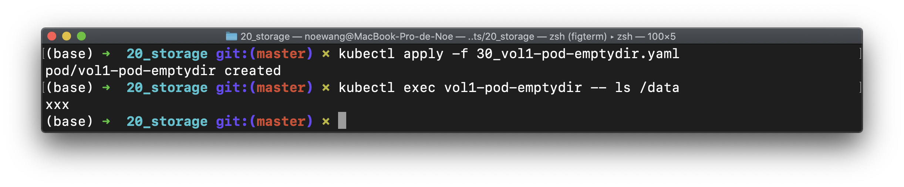

##### 8.2.1.2 hostPath

挂载一个Node上存在的目录

```yaml
apiVersion: v1
kind: Pod
metadata:
  name: vol2-pod-hostpath
spec:
  volumes:
  - name: vol-data # 卷名称vol-data
    hostPath: # 类型是hostPath
      path: /tmp # 需要修改成一个存在的目录
      type: Directory # 除了挂载Directory，还可以挂载单个文件

  restartPolicy: Never
  containers:
  - name: ct-busybox
    image: busybox:latest
    imagePullPolicy: IfNotPresent
    volumeMounts:
    - name: vol-data
      mountPath: /data
    command: ["/bin/sh", "-c", "ls /data & sleep 3000"]
```

>  `spec.volumes.hostPah.path` 需要存在

```shell
kubectl apply -f 32_vol2-pod-hostpath.yaml
kubectl exec vol2-pod-hostpath -- ls /data 
```

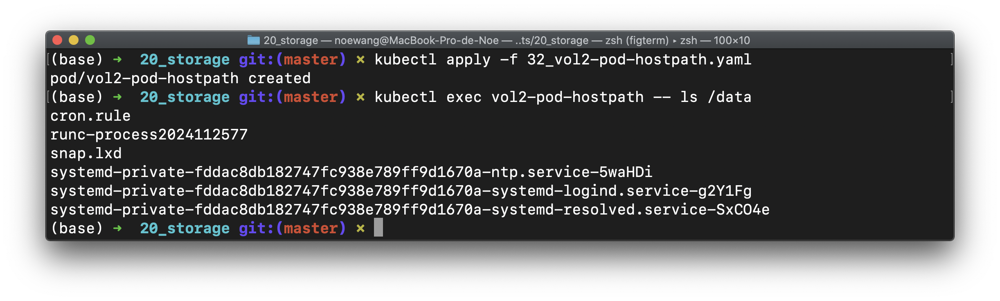

>  考虑到容器会在节点间被迁移/驱逐，挂载Node上的一个目录对于并非总是个很好的主意。
>
> 但对于有些容器，hostPath可以让容器能够与Node通过文件套接字沟通（例如/var/lib/docker.sock）


### 8.3 Persistent Volume

Persistent Volume包括PV和PVC两部分

#### 8.3.1 Persistent Volume (PV)

PV对底层共享存储的抽象。它于Pod独立，与K8S集群同寿。其从属于整个集群

根据服务的不同，PV有三种访问模式：

1. ReadWriteOnce (RWO) – 单node的读写
2. ReadOnlyMany (ROM) – 多node的只读
3. ReadWriteMany (RWM) – 多node的读写

用户删除PVC后，PV回收策略有

1. Retain 保留策略 - 允许人工处理保留的数据。（默认）
2. Delete 删除策略 - 将删除pv和外部关联的存储资源，需要插件支持。
3. Recycle 回收策略 - 将执行清除操作，之后可以被新的PVC使用，需要插件支持。

总体来说PV有以下几种状态

1. Available – 资源尚未被claim使用
2. Bound – 卷已经被绑定到claim了
3. Released – claim被删除，卷处于释放状态，但未被集群回收。
4. Failed – 卷自动回收失败

一般PV的常用配置参数有

- `Capaciity` PV的存储能力
- `Access Modes` 读写权限
- `storageClassName` 存储类别
- `persistentVolumeReclaimPolicy` 回收策略

> PV 可以设定其存储的类别，通过 `storageClassName` 参数指定一个 ``StorageClass`` 资源对象的名称。具有特定类别的 `PV` 只能与请求了该类别的 `PVC` 进行绑定。未设定类别的 `PV` 则只能与不请求任何类别的 `PVC` 进行绑定。

##### 40_pv1.yaml

```yaml
apiVersion: v1
kind: PersistentVolume
metadata:
  name: pv1 # 独一无二的名称
  labels:
    type: local 本地
spec:
  storageClassName: manual # 该名称将用于将 PVC 请求绑定到此
  capacity:
    storage: 2Gi # 大小2G
  accessModes:
    - ReadWriteOnce # 单个容器读写
  hostPath:
    path: "/tmp/storage/pv1" # 存放目录
```

```shell
kubectl apply -f 40_pv1.yaml
kubectl get pv
```

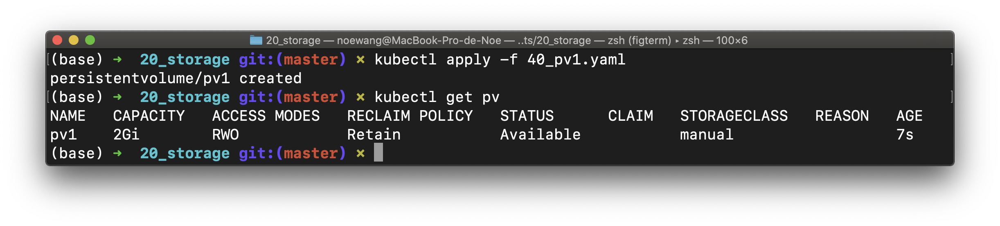

该命令创建了一个`2GiB`大小的PV，类型是`manual`，策略是`ReadWriteOnce`。**记住这一点**

#### 8.3.2 PersistentVolumeClaim (PVC)

用户对于存储资源的申请被称为PVC

##### Lab

以下一些解读。该配置文件分为两部分，第一部分：

```yaml
apiVersion: v1
kind: PersistentVolumeClaim
metadata:
  name: pvc1 # Claim的名称
spec:
  storageClassName: manual # K8S将寻找此类型的PV进行绑定，要和40_pv1.yaml中相同
  accessModes:
    - ReadWriteOnce # 单节点读写，同样的K8S将寻找此类型的PV绑定
  resources:
    requests: # 向PV请求1G
      storage: 1Gi
```

可以看到，这部分创建了一个PVC，类型是`manual`，容量需求是`1GiB`，权限是`ReadWriteOnce`。由于类型和权限都**匹配**`pv1`，因此`pv1`这个PV，将用于服务`pvc1`。

第二部分：

```yaml
apiVersion: v1
kind: Pod
metadata:
  name: pvc1-pod
spec:
  volumes: # Pod Volume
    - name: vol-data # 自定义名称
      persistentVolumeClaim: # Volume的存储后端来自PVC
        claimName: pvc1 # PVC的名称
  containers:
    - name: ct-busybox
      image: busybox:latest
      imagePullPolicy: IfNotPresent
      command: ["/bin/sh", "-c", "touch /data/xxx & sleep 60000"] 
      # 在Data下创建xxx文件
      volumeMounts:
        - name: vol-data # 把卷挂载到/data
          mountPath: /data
          readOnly: false
```

第二部分创建了一个Pod，该Pod配置文件定义了一个Pod Volume. 这个Volume需要`pvc1`提供存储。

我们可以发现，K8S服务用户**不需要**考虑PV是怎么实现的。用户只需要提出PVC，然后用这些PVC为定义的卷提供存储能力。至于安排这些PVC，用户也只需要为它们贴上`storageClass`、`accessModes`等标签，然后依靠集群进行调度。

```shell
kubectl apply -f 42_pvc1-pod.yaml 
# create a PVC which will bound to the PV1, and create a pod
kubectl exec pvc1-pod -- ls /data
kubectl get pvc
kubectl get pv
```

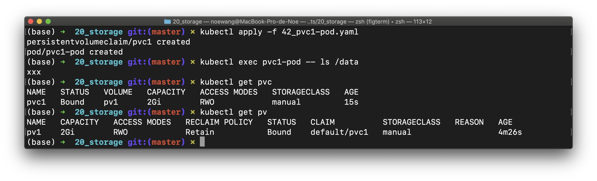

可以看到，这个2GiB的PV变成了Bond状态，PVC的容量变成了2GiB。这表明其已经与PVC绑定。K8S不允许一个PV绑定多个PVC，因此该PV**不能**和更多的PVC绑定了。其他的PVC只有等待该PV变成Available的时候才能和它绑定。

> 如果PVC里面设置的容量超过PV里面定义的容量，那么PVC是创建不成功的，会一直处于Pending状态。

我们登陆`pvc1-pod`所在的节点查看一下

```shell
kubectl get pods -o wide # 查看Pod被调度到了哪个节点（答案：node2）
[node2] $ ls /tmp/storage/pv1/
xxx
```

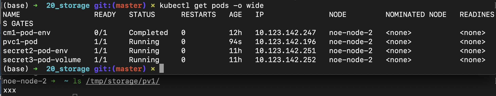

可以看到PV的存储能力由node2节点的本地存储提供。

现在，我们删除PVC后，再次查看PV的状态

```shell
kubectl delete -f 42_pvc1-pod.yaml
kubectl get pv
```

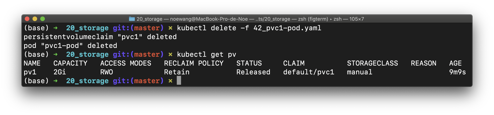

发现其状态为`Released`. 我们必须将该PV回复成`Available`状态，才能再次绑定PVC到该PV。

将一个Release状态的PV恢复可用:

```shell
 kubectl patch pv <pv-name> -p '{"spec":{"claimRef": null}}'
```

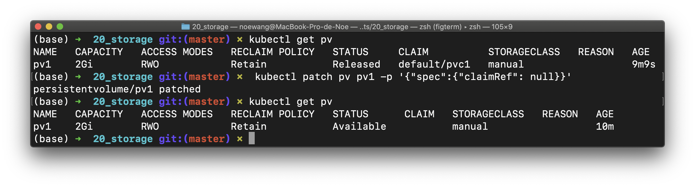

#### 8.3.3 Storage Class

PV 和 PVC 模式需要运维人员先创建好 PV，然后开发人员定义 PVC 进行Bond,维护成本很高。K8s 提供一种自动创建 PV 的机制，叫 StorageClass，它的作用就是创建 PV 的模板。

具体来说，StorageClass 会定义一下两部分：

1. PV 的属性 ：比如存储的大小、类型等；
2. 创建这种 PV 需要用到的存储插件：比如 Ceph 等；

有了这两部分信息，K8s 就能根据用户提交的 PVC 找到对应的 StorageClass，然后 K8s 就会调用 StorageClass 声明的存储插件创建需要的 PV。

##### 50_sc-hostpath.yaml

```yaml
apiVersion: storage.k8s.io/v1 # 使用storage.k8s.io API
kind: StorageClass # 定义了一个StorageClass
metadata:
  name: hostpath2 # 名称
# 存储能力的提供方是docker.io/hostpath，自动存在于DockerDesktopc创建的集群中
provisioner: docker.io/hostpath
reclaimPolicy: Delete
```

##### 52_sc1-pvc-pod.yaml

```yaml
apiVersion: v1
kind: PersistentVolumeClaim # 普通地申请了1GiB大容量
metadata:
  name: storage-sc
spec:
  storageClassName: hostpath2
  accessModes:
    - ReadWriteOnce
  resources:
    requests:
      storage: 1Gi

---
apiVersion: v1
kind: Pod
metadata:
  name: storage-pvc-sc
spec:
  volumes:
    - name: data-vol
      persistentVolumeClaim:
        claimName: storage-sc
  containers:
    - name: busybox-pvc-sc
      image: busybox
      command: ["/bin/sh", "-c", "sleep 60000"]
      volumeMounts:
        - name: data-vol
          mountPath: /usr/share/busybox # 卷被挂载的路径
          readOnly: false
```

```shell
kubectl apply -f 50_sc1-hostpath.yaml # create a default storage class
kubectl get storageClass # a new class should appear
kubectl apply -f 52_sc1-pvc-pod.yaml # create a PVC and a pod
kubectl get pv
kubectl get pvc
```

理论上，应该有一个PV被自动创建。实际上，没有PV被创建，Pod没有被部署，PVC停在了ExternalProvisioning阶段。这是因为kubeadm创建的集群中不存在`docker.io/hostpath`这个provisioner

因此下方的实验注定是失败的

```shell
kubectl exec -it storage-pvc-sc -- /bin/sh 
# access to the pod and test the storage
```

在kubeadm部署的集群上，需要自定义一个host-path provisioner才能进行实验。可以参考[这个项目](https://github.com/samisalkosuo/k8s-dynamic-hostpath-provisioner)

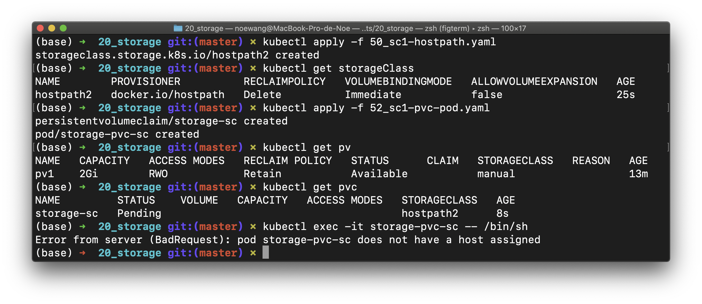

### 8.4 Third-party Drivers

假设说我们要使用NFS，我们就需要一个nfs-client的自动装载程序，我们称之为Provisioner，这个程序会使用我们已经配置好的NFS服务器自动创建持久卷，也就是自动帮我们创建PV。

#### 8.4.1 Custom

> 把大象放进冰箱需要三步：1. 把冰箱打开；2. 把大象放进去；3. 把冰箱门关上

创建一个自定义的Provisioner也需要三步:

首先，创建一个rbac权限绑定，对`ServiceAccount: hostpath-provisioner-account`授予`hostpath-provisioner-rule`权限，主要是允许该账户创建PV

```yaml
kind: ClusterRole
apiVersion: rbac.authorization.k8s.io/v1
metadata:
  name: VAR-provisioner-rule # 规则名称，可定制
rules:
  - apiGroups: [""] # 给予创建PV的权利
    resources: ["persistentvolumes"]
    verbs: ["get", "list", "watch", "create", "delete"]

  - apiGroups: [""] # 给予监控、修改PVC的权利
    resources: ["persistentvolumeclaims"]
    verbs: ["get", "list", "watch", "update"]

  - apiGroups: ["storage.k8s.io"] # 给予获取storageClasses的权利
    resources: ["storageclasses"]
    verbs: ["get", "list", "watch"]

  - apiGroups: [""] # 给予监控事件的权利
    resources: ["events"]
    verbs: ["list", "watch", "create", "update", "patch"]

---
kind: ClusterRoleBinding
apiVersion: rbac.authorization.k8s.io/v1
metadata:
  name: VAR-provisioner-binding # binding的名称，可定制
roleRef:
  apiGroup: rbac.authorization.k8s.io
  kind: ClusterRole
  name: VAR-provisioner-rule # 引用上面的规则，不能更改
subjects:
- kind: ServiceAccount # 创建的是ServiceAccount
  name: VAR-provisioner-account # ServiceAcount的名称
  namespace: kube-system # 命名空间选择系统命名空间，因为这属于运维范畴
```

然后需要创建一个自定义的storageClass，名称和provissioner名称可以定义

```yaml
kind: StorageClass
apiVersion: storage.k8s.io/v1
metadata:
  name: VAR # 自定义的storageClass名称
  annotations:
    #是否为默认的storageClass
    storageclass.kubernetes.io/is-default-class: "false"
provisioner: DOMAIN/VAR-PROVISIONER  # 自定义的provisioner名称
reclaimPolicy: Retain # 自定义策略
parameters:
    key: value # 一些其他参数 

apiVersion: extensions/v1beta1
kind: Deployment
metadata:
  name:  VAR-provisioner # 自定义名称
  namespace: kube-system
spec:
  replicas: 1 # 保持一个副本
  selector:
    matchLabels:
      app: VAR-provisioner # 自定义的label，和spec.template.metadata.labels匹配
  strategy:
    type: Recreate # 这个Pod是无状态的，Recreate就完事了
  template:
    metadata:
      labels:
        app:  VAR-provisioner# 和spec.selector.matchLabels匹配
    spec:
      serviceAccountName: VAR-provisioner-account # ServiceAcount的名称
      containers:
      - name: VAR-provisioner # 自定义名称
        image: DOMAIN/VAR-PROVISIONER # 和storageClass中的provisioner匹配
        securityContext: # 允许特权执行
          privileged: true
        volumeMounts: ...
        resources: ...
      volumes: ...
```

你设计的这个容器接受的参数是

- K8S集群的状态、实践
- StorageClass传入的参数
- 你定义的其他存储资源（快存储、本地映射的volume、NFS端点）

你的容器需要完成的工作是

- 监听PVC的创建
- 在自己管理的存储资源中，根据PVC的请求为PVC保留资源
- 操作K8S集群，使用为该PVC保留的资源创建PV
- 将PVC与PV相绑定
- 监听PVC的回收
- 根据回收策略，释放存储资源

#### 8.4.2 NFS

NFS是非常常见的网络存储协议。Kubernetes 不包含内部 NFS 驱动。你需要使用外部驱动为 NFS 创建 StorageClass.

[kubernets-sigs/nfs-subdir-external-provisioner](https://github.com/kubernetes-sigs/nfs-subdir-external-provisioner)是一个流行的为K8S集群提供NFS的项目

首先，需要创建一个有NFS能力的节点。这里我们选择创建一台独立的节点用于提供NFS服务。该节点的主机名为`storage0`。我们需要在`storage0`节点上安装`nfs-common`, `nfs-kernel-server`套件

```shell
[storage0] $ sudo apt-get install nfs-common nfs-kernel-server
```

该节点还需要配置`/etc/exports`，添加以下选项：

```shell
/path/to/server_data  [cidr]([rw|ro],sync) # 注意(,)没有空格
```

例如

```shell
/data 10.64.13.0/24(rw,sync)
```

> 该命令将会允许来自`[cidr]`的客户端以`rw`或者`ro`的方式访问`/path/to/server_data`目录。`CIDR`即形如`192.168.1.0/24`的无类域间路由描述

>  `/path/to/server_data`必须手动创建，并且赋予"NFS映射的用户"读写权限。一般来说NFS会把用户映射到root组的other，因此需要使用`chmod go+w /path/to/server_data`修改权限

> `nfs-kernel-server` 受`systemd`管理

所有的K8S节点都是NFS客户端，需要安装`nfs-common`组件。客户端挂载NFS存储有两种方式

- 单次挂载

    ```shell
    mount -tnfs server_ip:/path/to/server_data /path/to/client_data
    ```

    其中`server_ip`是NFS服务器IP(`storage0`节点IP)，`/path/to/server_data`为NFS服务器的共享路径。`/path/to/client_data`为本地挂载路径

- 开机启动挂载

    需要修改`/etc/fstab`，添加挂载配置

    ```shell
    server_ip:/path/to/server_data  /path/to/client_data nfs rsize=8192,wsize=8192,timeo=14,intr
    ```

> 使用`/etc/fstab`挂载方法时，非常有必要用`charttr +i /path/to/client_data`命令为`/path/to/client_data`添加不可变选项。防止其意外产生读写行为

> `mount -a`可以挂载所有的挂载点

本实验中，我们使用一台已经配置好NFS的存储服务器，我们把它叫做`storage0`

首先将该项目克隆到本地

```shell
git clone https://github.com/kubernetes-sigs/nfs-subdir-external-provisioner
cd nfs-subdir-external-provisioner
git checkout nfs-subdir-external-provisioner-4.0.16 # 使用4.0.16
```

根据官网的提示，修改并创建对应的rbac角色

```shell
NS=$(kubectl config get-contexts|grep -e "^\*" |awk '{print $5}')
NAMESPACE=${NS:-default}
sed -i '' "s/namespace:.*/namespace: $NAMESPACE/g" ./deploy/rbac.yaml ./deploy/deployment.yaml
kubectl create -f deploy/rbac.yaml
```

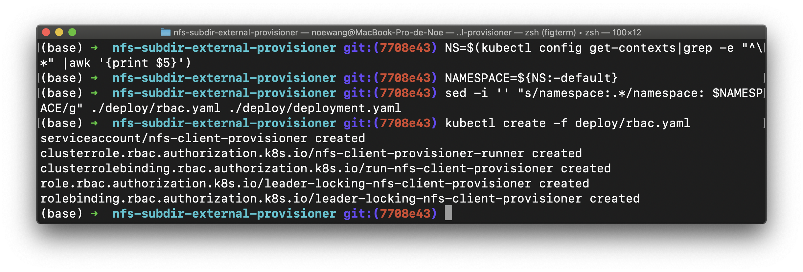

然后修改`deploy/deployment.yaml`和`class.yaml`，添加NFS服务器的地址和目录

```yaml
apiVersion: apps/v1
kind: Deployment
metadata:
  name: nfs-client-provisioner
  labels:
    app: nfs-client-provisioner
  # replace with namespace where provisioner is deployed
  namespace: default
spec:
  replicas: 1
  strategy:
    type: Recreate
  selector:
    matchLabels:
      app: nfs-client-provisioner
  template:
    metadata:
      labels:
        app: nfs-client-provisioner
    spec:
      serviceAccountName: nfs-client-provisioner
      containers:
        - name: nfs-client-provisioner
          image: registry.hub.docker.com/davidliyutong/nfs-subdir-external-provisioner:v4.0.2
          volumeMounts:
            - name: nfs-client-root
              mountPath: /persistentvolumes
          env:
            - name: PROVISIONER_NAME
              value: k8s-sigs.io/nfs-subdir-external-provisioner
            - name: NFS_SERVER
              value: 10.64.13.100
            - name: NFS_PATH
              value: /data
      volumes:
        - name: nfs-client-root
          nfs:
            server: 10.64.13.100
            path: /data
```

```yaml
apiVersion: storage.k8s.io/v1
kind: StorageClass
metadata:
  name: nfs-client
provisioner: k8s-sigs.io/nfs-subdir-external-provisioner 
# 匹配 deployment's env PROVISIONER_NAME
parameters:
  pathPattern: "${.PVC.namespace}/${.PVC.annotations.nfs.io/storage-path}" 
  # waits for nfs.io/storage-path annotation, default is empty string.
  onDelete: delete # Or retain
```

| Name            | Description                                                  |
| --------------- | ------------------------------------------------------------ |
| onDelete        | `delete` 在PVC删除后删除数据, `retain`在PVC删除后保留数据；默认是保存在`archived-<volume.Name>`目录下 |
| archiveOnDelete | `false` 在PVC删除后删除数据, 否则进行归档。如果有`onDelete`，`archiveOnDelete` 将会被忽略。 |
| pathPattern     | 卷目录的命名方式，例如 `${.PVC.namespace}-${.PVC.name}`可以创建`<pvc-namespace>-<pvc-name>` |

对修改后的配置进行应用

```shell
kubectl apply -f deploy/deployment.yaml
kubectl apply -f deploy/class.yaml
```

> 设置一个storageClass为默认
>
> ```shell
> kubectl patch storageclass <storageClass> -p '{"metadata": {"annotations":{"storageclass.kubernetes.io/is-default-class":"true"}}}'
> ```
>
> 取消一个storageClass的默认设置
>
> ```shell
> kubectl patch storageclass <storageClass> -p '{"metadata": {"annotations":{"storageclass.kubernetes.io/is-default-class":"false"}}}'
> ```

##### 测试

`nfs-subdir-external-provisioner`项目提供了一个测试用例。

该测试用例由`test-claim.yaml`和`test-pod.yaml`构成

```yaml
kind: PersistentVolumeClaim
apiVersion: v1
metadata:
  name: test-claim
spec:
  storageClassName: nfs-client
  accessModes:
    - ReadWriteMany
  resources:
    requests:
      storage: 1Mi
```

```yaml
kind: Pod
apiVersion: v1
metadata:
  name: test-pod
spec:
  containers:
  - name: test-pod
    image: busybox:stable
    command:
      - "/bin/sh"
    args:
      - "-c"
      - "touch /mnt/SUCCESS && exit 0 || exit 1"
    volumeMounts:
      - name: nfs-pvc
        mountPath: "/mnt"
  restartPolicy: "Never"
  volumes:
    - name: nfs-pvc
      persistentVolumeClaim:
        claimName: test-claim
```

解释:

该测试用例将申请一个容量为1MiB的PVC，并且在这个PVC挂载到容器的`/mnt`中。容器将尝试在`/mnt`中创建一个`SUCCESS`文件

```shell
kubectl apply -f deploy/test-claim.yaml -f deploy/test-pod.yaml
```

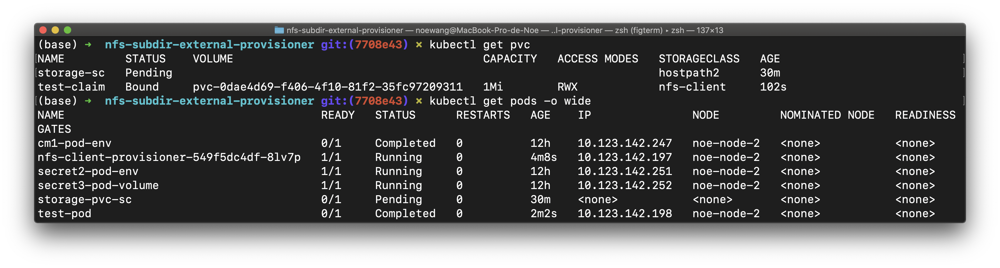

当容器运行完毕后，我们应该能在NFS目录中看到新创建的文件(测试时间为`2022.05.22-13:36`)

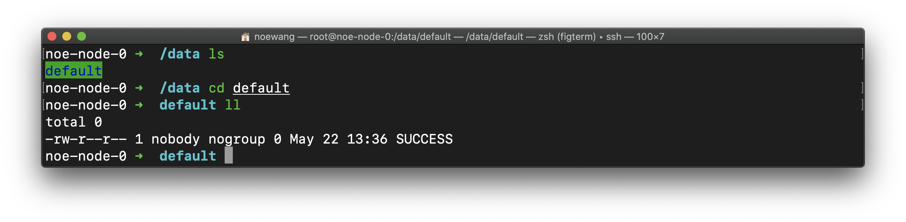

当我们删除测试用例的时候，PVC和PV将一并删除（因为`storageClass.yaml`中的`onDelete`设置为了`delete`）

```shell
kubectl delete -f deploy/test-claim.yaml -f deploy/test-pod.yaml
```

#### 8.4.3 Ceph

> 这一部分的实验有待改进

Ceph是一个统一的分布式存储系统，设计初衷是提供较好的性能、可靠性和可扩展性。K8S通过cephfs支持Ceph。

如果要部署Ceph，可以参考官方的教程[Ceph](https://docs.ceph.com/en/quincy/cephadm/services/mds/#orchestrator-cli-cephfs).

Ceph的部署思路基本上是

1. 首先在单主机上引导一个Ceph集群，只有一个节点
2. 随后将其他节点加入集群
3. 节点和节点之间用SSH免密码管理

一些Ceph的概念

- `MON` Monitor，Ceph守护进程，所有节点都向Monitor报告。一个集群中应该有3-5个`MON`
- `RBD` Ceph对外提供的块存储服务（Block Storage）
- `RGW` Ceph对外提供的对象存储服务，兼容Amazon S3和OpenStac Swift （Object Storage）
- `MDS` 元数据服务器
- `OSD` Object Storage Device，提供存储能力的设备
- `RADOS``MON`,`OSD` 的集合

[Ceph RBD](https://kubernetes.io/zh/docs/concepts/storage/storage-classes/)介绍了管理员应该如何为K8S添加Ceph

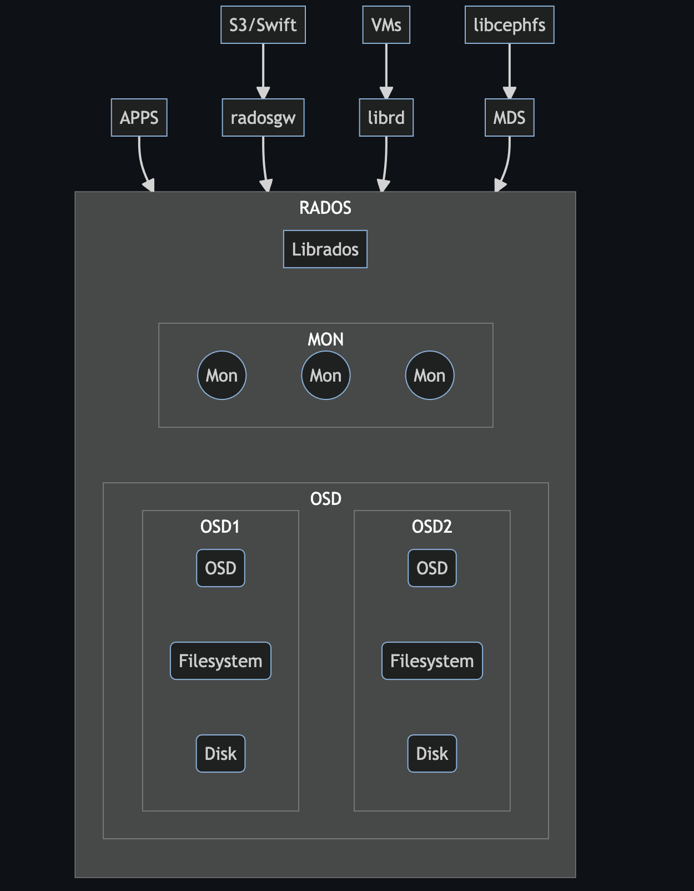

Ceph只能利用满足以下条件的设备：

1. 没有文件系统
2. 没有分区
3. 设备没有被mount
4. 设备没有LVM状态
5. 设备大于5GB
6. 设备不能包括Ceph BlueStore OSD

具体实验可以参考[厉宇桐同学的报告](https://report.ice6413p.space/objects/#ceph)


