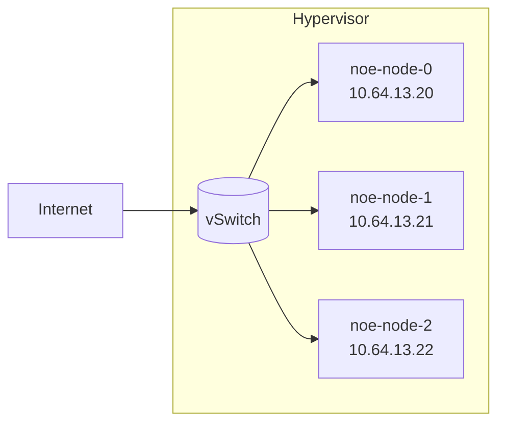

# 第三章 API对象

## 1. 综述

API 对象是 K8s 集群中的管理操作单元。K8s集群系统每支持一项新功能、引入一项新技术，一定会新引入对应的 API 对象，支持对该功能的管理操作。例如副本集 Replica Set 对应的 API 对象是 RS。

### YAML语法

每个 API 对象都有 3 大类属性，元数据 metadata、规范 spec 和状态 status：

- 元数据 metadata：用来标识 API 对象的，对所有 API 对象来说，这部分的字段和格式基本上是一致的。每个对象都至少有3个元数据：namespace，name和uid；除此以外还有各种各样的标签 labels 用来标识和匹配不同的对象，例如用户可以用标签 env 来标识区分不同的服务部署环境，分别用 env=dev、env=testing、env=production 来标识开发、测试、生产的不同服务。
  - Labels：一组 key-value 格式的标签，表示对象的某些属性。Deployment 使用 label的过滤规则的 Deployment 的“spec.selector.matchLabels”字段，被称为Label Selector。
  - Annotations：携带key-value格式的内部信息，被k8s本身使用。多数Annotations都是自动被k8s加上的。
- 规范 spec：自定义数据,描述了用户期望 K8s 集群中的分布式系统达到的理想状态（Desired State），例如用户可以通过复制控制器 Replication  Controller 设置期望的 Pod 副本数为 3。K8s 中所有的配置都是通过 API 对象的 spec 去设置的，也就是用户通过配置系统的理想状态来改变系统，这是 k8s 重要设计理念之一，即所有的操作都是声明式（Declarative）的而不是命令式（Imperative）的。声明式操作在分布式系统中的好处是稳定，不怕丢操作或运行多次，例如设置副本数为 3 的操作运行多次也还是一个结果，而给副本数加1的操作就不是声明式的，运行多次结果就错了。

```yaml
apiVersion: apps/v1
kind: Deployment
metadata: 
  name: nginx-deployment
spec: 
  selector: 
    matchLabels: 
      app: nginx 
  replicas: 2 
  template: 
    metadata: 
      labels: 
        app: nginx 
    spec: 
      containers: 
      - name: nginx 
        image: nginx:1.7.9 
        ports: 
        - containerPort: 80
```

- 状态 status：描述了系统实际当前达到的状态（Status），例如系统当前实际的 Pod 副本数为 2；那么复本控制器当前的程序逻辑就是自动启动新的 Pod，争取达到副本数为 3。

## 2. 实验

我们回顾一下cluster的配置

- 有`noe-node-0`，`noe-node-1`，`noe-node-2`三个节点
- `noe-node-0`是控制平面所在节点



```yaml
nodes:
  - node0:
      hostname: 'noe-node-0'
      address: '10.119.12.1'
  - node1:
      hostname: 'noe-node-1'
      address: '10.119.12.3'
  - node2:
      hostname: 'noe-node-2'
      address: '10.119.12.4'
```

三台节点均为x86虚拟机，安装Ubuntu 20.04.3 LTS操作系统，配置了2核CPU和4GB内存。`noe-node-0`将作为控制平面所在的节点


## 目录

- [1. Config](1_config/README.md)
- [2. Node & Cluster](2_cluster-node/README.md)
- [3. Label & Annotation](3_label_annotation/README.md)
- [4. Namespace](4_namespace/README.md)  
- [5. Pod](5_pod/README.md)
- [6. Workload](6_workload/README.md)
- [7. Service](7_service/README.md)
- [8. Storage](8_storage/README.md)
- [9. Network](9_network/README.md)


## Tips

`kubectl delete -f <NAME>.yaml`可以删除由`kubectl apply -f <NAME>.yaml`应用的配置
