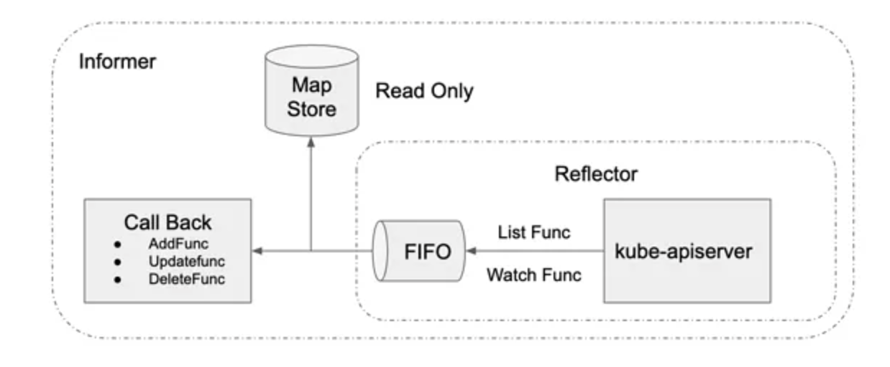
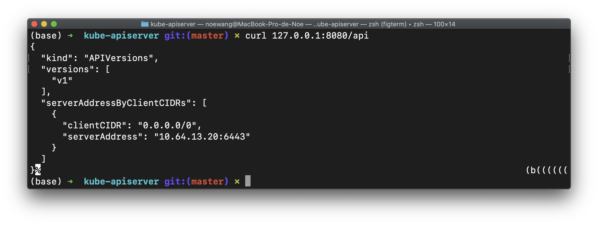
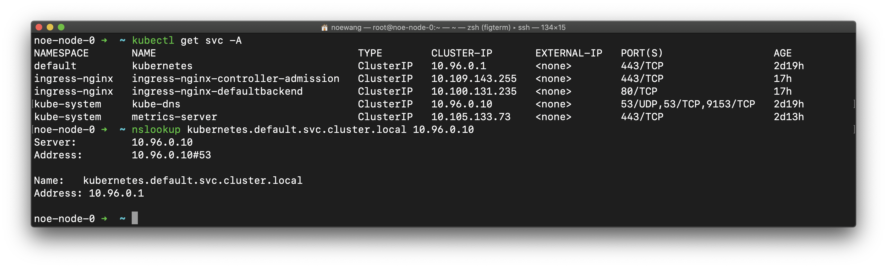

# 第四章 核心组件

Kubernetes 主要由以下几个核心组件组成：

Master：

- etcd 保存了整个集群的状态；
- kube-apiserver 提供了资源操作的唯一入口，并提供认证、授权、访问控制、API 注册和发现等机制；
- kube-controller-manager 负责维护集群的状态，比如故障检测、自动扩展、滚动更新等；
- kube-scheduler 负责资源的调度，按照预定的调度策略将 Pod 调度到相应的机器上；

Node：

- kubelet 负责维持容器的生命周期，同时也负责 Volume（CVI）和网络（CNI）的管理；
- Container runtime 负责镜像管理以及 Pod 和容器的真正运行（CRI），默认的容器运行时为 Docker；
- kube-proxy 负责为 Service 提供 cluster 内部的服务发现和负载均衡；

除了核心组件，还有一些推荐的 Add-ons：

- kube-dns 负责为整个集群提供 DNS 服务
- Ingress Controller 为服务提供外网入口
- Heapster 提供资源监控
- Dashboard 提供 GUI
- Federation 提供跨可用区的集群
- Fluentd-elasticsearch 提供集群日志采集、存储与查询


## 1. Kube-apiserver

### 1.1 List-Watch

Etcd 存储集群的数据信息，而 Apiserver 作为统一入口，任何对数据的操作都必须经过 Apiserver。客户端（如kubelet、scheduler、controller-manager）通过 list-watch 监听Apiserver 中的资源（如 pod、rs、rc 等）的 create、update和 delete 事件，并针对事件类型调用相应的事件处理函数。

list-watch 有 list 和 watch 两部分组成。

- list 就是调用资源的list API 罗列所有资源，它基于 HTTP 短链接实现。

- watch 则是调用资源的 watch API 监听资源变更事件，基于 HTTP 长链接实现。

以 pod 资源为例，它的 list 和 watch API 分别为：

- List API：返回值为 PodList，即一组 pod

```
GET /api/v1/pods
```

- Watch API：往往带上 watch=true，表示采用 HTTP 长连接持续监听 pod 相关事件。每当有新事件，返回一个 WatchEvent 。

```
GET /api/v1/watch/pods
```

K8s 的 informer 模块封装了 list-watch API，用户只需要指定资源，编写事件处理函数 AddFunc、UpdateFunc 和DeleteFunc 等。如下图所示，informer 首先通过 list API 罗列资源，然后调用 watch API 监听资源的变更事件，并将结果放入到一个 FIFO 队列，队列的另一头有协程从中取出事件，并调用对应的注册函数处理事件。Informer 还维护了一个只读的 Map Store 缓存，主要为了提升查询的效率，降低 Apiserver 的负载。



#### Watch 的实现

Watch 是如何通过 HTTP 长链接接收 Apiserver 发来的资源变更事件呢？秘诀就是 Chunked Transfer Encoding（分块传输编码），它首次出现在HTTP/1.1 。

当客户端调用 watch API 时，Apiserver 在 response 的 HTTP Header 中设置 Transfer-Encoding 的值为 chunked，表示采用分块传输编码。客户端收到该信息后，便和服务端该链接，并等待下一个数据块，即资源的事件信息。例如：

```shell
$ curl -i http://{kube-api-server-ip}:8080/api/v1/watch/pods?watch=yes

HTTP/1.1 200 OK
Content-Type: application/json
Transfer-Encoding: chunked
Date: Thu, 02 Jan 2019 20:22:59 GMT
Transfer-Encoding: chunked

{"type":"ADDED", "object":{"kind":"Pod","apiVersion":"v1",...}}
{"type":"ADDED", "object":{"kind":"Pod","apiVersion":"v1",...}}
{"type":"MODIFIED", "object":{"kind":"Pod","apiVersion":"v1",...}}
...
```

List-Watch 基于 HTTP 协议，是 K8s 重要的异步消息通知机制。它通过 list 获取全量数据，通过 watch API 监听增量数据，保证消息可靠性、实时性、性能和顺序性。而消息的实时性、可靠性和顺序性又是实现声明式设计的良好前提。

### 1.2 K8S Proxy API

kube-apiserver把收到的REST request转发到某个node的kubelet的REST端口上，通过k8s proxy API获得的数据来自node而非etcd。

- Authentication：
    - 最严格的HTTPS证书认证，基于CA根证书签名的双向数字证书 认证方式
    - HTTP Token认证：通过一个Token来识别合法用户
    - Http Base认证：通过用户名+密码的方式认证
- Authorization：API Server授权，包括AlwaysDeny、AlwaysAllow、ABAC、RBAC、WebHook
- Admission Control：k8s AC体系中的最后一道关卡，官方标准的Adminssion Control就有10个，在启动kube-apiserver时指定

### 1.3 Dynamic Admission Control（Initializer）

当任何一个API对象被提交给APIServer之后，总有一些“初始化”性质的工作需要在它们被k8s正式处理之前进行。比如，自动为所有Pod加上某些标签（Labels）。而这个“初始化”操作的实现，借助的是Admission Control功能。它其实是k8s里一组被称为Admission Controller的代码，可以选择性地被编译进APIServer中，在API对象创建之后会被立刻调用到。k8s提供了一种“**热插拔**”式的Admission机制，它就是Dynamic Admission Control，也叫作：Initializer。

Initializer也是一个controller，实时查看用户给APIServer的请求，遇到实际状态与期望值不同时，更新用户API对象。更新用户的API对象的时候，使用PATCH API来完成merge工作。而这种PATCH API，正是声明式API最主要的能力。Initializer会再创建一个新的对象，然后通过TwoWayMergePatch和PATCH API把两个API对象merge，完成类似注入的操作。

### 1.4 Aggregated API

APIServer Aggregator的设计思路是允许用户编写一个自定义的 APIServer，在这里面添加自定义 API。这个APIServer就可以跟k8s原生的APIServer绑定部署在一起统一提供服务了。同时，构建出的API接口更加规范整齐，能利用k8s原生的认证、授权、准入机制。

不同于CRD，Aggregated APIServer中的API资源是通过代码向k8s注册资源类型的方式实现的，而CRD是直接通过yaml文件创建自定义资源的方式实现的。

[](https://github.com/rebirthmonkey/k8s/blob/master/30_components/kube-apiserver/figures/image-20200201143831501.png)

### 1.5 Lab

使用curl调试K8SAPI是复杂的，因为这需要附加集群的认证信息。

在正确配置kubectl的context情况下。可以通过kubectl在本地创建一个远程API的代理。需要使用K8SAPI的本地应用就可以通过该代理免验证调用K8SAPI

```shell
kubectl proxy --port=8080
```

该命令将在本地的8080端口创建一个K8SAPI代理，并持续运行。关闭运行该命令的终端窗口或打断命令将关闭代理

> `--port`参数指定了一个本地端口号

```shell
curl 127.0.0.1:8080/api
curl 127.0.0.1:8080/api/v1
curl 127.0.0.1:8080/api/v1/pods
```



## 2. kube-controller-manager

- Replication Controller：RC所关联的pod副本数保持预设值，pod的RestartPolicy=Always
- Node Controller：kubelet通过API server注册自身节点信息
- ResourceQuota Controller：确保指定资源对象在任何时候都不会超量占用系统物力资源（需要Admission Control配合使用）
- Endpoint Controller：生成和维护同名server的所有endpoint（所有对应pod的service）
- Service Controller：监听、维护service的变化
- Namespace Controller
- ServiceAccount Controller
- Token Controller

### 代码机制

- client-go：负责与apiserver通信，获取API对象的状态信息
    - reflector维护与APIServer的连接，使用 ListAndWatcher方法来监听对象的变化，并把该变化事件及对应的API对象存入DeltaFIFO队列
    - Informer从DeltaFIFO取出API对象，根据事件的类型，来创建、更新或者删除本地缓存
    - Indexer使用线程安全的数据存储来缓存API对象及其值，为controller提供数据索引功能
    - Informer另一方面可以调用注册的Event Handler把API 对象发送给对应的controller
- custom controller：维护API对象的期望状态
    - 把事件对应的API对象存入workQueue中，这里存储的只是API对象的key
    - 进入Controller Loop：获取到API对象后则会根据API对象描述的期望状态与(集群)中的实际状态进行比对、协调，最终达到期望状态


## 3. kube-scheduler

kube-scheduler的作用是根据待调度pod列表、可用node列表、以及调度算法/策略，将待调度pod绑定到某个合适的node上（将pod的spec.nodeName字段填上调度结果的节点名字），并将绑定信息写入etcd。

### 3.1 调度原理

- 第一个控制循环是Informer Path，用于监听（Watch）Etcd 中 Pod、Node、Service 等与调度相关的 API 对象的变化。比如，当一个待调度 Pod（即：它的 nodeName 字段是空的）被创建出来之后，调度器就会通过 Pod Informer 的 Handler，将这个待调度 Pod 添加进调度队列。同时，k8s默认调度器还要负责对调度对象进行缓存。
- 第二个控制循环是调度器负责 Pod 调度的主循环，我们可以称之为 Scheduling Path，它不断地从调度队列里出队一个 Pod。然后，调用 Predicates 算法进行node“过滤”（Predicates 算法需要的 Node 信息，都是从 Scheduler Cache 里直接拿到的）。<u>再调用 Priorities 算法为上述列表里的 Node 打分，得分最高的 Node就会作为这次调度的结果。</u>**调度算法执行完成后，调度器就需要将 Pod 对象的 nodeName 字段的值，修改为上述 Node 的名字，这个步骤在k8s里面被称作 Bind。**

[](https://github.com/rebirthmonkey/k8s/blob/master/30_components/kube-scheduler/figures/image-20200131150155419.png)

### 3.2 Predicates

**Predicates 在调度过程中的作用，可以理解为 Filter，即：它按照调度策略，从当前集群的所有节点中，“过滤”出一系列符合条件的节点。**这些节点，都是可以运行待调度 Pod 的宿主机。

当开始调度一个 Pod 时，scheduler会同时启动 16 个 Goroutine，来并发地为集群里的所有 Node 计算 Predicates，最后返回可以运行这个 Pod 的宿主机列表。每个 Node 执行 Predicates 会按照固定的顺序来进行执行不同的调度策略，其中的策略包括：GeneralPredicates、与 Volume 相关的过滤规则、宿主机相关的过滤规则、Pod 相关的过滤规则。

- NoDiskConflict：检查在此主机上是否存在卷冲突。如果这个主机已经挂载了卷，其它使用这个卷的Pod不能调度到这个主机上。GCE 、Amazon EBS 和 Ceph RBD 使用的规则如下:
    1. GCE 允许同时挂载多个卷，只要这些卷都是只读的。
    2. Amazon EBS 不允许不同的 Pod 挂载同一个卷。
    3. Ceph RBD 不允许任何两个 pods 分享相同的 monitor，match pool 和 image。
- **NoVolumeZoneConflict :** 检查在给定的 zone 限制前提下，检查在此主机上部署 Pod 是否存在卷冲突，目前指对 PV 资源进行检查(NewVolumeZonePredicate对象predicate函数)。
- **MaxEBSVolumeCount :** 确保已挂载的 EBS 存储卷不超过设置的最大值。默认值是39。它会检查直接使用的存储卷，和间接使用这种类型存储的 PVC 。计算不同卷的总目，如果新的 Pod 部署上去后卷的数目会超过设置的最大值，那么 Pod 就不能调度到这个主机上。
- **MaxGCEPDVolumeCount :** 确保已挂载的 GCE 存储卷不超过设置的最大值。默认值是16。规则同MaxEBSVolumeCount。
- **MaxAzureDiskVolumeCount :** 确保已挂载的Azure存储卷不超过设置的最大值。默认值是16。规则同MaxEBSVolumeCount。
- **CheckNodeMemoryPressure :** 判断节点是否已经进入到内存压力状态，如果是则只允许调度内存为0标记的 Pod。
- **CheckNodeDiskPressure :** 判断节点是否已经进入到磁盘压力状态，如果是则不调度新的Pod。
- **PodToleratesNodeTaints :** Pod 是否满足节点容忍的一些条件。
- **MatchInterPodAffinity :** 节点亲和性筛选。
- **GeneralPredicates :** 包含一些基本的筛选规则（PodFitsResources、PodFitsHostPorts、HostName、MatchNodeSelector）。
- **PodFitsResources :** 检查节点上的空闲资源(CPU、Memory、GPU资源)是否满足 Pod 的需求。
- **PodFitsHostPorts :** 检查 Pod 内每一个容器所需的 HostPort 是否已被其它容器占用。如果有所需的HostPort不满足要求，那么 Pod 不能调度到这个主机上。
- 检查主机名称是不是 Pod 指定的 HostName。
- 检查主机的标签是否满足 Pod 的 **nodeSelector**属性需求。

### 3.3 Preemption

**Preemption就是当一个高优先级的 Pod 调度失败后，该 Pod 并不会被“搁置”，而是会“挤走”某个 Node 上的一些低优先级的 Pod ，从而保证这个高优先级 Pod 的调度成功。**

### 3.4 Priorities

**Priorities 阶段的工作就是为这些节点打分，每一个优先级函数会返回一个0-10的分数，分数越高表示主机越“好”，同时每一个函数也会对应一个表示权重的值。**最终主机的得分用以下公式计算得出：

```python
finalScoreNode = (weight1 * priorityFunc1) + (weight2 * priorityFunc2) + … + (weightn * priorityFuncn)
```

**得分最高的节点就是最后被 Pod 绑定的最佳节点。**其中打分规则包含：LeastRequestedPriority、BalancedResourceAllocation、NodeAffinityPriority、TaintTolerationPriority 和 InterPodAffinityPriority。

可以通过为 kube-scheduler 指定一个配置文件或者创建一个 ConfigMap ，来配置哪些规则需要开启、哪些规则需要关闭。并且，通过为 Priorities 设置权重来控制调度器的调度行为。

- **SelectorSpreadPriority :** 对于属于同一个 service、replication controller 的 Pod，尽量分散在不同的主机上。如果指定了区域，则会尽量把 Pod 分散在不同区域的不同主机上。调度一个 Pod 的时候，先查找 Pod 对于的 service或者 replication controller，然后查找 service 或 replication controller 中已存在的 Pod，主机上运行的已存在的 Pod 越少，主机的打分越高。
- **LeastRequestedPriority :** 如果新的 pod 要分配一个节点，这个节点的优先级就由节点空闲的那部分与总容量的比值(（总容量-节点上pod的容量总和-新pod的容量）/总容量）来决定。CPU 和 memory 权重相当，比值最大的节点的得分最高。需要注意的是，这个优先级函数起到了按照资源消耗来跨节点分配 pods 的作用。计算公式如下： cpu((capacity – sum(requested)) * 10 / capacity) + memory((capacity – sum(requested)) * 10 / capacity) / 2
- **BalancedResourceAllocation :** 尽量选择在部署 Pod 后各项资源更均衡的机器。BalancedResourceAllocation不能单独使用，而且必须和 LeastRequestedPriority 同时使用，它分别计算主机上的 cpu 和 memory 的比重，主机的分值由 cpu 比重和 memory 比重的“距离”决定。计算公式如下：score = 10 – abs(cpuFraction-memoryFraction)*10
- **NodeAffinityPriority :** k8s 调度中的亲和性机制。Node Selectors（调度时将 pod 限定在指定节点上），支持多种操作符（In、 NotIn、 Exists、DoesNotExist、 Gt、 Lt），而不限于对节点 labels 的精确匹配。另外，Kubernetes 支持两种类型的选择器，一种是 “hard（requiredDuringSchedulingIgnoredDuringExecution）”选择器，它保证所选的主机满足所有Pod对主机的规则要求。这种选择器更像是之前的 nodeselector，在 nodeselector 的基础上增加了更合适的表现语法。另一种 “soft（preferresDuringSchedulingIgnoredDuringExecution）” 选择器，它作为对调度器的提示，调度器会尽量但不保证满足 NodeSelector 的所有要求。
- **InterPodAffinityPriority :** 通过迭代 weightedPodAffinityTerm 的元素计算和，并且如果对该节点满足相应的PodAffinityTerm，则将 “weight” 加到和中，具有最高和的节点是最优选的。
- **NodePreferAvoidPodsPriority(权重1W) :** 如果 Node 的 Anotation 没有设置 key-value:scheduler. alpha.kubernetes.io/ preferAvoidPods = "..."，则该 node 对该 policy 的得分就是10分，加上权重10000，那么该node对该policy的得分至少10W分。如果Node的Anotation设置了，scheduler.alpha.kubernetes.io/preferAvoidPods = "..." ，如果该 pod 对应的 Controller 是 ReplicationController 或 ReplicaSet，则该 node 对该 policy 的得分就是0分。
- **TaintTolerationPriority :** 使用 Pod 中 tolerationList 与 Node 节点 Taint 进行匹配，配对成功的项越多，则得分越低。

**另外在优选的调度规则中，有几个未被默认使用的规则：**

- **ImageLocalityPriority :** 据主机上是否已具备 Pod 运行的环境来打分。ImageLocalityPriority 会判断主机上是否已存在 Pod 运行所需的镜像，根据已有镜像的大小返回一个0-10的打分。如果主机上不存在 Pod 所需的镜像，返回0；如果主机上存在部分所需镜像，则根据这些镜像的大小来决定分值，镜像越大，打分就越高。

- **EqualPriority :** EqualPriority 是一个优先级函数，它给予所有节点一个相等的权重。

- **ServiceSpreadingPriority :** 作用与 SelectorSpreadPriority 相同，已经被 SelectorSpreadPriority 替换。

- **MostRequestedPriority :** 在 ClusterAutoscalerProvider 中，替换 LeastRequestedPriority，给使用多资源的节点，更高的优先级。计算公式为：

```python
(cpu(10 * sum(requested) / capacity) + memory(10 * sum(requested) / capacity)) / 2
```

## 4. kubelet

kubelet是k8s这样一个容器编排与管理系统跟容器打交道的主要“场所”。

处理master下发给本节点（node）的任务，管理本节点pod及其中的container。

- 在`API Server`上注册本node信息
- 通过`API Server`监听所有针对pod的操作，并做相关如创建、删除CT等的操作
- 通过cAdvisor监控container和node资源，并定期向master汇报资源使用情况

### 4.1 工作原理

kubelet就是一个控制循环SyncLoop，而驱动该控制循环运行的事件包括：Pod 更新事件；Pod 生命周期变化；kubelet 本身设置的执行周期；定时的清理事件。kubelet 启动的时候，先要设置 Listers，也就是注册它所关心的各种事件的 Informer。这些 Informer，就是 SyncLoop 需要处理的数据的来源。

kubelet 还负责维护着很多子控制循环，如Volume Manager、Image Manager、Node Status Manager 等。这些控制循环就是通过控制器模式，完成 kubelet 的某项具体职责。比如 Node Status Manager，就负责响应 Node 的状态变化，然后将 Node 的状态收集起来，并通过 Heartbeat 的方式上报给 APIServer。

kubelet通过Watch机制监听与自己相关的Pod对象的变化，并把这些 Pod 的信息缓存在自己的内存里。而当一个 Pod 完成调度、与一个 Node 绑定起来之后， 这个 Pod 的变化就会触发 kubelet 在控制循环里注册的 Handler HandlePods。此时，通过检查该 Pod 在 kubelet 内存里的状态，kubelet 就能够判断出这是一个新调度过来的 Pod，从而触发 Handler 里 ADD 事件对应的处理逻辑。在具体的处理过程当中，kubelet 会启动一个名叫 Pod Update Worker 的、单独的 Goroutine 来完成对 Pod 的处理工作。比如，如果是 ADD 事件的话，kubelet 就会为这个新的 Pod 生成对应的 Pod Status，检查 Pod 所声明使用的 Volume 是不是已经准备好。然后，调用下层的容器运行时（比如 Docker），开始创建这个 Pod 所定义的容器。kubelet 调用下层容器运行时的执行过程，并不会直接调用 Docker 的 API，而是通过一组叫作 CRI的 gRPC 接口来间接执行的。

**SyncLoop设计的理念是要求这个控制循环是绝对不可以被阻塞的。凡是在 kubelet 里有可能会耗费大量时间的操作，比如准备 Pod 的 Volume、拉取镜像等，SyncLoop 都会开启单独的 Goroutine（小循环）来进行操作。**

[](https://github.com/rebirthmonkey/k8s/blob/master/30_components/kubelet/figures/image-20200131153447553.png)

### 4.2 CRI

**之所以要在kubelet中引入CRI这样一层单独的抽象，当然是为了对k8s屏蔽下层容器运行时的差异。**当kubelet要操作容器运行时时，会调用一个叫作 GenericRuntime 的通用组件来发起例如创建 Pod 的 CRI 请求。这个 CRI 请求会由dockershim响应，它把 CRI 请求里的内容拿出来，然后组装成 Docker API 请求发给 Docker Daemon。**每台宿主机上安装的、负责响应 CRI 的组件被称作 CRI shim，它扮演着kubelet与容器项目之间的“垫片”（shim）的作用。**<u>它的作用就是实现CRI规定的每个接口，然后把具体的CRI请求“翻译”成对后端容器项目的请求或者操作。</u>

目前，K8S正在向containerd转型，并将最终完全抛弃Docker。这是通过kubelet的CRI实现的。

CRI可分为两组：

- **第一组是 RuntimeService，它提供跟容器相关的操作的接口，**如：创建和启动容器、删除容器、执行 exec 命令等。其中不仅包括了容器的生命周期管理，也包括了如何将k8s Pod映射成为不同容器运行时的实现，还包括了如何调用 CNI 插件来为k8s Pod 设置网络的过程。
- **第二组是 ImageService。它提供容器镜像相关的操作的接口，**比：拉取镜像、删除镜像等。

[](https://github.com/rebirthmonkey/k8s/blob/master/30_components/kubelet/figures/image-20200131154941735.png)

#### K8s + Docker

CNCF/Docker的cri-containerd提供一个典型的CRI shim的能力，它将k8s发出的CRI请求转换成对containerd的调用，然后创建出 runC 容器。runC负责执行设置容器Namespace、Cgroups 和 chroot 等基础操作的组件。

[](https://github.com/rebirthmonkey/k8s/blob/master/30_components/kubelet/figures/image-20200201112048614.png)


### 4.3 Metrics-server

总的来说，metrics-server 的正常运行依赖于：

1. Master节点和Metrics Server Pod能够互相联通（kubeadm默认满足）
2. APIServer 启用聚合支持（kubeadm默认启用）
3. 证书通过CA认证（开启serverTLSBootstrap）

```shell
wget https://github.com/kubernetes-sigs/metrics-server/releases/latest/download/components.yaml
kubectl apply -f components.yaml
```

详见[Metrics-Server](./objects.md#monitor)，在此不做赘述。可能需要替换镜像为`bitnami/metrics-server`；可能需要增加`--kubelet-insecure-tls`参数。

## 5. kube-proxy

Service的clusterIP和nodePort等概念，都是kube-proxy通过Iptables的NAT转换实现的。 kube-proxy在运行过程中动态创建与service相关的Iptables规则，这些规则实现了clusterIP和NodePort的request流量重定向到service对应的SocketServer。

### 5.1 Functionality

- 通过监听kube-apiserver获得service、endpoint变化
- 为每个service在本地node上建立一个SocketServer、监听一个临时端口：确保本host上的任何pod能访问该service
- service的本地SocketServer会通过内部LB均匀发送到后端某个pod的端口上
- LB保存了endpoint列表（该service对应的podIP+port）：确保了service的request会被寄到任何一个node的pod上

### 5.2 Iptables

kube-proxy会为每个service在本地创建4条规则：

- CT中通过clusterIP+port访问service
- Host中通过clusterIP+port访问service
- CT中通过nodeIP+nodePort访问service
- Host中通过nodeIP+nodePort访问service

### 5.3 Service实现机制

#### 5.3.1 Userspace

发往clusterIP的流量会先转发给kube-proxy，然后由kube-proxy转发给不同的pod。

[](https://github.com/rebirthmonkey/k8s/blob/master/30_components/kube-proxy/figures/image-20200205131142504.png)

#### 5.3.2 IPtables

kube-proxy直接在iptables里面创建转发规则，把发给clusterIP的流量转发给不同的pod。

[](https://github.com/rebirthmonkey/k8s/blob/master/30_components/kube-proxy/figures/image-20200205131358750.png)

iptables中的转发规则如下：

[](https://github.com/rebirthmonkey/k8s/blob/master/30_components/kube-proxy/figures/image-20200205131500023.png)

#### 5.3.3 IPVS

kube-proxy创建IPVS，由IPVS把转发给clusterIP的流量转发给相应的pod。

[](https://github.com/rebirthmonkey/k8s/blob/master/30_components/kube-proxy/figures/image-20200205131740107.png)


## 6. kube-dns

### 6.1 Installation

### 6.2 Components

[](https://github.com/rebirthmonkey/k8s/blob/master/30_components/kube-dns/figures/kube-dns.png)

#### 6.2.1 kubedns

- watch the kube-apiserver to add new DNS entries

#### 6.2.2 dnsmasq

- cache the DNS entries and response for pod DNS lookup
- pod
    - each pod checks DNS through this component, k8s configures `/etc/resolv.conf` when launches a pod
    - name server: DNS server
    - search: automatically add domain name, k8s default domain is `SVC_ID.NAMESPACE_ID.svc.cluster.local`
    - `ping` automatically add *search domain*
    - `nslookup` doesn't add *search domain*

#### 6.2.3 sidecar

- healthz check kubedns and dnsmasq

#### 6.2.4 Volume: kube-dns-config

- [ConfigMap Yaml File](https://github.com/rebirthmonkey/k8s/blob/master/30_components/kube-dns/dns-configmap.yaml)

### 6.3 Lab

K8S种每一个Service都可以一个DNS名称。一般是`<SVC>.<NS>.svc.cluster.local`，其中SVC是Service名称，NS是Service所在的Namespace名称

```shell
kubectl get svc -A
nslookup kubernetes.default.svc.cluster.local 10.96.0.10
```

可以看到，kubernetes的解析名是`kubernetes.default.svc.cluster.local`，该记录存在于`10.96.0.10`，即`kube-dns`中



可以对kube-dns进行配置

```yaml
apiVersion: v1
kind: ConfigMap
metadata:
  name: kube-dns
  namespace: kube-system
data:
  stubDomains:
    aaa.bbb: ["1.2.3.4"] # aaa.bbb结尾的域名将交由DNS服务器1.2.3.4处理
  upstreamNameservers:
    - "114.114.114.114" # 指定上游DNS
```

- `stubDomains` 指定了怎样的domain应该由怎样的DNS处理
- `upstreamNameservers` 指定了上游DNS

## 7. Security

### 7.1 Authentication

- CA证书
- HTTP Token: 用token来表明user身份，`kube-apiserver`通过私钥来识别用户的合法性
- HTTP Base：把`UserName:Password`用BASE64编码后放入Authorization Header中发送给`kube-apiserver`

### 7.2 Authorization

API server收到一个request后，会根据其中数据创建access policy object，然后将这个object与access policy逐条匹配，如果有至少一条匹配，则鉴权通过。

#### WebHook

k8s调用外部的access control service来进行用户授权。

#### ABAC

通过如subject user、group，resource/object apiGroup、namespace、resource等现有的attribute来鉴权。

#### RBAC

- Role：一个NS中一组permission/rule的集合
- ClusterRole：整个k8s集群的一组permission/rule的集合
- RoleBinding：把一个role绑定到一个user/group/serviceAccount，roleBinding也可使用clusterRole，把一个clusterRole运用在一个NS内。
- ClusterRoleBinding：把一个clusterRole绑定到一个user

### 7.3 Admission Control

发送个`kube-apiserver`的任何一个request都需要通过买个admission controller的检查，如果不通过则`kube-apiserver`拒绝此调用请求。

### 7.4 ServiceAccount

Service account是一种给pod里的进程而不是给用户的account，它为pod李的进程提供必要的身份证明。 Pod访问`kube-apiserver`时是以service方式访问kubernetes这个service。

## 参考文献

- [kubernetes之kubedns部署](http://blog.51cto.com/newfly/2059972)
- [Kubernetes技术分析之DNS](http://dockone.io/article/543)
- [kubernetes 简介：kube-dns 和服务发现](http://cizixs.com/2017/04/11/kubernetes-intro-kube-dns)
- [Configuring Private DNS Zones and Upstream Nameservers in Kubernetes](https://kubernetes.io/blog/2017/04/configuring-private-dns-zones-upstream-nameservers-kubernetes/)
