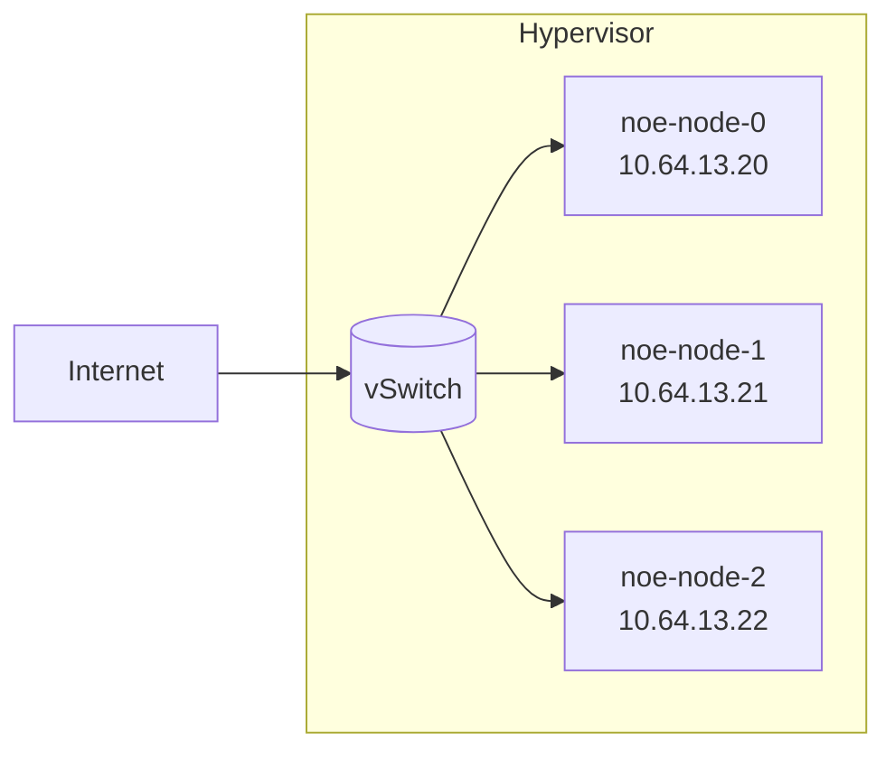
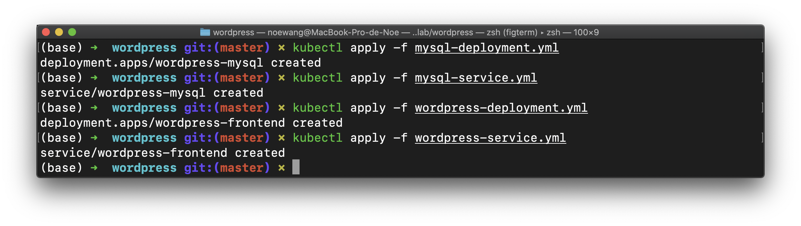
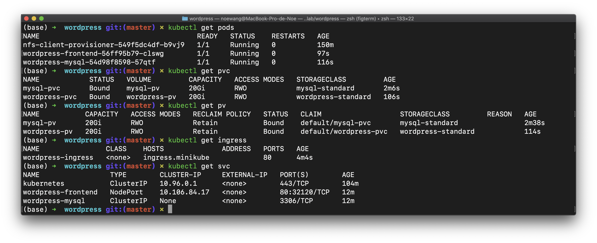
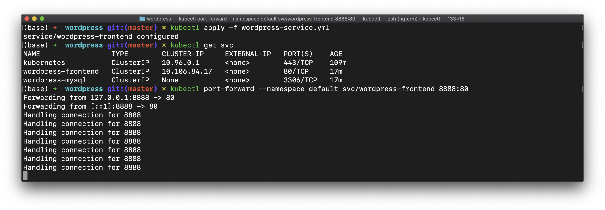
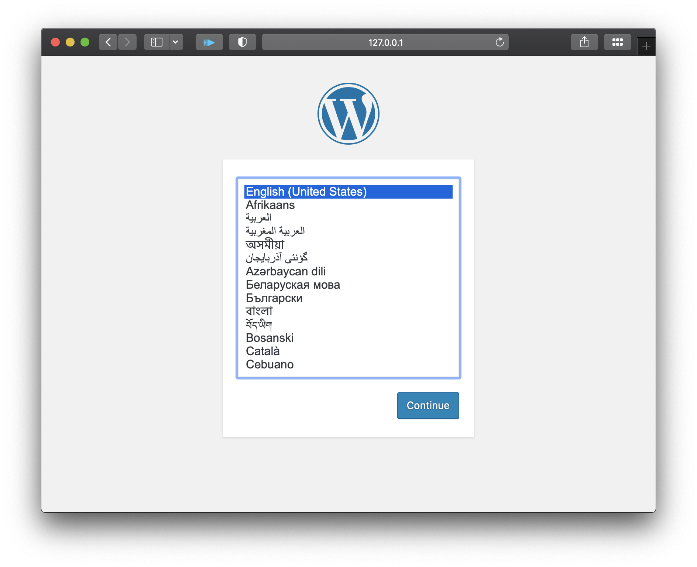
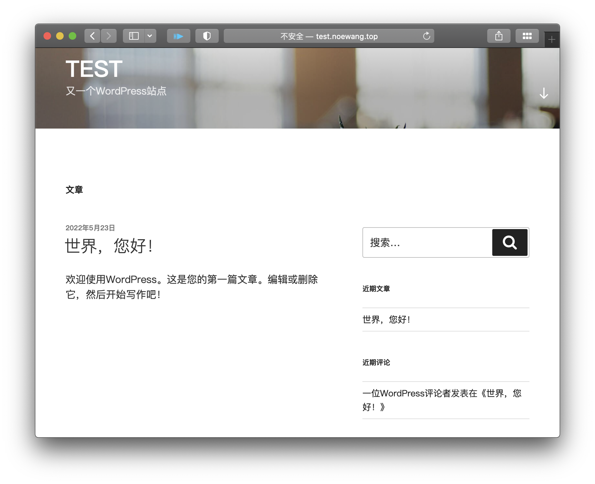

# Lab - Wordpress

我们选择在之前搭建的K8S集群上完成Wordpress实验。

我们来回顾一下我们的集群：我们有三台互相连接的节点，这些节点在一个交换机域下。三个节点的主机名:



IP地址描述如下:


```yaml
nodes:
  - node0:
      hostname: 'noe-node-0'
      address: '10.119.12.1'
  - node1:
      hostname: 'noe-node-1'
      address: '10.119.12.3'
  - node2:
      hostname: 'noe-node-2'
      address: '10.119.12.4'
```

三台节点均为x86虚拟机，安装Ubuntu 20.04.3 LTS操作系统，配置了2核CPU和4GB内存。`noe-node-0`将作为控制平面所在的节点。

## 1. Create Pods

```shell
kubectl apply -f mysql-deployment.yml
kubectl apply -f mysql-service.yml
kubectl apply -f wordpress-deployment.yml
kubectl apply -f wordpress-service.yml
```



## 2. Create Ingress

首先需要添加正确的主机名

##### Wordpress-ingress.yml

```yaml
apiVersion: networking.k8s.io/v1
kind: Ingress
metadata:
  name: wordpress-ingress
  labels:
    app: wordpress
spec:
  rules:
    - host: ingress.minikube
      http:
        paths:
          - path: /
            pathType: Prefix
            backend:
              service:
                name: wordpress-frontend
                port:
                  number: 80
```

## Create 2 PVs

为了持久化我们的数据，我们需要创建两个PV和对应的PVC，然后修改部署MySQL和Wordpress的方法以使用这些持久化卷。

##### Wordpress-service.yml

```yaml
apiVersion: v1
kind: Service
metadata:
  name: wordpress-frontend
  labels:
    app: wordpress
spec:
  ports:
    - port: 8888        # 端口要和ingress一致，我们将80端口转到ingress的8888端口
      targetPort: 80
  selector:
    app: wordpress
    service: frontend
  type: ClusterIP # 将nodePort 改为 ClusterIP
```

##### Wordpress-ingress.yml

```yaml
apiVersion: networking.k8s.io/v1
kind: Ingress
metadata:
  name: wordpress-ingress
  annotations:
    kubernetes.io/ingress.class: nginx
  labels:
    app: wordpress
spec:
  rules:
    - host: test.noewang.top        # 我拥有这个域名，这样操作之后，我们可以从公网通过域名访问
      http:
        paths:
          - path: /
            pathType: Prefix
            backend:
              service:
                name: wordpress-frontend
                port:
                  number: 8888
```

终端运行

```shell
# /var/lib/mysql for MySQL deployment
kubectl apply -f mysql-pv.yml
kubectl apply -f mysql-pvc.yml
kubectl apply -f mysql-deployment2.yml
kubectl apply -f mysql-service.yml
# /var/www/html for Wordpress deployment
kubectl apply -f wordpress-pv.yml
kubectl apply -f wordpress-pvc.yml
kubectl apply -f wordpress-deployment2.yml
kubectl apply -f wordpress-service.yml
```

我们用一系列命令检查安装情况 

```shell
kubectl get pods
kubectl get pvc 
kubectl get pv
kubectl get ingress 
kubectl get svc
```



我们将80端口转发到本地的8888端口

```shell
kubectl port-forward --namespace default svc/wordpress-frontend 8888:80 
```



在本地访问：`http:127.0.0.1:8888`，成功看到wordpress的欢迎页。



我们在主机的域名解析加入对`test.noewang.top`的解析


然后就可以通过域名来访问wordpress了



Yeah! 

: - )

